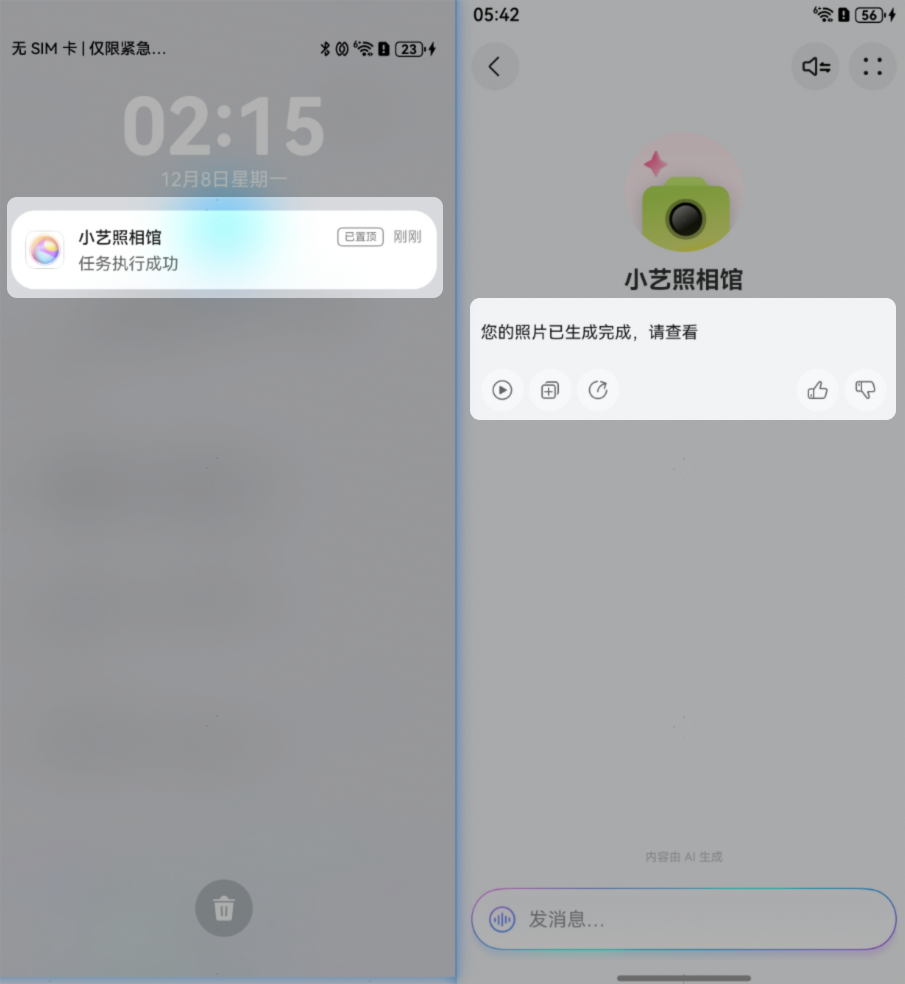
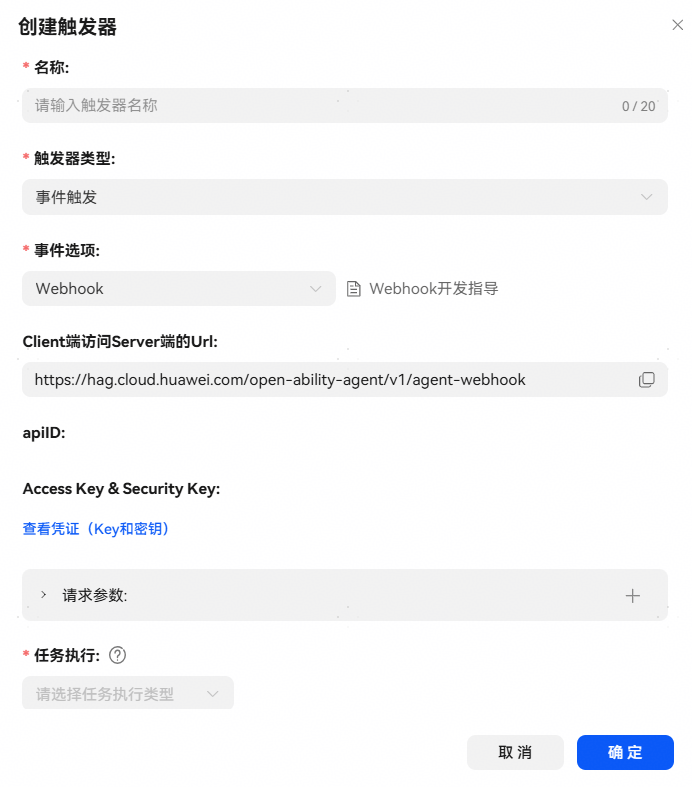
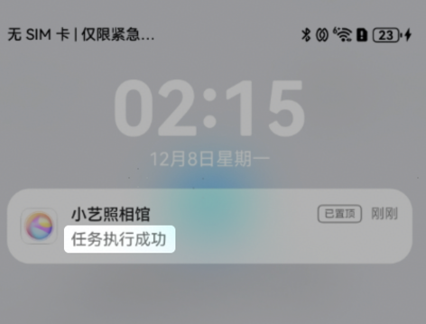
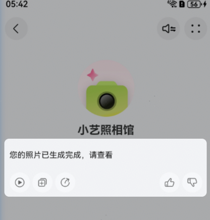
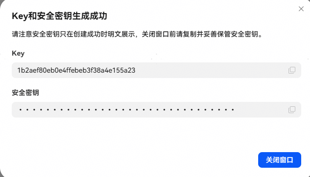

import MergeTable from '@site/src/components/MergeTable';

# Webhook事件

## 概述

异步事件场景，当内容生成完成或任务执行完成时，开发者需要向华为开放的统一接口发送通知消息，发送成功后用户手机端将收到通知消息，用户点击通知消息后进入智能体，可以查看任务执行结果。通知消息分为两种类型：text和data。

* text：点击通知消息进入智能体后，将text内容展示给用户。
* data：data作为入参触发触发器的任务执行，并将执行结果答复给用户。
* 若同时发送text和data类型消息，只有text消息生效。



## Webhook事件触发器配置及字段说明

| 配置字段 | 说明 |
| --- | --- |
| 事件选项 | Webhook。 |
| Client端访问Server端的Url | 华为开放的统一接口，用于接收开发者发送的通知消息。 |
| Access Key & Security Key | 创建凭证后生成的密钥对，用于接口鉴权。 |
| apiID | 触发器配置完成点击确认后，重新进入该触发器即可查看apiID取值，用于确认Webhook事件与智能体的绑定关系。 |
| 请求参数 | Webhook事件下此配置不生效。 |
| 任务执行 | 可执行的任务类型：  插件：开发者推送data消息后，自动执行插件，并将任务执行结果保存起来，插件执行完成后用户手机端接收到通知消息，当用户点击通知消息进入智能体后，将执行结果答复给用户。  工作流：开发者推送data消息后，自动执行工作流，并将任务执行结果保存起来，工作流执行完成后用户手机端接收到通知消息，当用户点击通知消息进入智能体后，将执行结果答复给用户。  事件结果按A2A协议返回给智能体处理：开发者推送data消息后，，通过A2A协议规范将data数据作为入参发送给Agent Server，并将Agent Server的执行结果答复给用户。 |



## Webhook事件通知消息字段说明

**Request Header**

| 参数 | 参数类型 | <strong>M/O</strong> | 说明 |
| --- | --- | --- | --- |
| Content Type | String | M | 固定值：application/json |
| Accept | String | M | 固定值：application/json |
| x-hag-trace-id | String | M | 请求标识，使用随机数生成，用于问题定位。 |
| X-Access-Key | String | M | 从小艺开放平台获取的触发器事件WebHook分配的Access Key。 |
| X-Sign | String | M | 从小艺开放平台获取的触发器事件WebHook分配的Security Key生成的签名，参数签名=Base64（HMAC-SHA256（secretKey， ts））， 其中secretKey 为开发者在小艺开放平台上配置的接入密钥（Security Key）。 |
| X-Ts | String | M | 时间戳，用于加密和缓存穿透。 格式为：当前计算机时间和GMT时间（格林威治时间）1970年1月1号0时0分0秒所差的毫秒数。 例如：2018/1/1 08:00:00.000 的时间戳为"1514764800000" |

**Request Body**

| 参数 | - | 参数类型 | <strong>M/O</strong> | 说明 |
| --- | --- | --- | --- | --- |
| jsonrpc | - | String | M | JSON-RPC协议版本，固定值：2.0 |
| id | - | String | M | 外层id；  全局唯一消息序列号，用于响应时标识请求，可用随机数uuid生成。 |
| result | - | Object | M | - |
| id | String | M | 内层result.id；  流式交互的唯一标识，一次流式交互中（从发起本次请求到本次请求完成处理之间）保持不变，可用随机数uuid生成。 |
| apiId | String | M | 创建Webhook触发器时生成的唯一标识apiID。 |
| pushId | String | M | 请求时使用平台[系统变量](https://developer.huawei.com/consumer/cn/doc/service/variable-0000002437625886#section177616814473)push\_id，代表通过webhook推送通知时使用的唯一ID。 |
| agentLoginSessionId | String | O | 账号授权时三方智能体服务器提供的用户授权身份ID，需要账号绑定的智能体必填，账号绑定可参考[账号绑定设置](https://developer.huawei.com/consumer/cn/doc/service/account-binding-0000002471344141)。 |
| pushText | String | M | 通知消息的展示内容，按Push服务规格提供。  规格：内容最多显示 84 个英文字符，或 57 个中文字；最多显示 3 行，显示不下部分“…”截断。 |
| kind | String | M | 事件类型，固定值：task。 |
| artifacts | Array[Artifacts] | M | 推送数据。 |

**Artifacts**

| 参数 |  | 参数类型 | <strong>M/O</strong> | 说明 |
| --- | --- | --- | --- | --- |
| artifactId | - | String | M | 本条Artifact的唯一ID，用于请求消息去重。 |
| parts | - | Array`<Object>` | M | - |
| kind | String | M | 消息类型，推送文本内容时值为：text；推送任务消息时值为：data。 |
| text | String | O | 文本内容，支持markdown格式。发送通知消息时，text和data字段二选一。 |
| data | Object | O | 执行触发器任务时，将data数据作为任务的入参调用对应插件、工作流或Agent server。发送通知消息时，text和data字段二选一。 |

请求示例：

```
curl 'https://hag.cloud.huawei.com/open-ability-agent/v1/agent-webhook' \
-H 'Content Type: application/json' \
-H 'Accept: application/json' \
-H 'x-hag-trace-id: {{请求标识，使用随机数生成，用于问题定位。}}' \
-H 'X-Access-Key: {{从小艺开放平台获取的触发器事件WebHook分配的Access Key。}}' \
-H 'X-Sign: {{从小艺开放平台获取的触发器事件WebHook分配的Security Key生成的签名，参数签名=Base64（HMAC-SHA256（secretKey， ts））， 其中secretKey 为开发者在小艺开放平台上配置的接入密钥（Security Key）。}}'\
-H 'X-Ts: {{时间戳，用于加密和缓存穿透。 格式为：当前计算机时间和GMT时间（格林威治时间）1970年1月1号0时0分0秒所差的毫秒数。 例如：2018/1/1 08:00:00.000 的时间戳为"1514764800000"}}’\
-d '{
    "jsonrpc": "2.0",
    "id": "a3f9b2c1-d9e4-4b8f-9a7c-2e1d5f3b8c0a",
    "result": {
        "id": "7c1d3e5f-9a2b-4c8d-6e3f-1a9b4c2d8e6f",
        "apiId": "webhook794ed095874f4c68888",
        "pushId": "d2e4f1c8-9b3a-4d7e-8f2c-6a1b5e9f3d4c",
        "agentLoginSessionId":"MDEr1a7L0wxJpyjiaur43RicGHm9FVbJSB",
        "pushText": "您的照片已完成，请查看",
        "kind": "task",
        "artifacts": [
            {
                "artifactId": "b5c8d1a3-f9e2-4b7c-8d6a-1f9e3b5c7d8a",
                "parts": [
                    {
                        "kind": "data",
                        "data": {
		                "prompt": "生成一只可爱小猫"
	                }
                    }
                ]
            }
        ]
    }
}'
```

发送通知消息后，httpcod码为200表示请求成功。

pushText展示图示：



text或任务执行结果效果图示：



## data数据说明

1）触发执行插件任务时通知消息data示例：

```
{
	"kind": "data",
	"data": {
		"cityName": "南京" //执行插件的入参，使用时替换成执行插件入参及值。
	}
}
```

触发后使用data中的参数执行插件。

2）触发执行工作流任务时通知消息data示例：

```
{
	"kind": "data",
	"data": {
		"cityName": "南京" //自定义参数，执行工作流时将参数塞入工作流入参的EVENT_INPUT.payload里。
	}
}
```

触发后将data参数作为EVENT\_INPUT.payload中执行工作流，EVENT\_INPUT示例：

```
{
            "payload": {
                "cityName": "南京" //通知消息中的自定义参数。
            },
            "header": {
                "name": "CloudEvent", //固定值。
                "namespace": "Common" //固定值。
            }
        }
```

3）A2A模式下触发执行任务时通知消息data示例：

```
{
	"kind": "data",
	"data": {
		"cityName": "南京" //自定义参数，执行任务时将此参数塞入会话消息的的data.events中。

	}
}
```

触发后将data参数作为data.events按照A2A协议发送给Agent Server获取答复结果（A2A协议规范请可参考[鸿蒙Agent通信协议接入方案](https://developer.huawei.com/consumer/cn/doc/service/agent2agent-0000002498656261)），events示例：

```
[{
		"header": {
			"name": "Trigger",
			"namespace": "Common"
		},
		"payload": {
			"dataMap": {
				"cityName": "南京" //通知消息中的自定义参数。
			},
			"dialogueHistorySwitch": false,
			"eventDescription": "{{apiID}}",
			"eventName": "{{apiID}}",
			"eventType": "Webhook",
			"triggerName": "{{触发器名称}}",
			"triggerType": "event"
		}
	}]
```

## Webhook触发器在不同模式下的差异

| 模式 | 差异点 |
| --- | --- |
| LLM模式 | 任务执行可配置插件或工作流，注意：不支持选择端插件或包含端插件的工作流。 |
| 工作流模式 | 任务执行仅支持配置工作流，且触发器执行工作流和智能体工作流配置中添加的必须是同一个工作流。 |
| A2A模式 | 任务执行仅支持配置：事件结果按A2A协议返回给智能体处理。 |

## 凭证

进入小艺开放平台，选择【工作空间】-【凭证】，点击新建凭证，设置Key名称后保存，保存后将生成Key和安全密钥。生成的Key和安全密钥将在Webhook事件触发器中作为Access Key （Key）& Security Key（安全密钥）使用。

* 创建的凭证通用，可供本账号下所有智能体的Webhook事件使用；
* 如果创建了多个凭证，Webhook事件可任意选择密钥对使用。
* 安全密钥只在创建成功时可明文复制，关闭窗口前请复制并妥善保管。



## FAQ

1、工作流模式的智能体，工作流配置中添加的工作流和触发器执行任务配置的是同一个工作流，如何同时实现对话逻辑和触发器功能？

回答：工作流编排时，可以配合选择器节点使用：当工作流开始节点的EVENT\_INPUT.EventPayload包含特殊参数键值时走触发器触发任务流，否则走对话逻辑流。