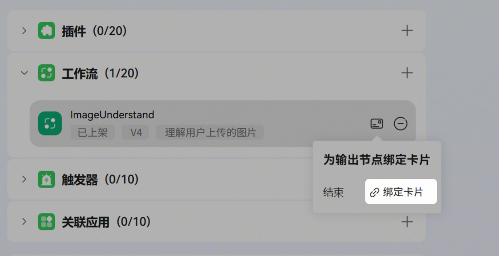
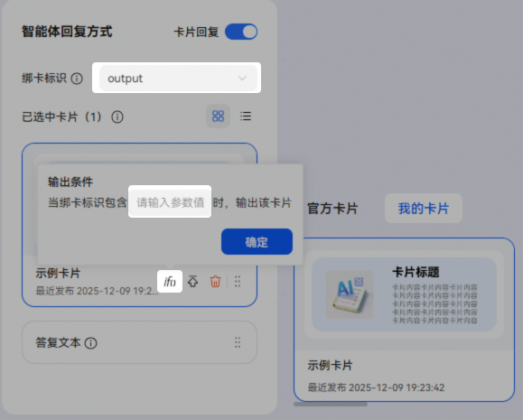

# 工作流绑卡

添加工作流后点击图中绑定卡片图标可选择工作流节点分别进行绑定卡片。

点击卡片可查看卡片的详细内容，如需绑定该卡片，将鼠标悬停在卡片上并点击添加按钮。

支持为工作流的输出节点和结束节点绑定卡片，单节点支持绑定多张卡片，支持同一时刻输出多张卡片，支持配置答复文本和卡片的输出顺序，答复文本和卡片将按照配置顺序输出。

**输出节点绑卡：**

* 非流式输出的输出节点绑卡时，只输出卡片，不输出答复文本；若非流式输出节点需要同时输出卡片和文本，编排时可使用两个输出节点，一个用来绑卡，一个用来输出答复文本。
* 流式输出的输出节点绑卡，支持同时输出卡片和答复文本。
* 思考模式的输出节点不支持绑卡。

**结束节点绑卡：**

* 流式输出结束节点，支持在首帧或末帧返回绑卡数据。如果在首帧返回卡片数据，则先出卡再出文本；如果在末帧返回绑卡数据，则先出文本再出卡片；
* 非流式输出结束节点绑卡时，支持调整输出顺序，但答复文本只能设置为首位或末位；
* 返回变量的结束节点，无答复文本，只输出卡片。同时支持调整卡片输出顺序。

**绑卡标识**

开发者可以通过绑定绑卡标识设置出卡条件，不设置绑卡标识时，固定出卡。

* 绑卡标识仅支持选择String和Array[String]类型的参数；
* 出卡对比值在卡片输出条件中配置；
* 用户选择绑卡标识为String类型时，当绑卡标识值和输出条件中输入值完全相等时出卡，否则不出卡；
* 用户选择绑卡标识为Array[String]类型时，当绑卡标识值包含输出条件中输入的值时出卡，否则不出卡。

