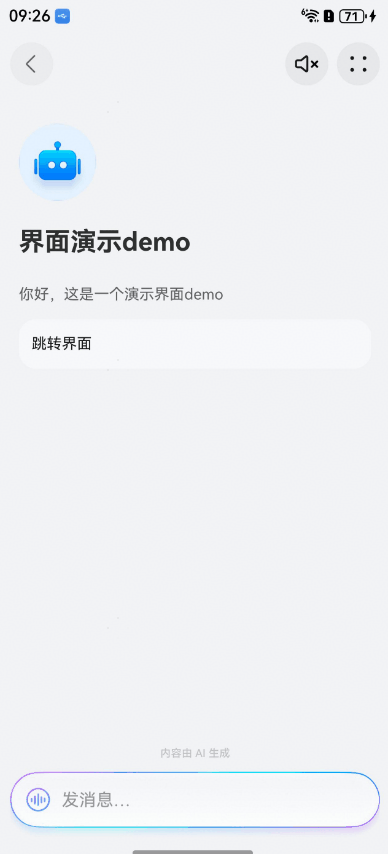
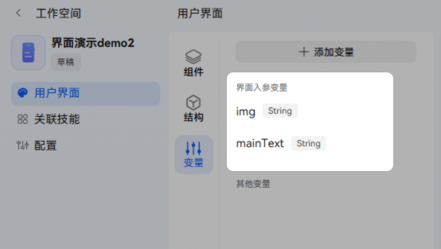
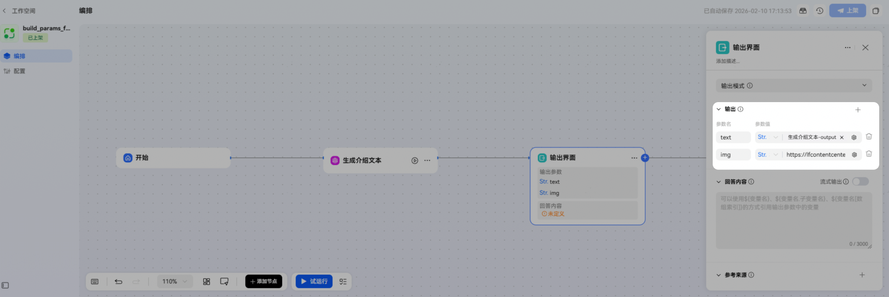
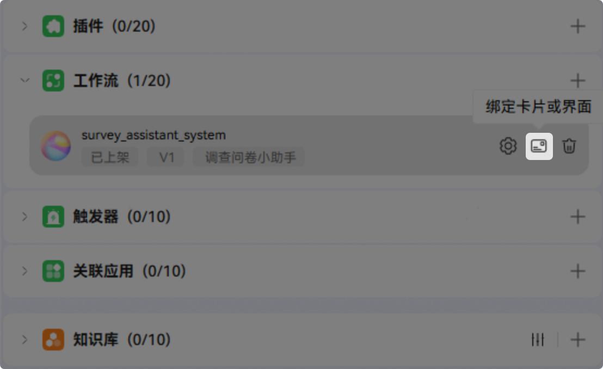
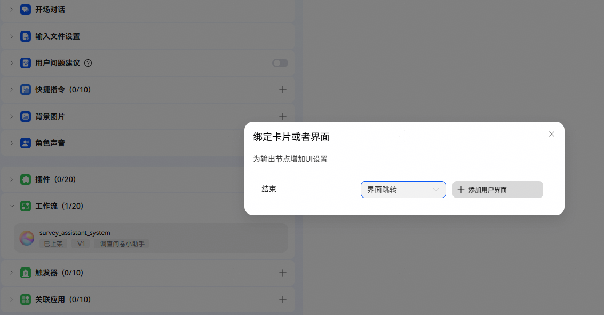
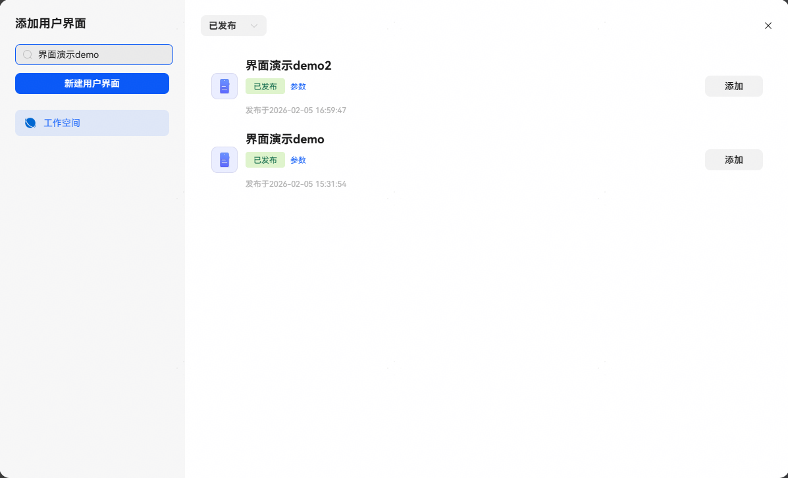
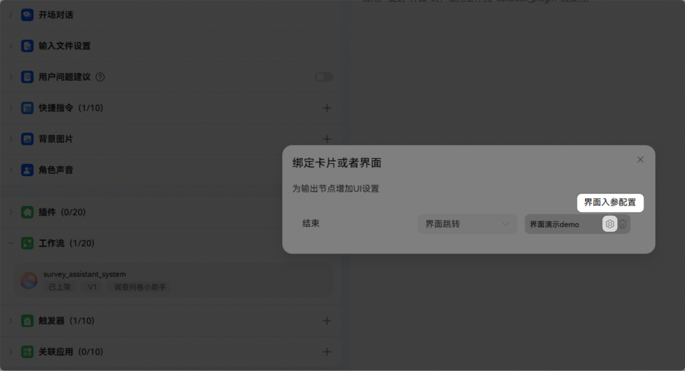
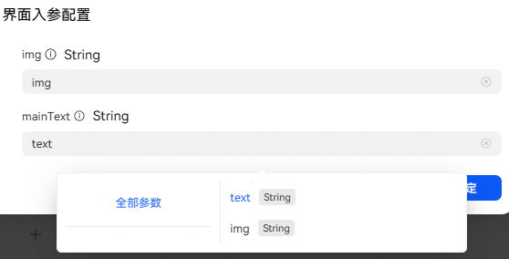
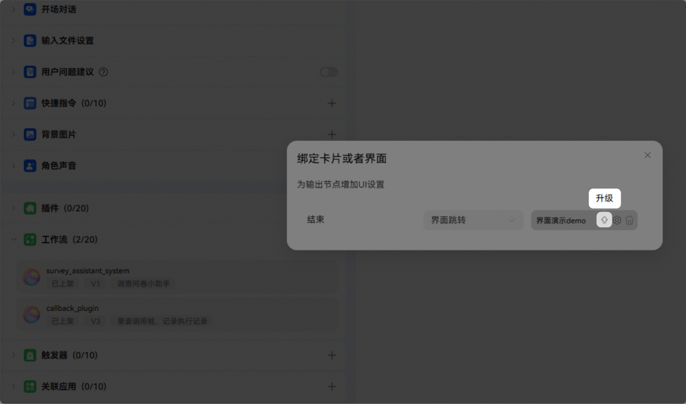

# 工作流界面跳转配置

## 功能介绍

当智能体调用配置工作流进行响应时，支持以界面形式返回结果，实现更丰富的交互体验。

手机端效果示例：

## 演示案例

下面我们将以功能介绍中的图示效果为例，演示完整的开发过程。

## 开发界面

参考[开发界面](https://developer.huawei.com/consumer/cn/doc/service/interface-0000002517970934)进行编排。

注意：需要预留合适的界面入参变量，以适配工作流的输出。

## 开发工作流

参考[开发工作流](https://developer.huawei.com/consumer/cn/doc/service/development-workflow-0000002435989628)进行编排。

注意：需要在即将绑定界面的节点将界面需要的值作为变量输出，工作流输出/结束节点绑定界面后，在原输出内容基础上，还将引起用户界面跳转，此时界面入参变量来源为当前输出/结束节点的输出变量。

## 智能体编排与发布

1、添加用户界面

智能体添加工作流后点击【绑定卡片或界面】图标，选择界面跳转，点击【添加用户界面】，添加已经发布的界面。

2、界面入参配置

添加界面后，点击【界面入参配置】，将界面入参变量与工作流输出/结束节点进行绑定映射。若无界面入参变量或不需要映射可跳过此步骤。

3、界面升级

添加的界面版本更新后，可以直接点击图示升级按钮进行升级，升级后若参数有变化，需重新配置关联关系。

4、调试

当前界面功能暂不支持在网页端调试，为确保功能效果与预期一致，可发布[真机测试](https://developer.huawei.com/consumer/cn/doc/service/list-of-user-groups-for-real-machine-testing-0000002471264273)通过手机端查看实际运行效果。

手机端效果示例：

