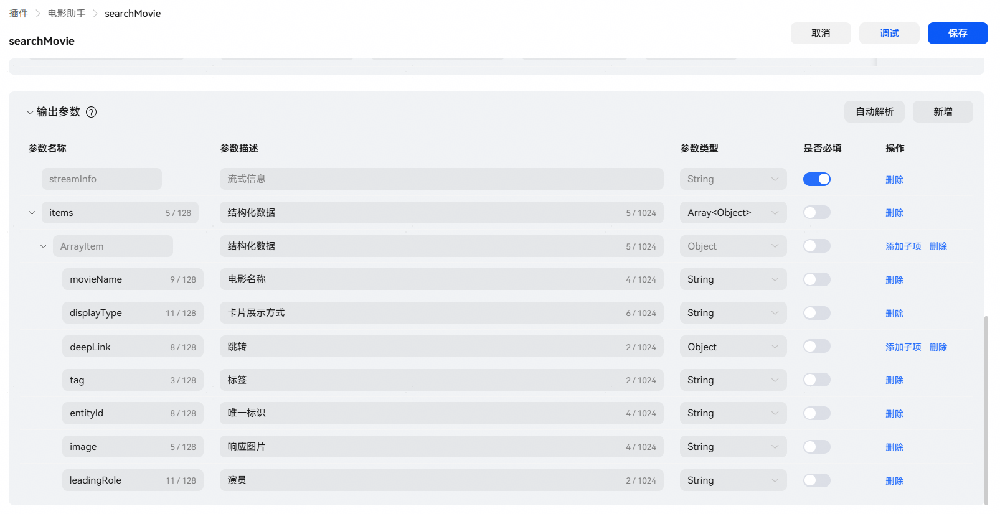
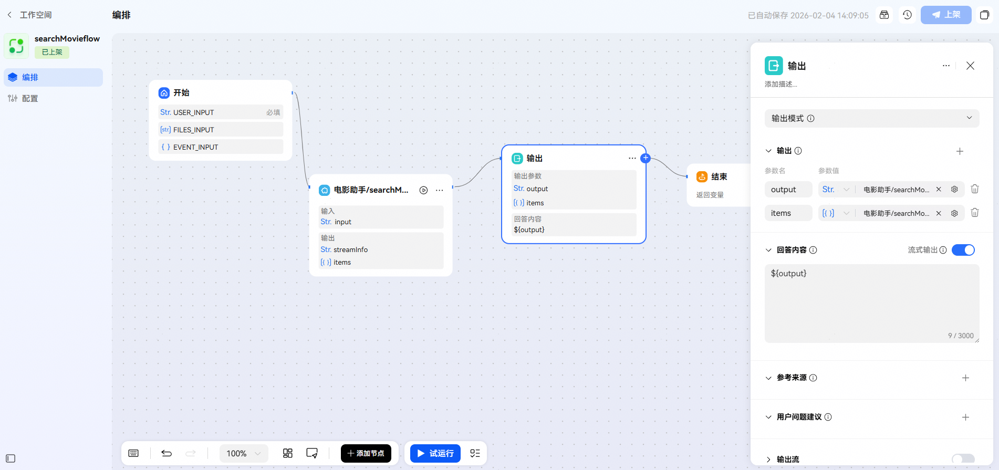
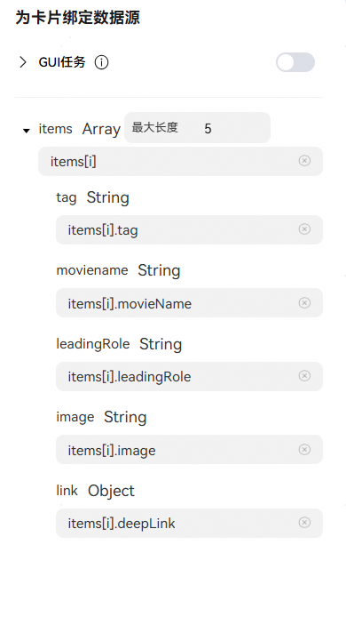
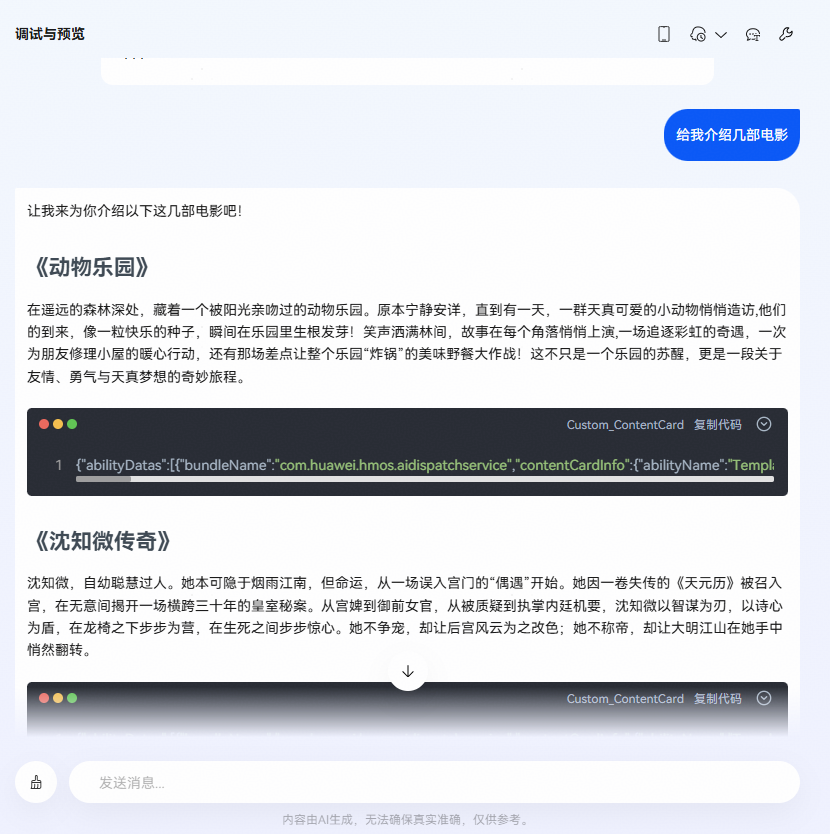

# 工作流文卡混排输出

## 功能介绍

当智能体调用配置工作流进行回复时，支持将文本与结构化卡片混合排布，打造清晰、直观、富有媒体感的输出体验。

效果图示：


## 场景说明

在此场景下，答复数据源必须来自流处理云插件。工作流编排时，通过“输出”或“结束”节点接收插件返回的文本内容与结构化数据，并在智能体中为工作流答复节点绑定卡片，最终实现文本与卡片混排的输出效果。

核心节点说明：

| 节点 | 说明 |
| --- | --- |
| 云插件 | * 插件必须为流式输出，其数据结构参考[输出参数配置](/docs/distribute/xiaoyi/cloud-plug-in-0000002471344189/create-tools-0000002437625946#section167031659154117)； * 插件响应的结构化数据帧（出卡帧）items.displayType值需为EmbedMarkdown；若中间帧不满足此条件，则不输出卡片；若结束帧不满足此条件，则无法实现文卡混排的输出效果。 * 配置插件时，需将 items 及其子项配在“插件输出参数”中，用于绑卡。 |
| 输出节点/结束节点 | * 绑卡变量名必须为 items；若使用其他变量名，无法实现文卡混排输出。 * 该节点必须开启“流式输出”开关，否则中间帧不出卡。 * 插件必须与用于答复的“输出”或“结束”直接相连，中间不得插入其他节点，也不得并联其他流式输出节点，否则将导致文卡混排输出异常。 |

## 演示案例

下面我们将以功能介绍中的图示效果为例，演示完整的开发过程。

## 1、开发插件

插件输出参数配置示例：



插件响应示例：

本场景共返回 4 帧数据，其中第 2、4 帧为卡片数据，其余帧为纯文本。开发完成后，将在 2、4 帧答复内容后输出卡片。

```
{"errorCode":"0","errorMessage":"","reply":{"streamInfo":{"streamContent":"让我来为你介绍以下这几部电影吧！","streamingTextId":"5d45816e-a042-4335-b0a1-560a903a1804","streamType":"partial","textType":"markdown"}},"version":"1.0"}

{"errorCode":"0","errorMessage":"","reply":{"streamInfo":{"streamContent":"让我来为你介绍以下这几部电影吧！\n## 《动物乐园》\n在遥远的森林深处，藏着一个被阳光亲吻过的动物乐园。原本宁静安详，直到有一天，一群天真可爱的小动物悄悄造访,他们的到来，像一粒快乐的种子，瞬间在乐园里生根发芽！笑声洒满林间，故事在每个角落悄悄上演,一场追逐彩虹的奇遇，一次为朋友修理小屋的暖心行动，还有那场差点让整个乐园“炸锅”的美味野餐大作战！这不只是一个乐园的苏醒，更是一段关于友情、勇气与天真梦想的奇妙旅程。","streamingTextId":"5d45816e-a042-4335-b0a1-560a903a1804","streamType":"partial","textType":"markdown"},"items":[{"displayType":"EmbedMarkdown","movieName":"动物乐园","tag":"9.3分/动画/2025","leadingRole":"鲍勃/皮特/爱丽丝","image":"https://p3-aiop-sign.byteimg.com/tos-cn-i-vuqhorh59i.jpg"}]},"version":"1.0"}

{"errorCode":"0","errorMessage":"","reply":{"streamInfo":{"streamContent":"让我来为你介绍以下这几部电影吧！\n## 《动物乐园》\n在遥远的森林深处，藏着一个被阳光亲吻过的动物乐园。原本宁静安详，直到有一天，一群天真可爱的小动物悄悄造访,他们的到来，像一粒快乐的种子，瞬间在乐园里生根发芽！笑声洒满林间，故事在每个角落悄悄上演,一场追逐彩虹的奇遇，一次为朋友修理小屋的暖心行动，还有那场差点让整个乐园“炸锅”的美味野餐大作战！这不只是一个乐园的苏醒，更是一段关于友情、勇气与天真梦想的奇妙旅程。\n## 《沈知微传奇》\n沈知微，自幼聪慧过人。她本可隐于烟雨江南，但命运，从一场误入宫门的“偶遇”开始。","streamingTextId":"5d45816e-a042-4335-b0a1-560a903a1804","streamType":"partial","textType":"markdown"}}}

{"errorCode":"0","errorMessage":"","reply":{"streamInfo":{"streamContent":"让我来为你介绍以下这几部电影吧！\n## 《动物乐园》\n在遥远的森林深处，藏着一个被阳光亲吻过的动物乐园。原本宁静安详，直到有一天，一群天真可爱的小动物悄悄造访,他们的到来，像一粒快乐的种子，瞬间在乐园里生根发芽！笑声洒满林间，故事在每个角落悄悄上演,一场追逐彩虹的奇遇，一次为朋友修理小屋的暖心行动，还有那场差点让整个乐园“炸锅”的美味野餐大作战！这不只是一个乐园的苏醒，更是一段关于友情、勇气与天真梦想的奇妙旅程。\n## 《沈知微传奇》\n沈知微，自幼聪慧过人。她本可隐于烟雨江南，但命运，从一场误入宫门的“偶遇”开始。她因一卷失传的《天元历》被召入宫，在无意间揭开一场横跨三十年的皇室秘案。从宫婢到御前女官，从被质疑到执掌内廷机要，沈知微以智谋为刃，以诗心为盾，在龙椅之下步步为营，在生死之间步步惊心。她不争宠，却让后宫风云为之改色；她不称帝，却让大明江山在她手中悄然翻转。","streamingTextId":"5d45816e-a042-4335-b0a1-560a903a1804","streamType":"final","textType":"markdown"},"items":[{"displayType":"EmbedMarkdown","movieName":"沈知微传奇","tag":"8.3分/古装/2025","leadingRole":"沈知微/谢蕴初/周允","image":"https://p3-aiop-sign.byteimg.com/tos-cn-i-vuqhorh59i.jpg"}]},"version":"1.0"}
```

## 2、开发工作流

本案例中，通过输出节点引用云插件的执行结果进行答复（结束节点类似）。

工作流编排示例：

* 输出节点的 output 参数（支持自定义）引用云插件返回的 streamInfo，用于生成流式文本答复。
* 输出节点的 items 参数（必须为 items）引用云插件返回的 items 数据，用于绑卡。
* 输出节点回答内容引用变量$\\{output\\} ，并开启“流式输出”开关。



## 3、智能体编排与调试

工作流上架后，添加到智能体中使用：


给配置工作流的输出节点绑定卡片：




智能体调试：

在网页端调试时，文卡混排的卡片内容会以代码块形式展示，用于直观呈现结构化数据。建议将智能体发布真机测试，在手机端实际运行并查看卡片的渲染效果，确保视觉样式与交互体验在真实设备上的一致性。

网页调试效果示例：



手机端效果示例：


