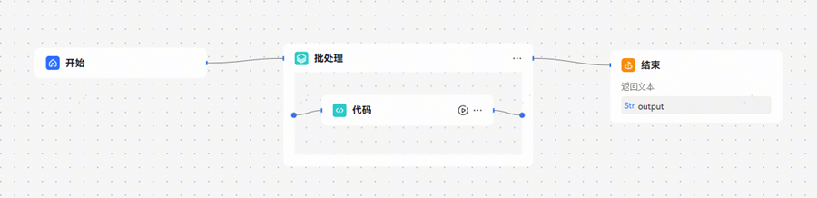
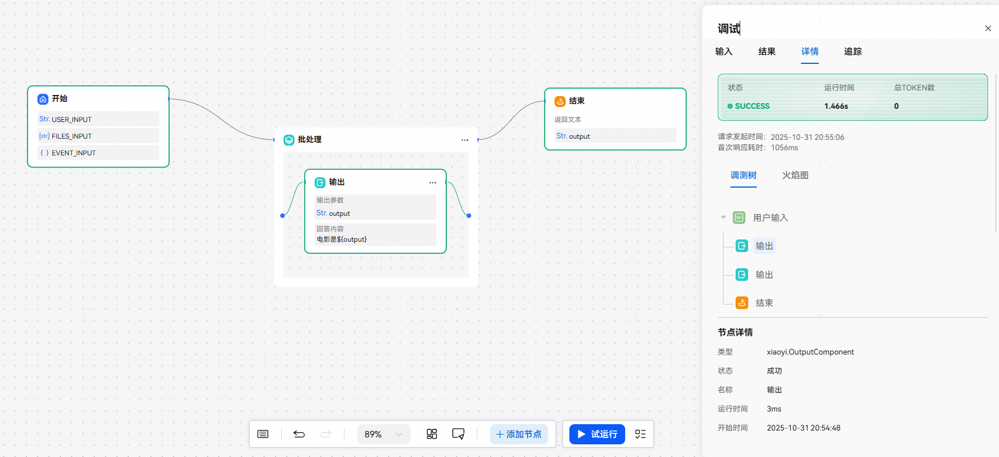

# 批处理节点

通过设定批量运行次数和逻辑，运行批处理体内的任务。

工作流执行时，每个节点按顺序运行一次，如果需要一次性运行多次，可以使用批处理节点提高工作流效率。

使用场景例如：一次性查询多个城市的天气。

批处理节点中不支持嵌套批处理和循环节点。

调测树不显示批处理节点，但会展示批处理体内节点执行情况。

**批处理设置**

并行运行数量：默认配置10次，数量最大限制10次，最少为1次表示全部串行执行。支持引用上游节点数值类型的输出参数，每一批任务默认并行运行。

批处理次数上限：默认配置为100次，数量最大限制200次，最少为1次，支持引用上游节点数组类型的的输出参数，每一批任务默认并行运行。批处理执行总次数达到此上限时，此节点终止运行。此节点的执行逻辑是处理数组中的元素，当批处理次数达到上限时，即使节点未遍历数组中的每个元素，也会停止运行。

**输入**

批处理节点最少设置一个输入参数，且只能引用上游节点的 Array类型参数。

**输出**

批处理完成后输出的内容，仅支持引用批处理体中节点的输出变量。输出收集结果为数组，因此路径选择时不要有父子关系。
