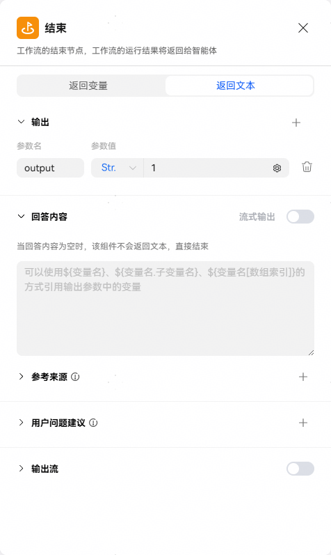

# 结束节点

结束节点是工作流的最终节点，用于返回工作流运行后的结果。结束节点支持两种返回方式：返回变量、返回文本。

## 返回变量

在返回变量模式下，工作流运行结束后会以JSON格式输出所有返回参数，适用于工作流绑定卡片、作为子工作流、由大模型进行融合答复的场景。

注意：工作流模式的智能体，如果其添加的工作流结束节点配置了返回变量，因为没有大模型做融合答复，所以智能体会没有响应内容；可以为结束节点绑定卡片，或者改为返回文本。

## 返回文本

在返回文本模式下，工作流运行结束后将直接使用指定的内容回复用户。回答内容支持引用输出参数。适用于工作流模式的场景。

|  |  |
| --- | --- |
| <strong>设置</strong> | <strong>说明</strong> |
| <strong>输出变量</strong> | 输出节点中输出的参数。在工作流绑定卡片时可以使用这些参数。 |
| <strong>参考来源</strong> | 配置流式输出内容的参考来源，非流式输出不生效；字段格式按照小艺参考来源规范定义。回答内容中使用\<rsup\>index\</rsup\>，表示引用第index条参考来源（index从1开始）。  参考来源使用方法可以参考[参考来源使用说明](/docs/distribute/xiaoyi/workflow-node-description-0000002437785730/output-node-0000002437785742#section1757195913239)。 |
| <strong>用户问题建议</strong> | 配置用户问题建议，字段格式按照小艺用户问题建议规范定义，配置后添加该工作流的智能体在对话时可展示自定义用户问题建议效果；  用户问题建议使用方法可以参考[用户问题建议使用说明](/docs/distribute/xiaoyi/workflow-node-description-0000002437785730/output-node-0000002437785742#section17421938182419)。 |
| <strong>回答内容</strong> | 工作流的最终输出内容。  支持引用输出参数，引用方式为$\\{变量名\\}。 |
| <strong>流式输出</strong> | 开关打开后，工作流响应会以流的形式吐出内容：  1、工作流调试目前无法观察到流式效果，可在智能体引用后在智能体调试页面观测；  2、输出参数引用节点若不支持流式，则默认批式返回。 |
| <strong>输出流</strong> | 开关开启时，如果配置的输出流id与多个连续的输出节点配置的输出流id值相同，那么将会在同一流中返回输出内容，使用输出流时必须打开流式输出。 |