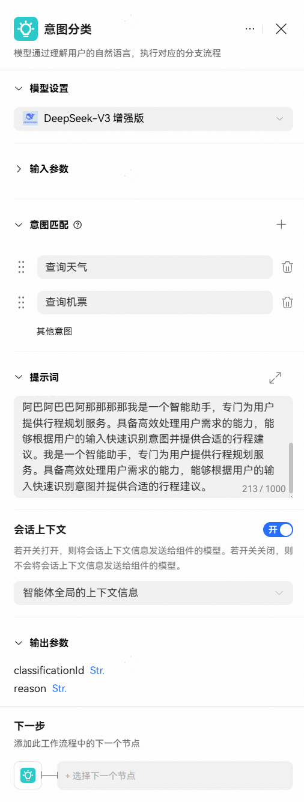

# 意图分类节点

意图分类节点能够让智能体识别用户输入的意图，并将不同的意图流转至工作流不同的分支处理，提高用户体验，增强智能体的落地效果。

**节点说明**

意图分类指的是让智能体理解用户通过自然语言表达的意图或目的。意图分类是智能助手的典型能力，例如用户在对话中输入“我想查询今天的天气”，其中“查询天气”为用户意图，也就是用户希望智能体执行的操作。工作流支持意图识别节点对用户意图进行归类，无需再通过大模型节点配合选择器节点实现意图识别，使工作流运行更加高效。

意图分类节点可用于以下场景：

客户服务：识别用户问题的类型，并转交各类知识库处理，对于知识库中未匹配的问题，转交人工客服处理。

医疗咨询：对用户咨询的医学问题进行归类，非医学问题的咨询则兜底回复。

**意图分类节点使用**

意图分类节点配置如下：

|  |  |
| --- | --- |
| <strong>配置项</strong> | <strong>说明</strong> |
| <strong>模型设置</strong> | 选择执行意图分类的大模型，选择更符合你预期的大模型。 |
| <strong>输入参数</strong> | 指定需要做意图分类判断的内容。输入参数默认为query，可引用前置节点的输出参数，或输入指定内容。该参数通常引用开始节点中的用户输入。 |
| <strong>意图匹配</strong> | 用户意图的分类选项，支持设置多个分类。对于匹配到这些分类的意图，处理流程会流转到对应的后续节点，若意图未匹配到此处定义的任何分类，则流转到兜底策略。 |
| <strong>提示词</strong> | 追加的系统提示词。平台已指定一系列提示词，用于指导大模型合理识别用户意图并分类。开发者也可以追加系统提示词提升意图分类效果。 |
| <strong>输出参数</strong> | 节点的输出参数，可作为变量被后续节点引用。  输出参数固定为：  classificationId：每个意图的ID。根据意图匹配中配置的意图，从上到下依次排序，第一个意图的ID为1。若未命中已配置的任何意图，则ID为0，执行其他分支。  reason：分类的原因和依据，由模型自动生成。 |
| <strong>会话上下文</strong> | 控制是否将会话上下文信息发送到模型，支持选择两种方式：  智能体全局的上下文信息：与智能体对话时用户可见的会话信息；  本节点内发生的上下文信息：该意图分类节点的输入输出。 |

工作流中的意图分类节点配置示例如下：

配置完成后，将意图分类节点与其他节点连接，形成完整的调用链路。

意图分类节点的每个意图分类，都需要与后续的处理节点相连接，否则意图命中次分类时无法触发后续的处理流程。例如在客服智能体中，产品咨询的分类可以流转至产品咨询知识库节点处理。

需要为意图分类节点设置兜底策略，若意图未匹配到此处定义的任何分类，则流转到兜底策略处理。兜底策略是针对其他意图的处理逻辑。