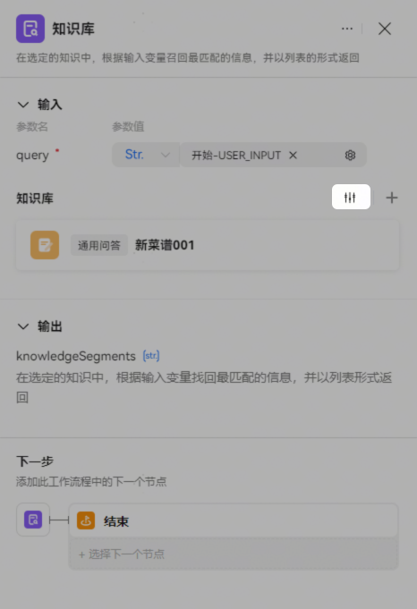
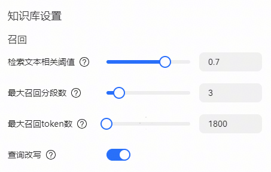

# 知识库节点

知识库是团队私有的知识合集，暂时不支持公开知识库。知识库节点可以基于用户输入查询指定的知识库，召回最匹配的信息，并将匹配结果以列表形式返回。

**输入与输出**

知识库节点的输入参数固定为query，表示用户希望在知识库中检索的关键信息，需要引用上游节点的输出参数，输入参数类型为String。

输出参数固定为一个名为knowledgeSegments的数组，其中包含多条召回结果，默认根据匹配度和相关性由高到低排序。

**添加知识库**

在知识库区域右上角单击+即可添加知识库到节点中，支持添加多个知识库。

**知识库检索配置**

知识库的检索配置在很大程度上会影响召回结果的准确性、相关性。

检索文本相关阈值：检索召回知识库段落的相关系数。默认系数为0.5。

最大召回分段数：默认的召回分段数为3。

最大召回token数：召回并输入给大模型的最大token数，范围0-999999。

查询改写：在多轮对话中，用户的 Query 和对话的上下文息息相关，仅凭借用户最新一条提问可能无法正确识别用户的真实检索意图。查询改写是指根据对话历史对用户输入的 Query 进行优化或重构，从而更准确地捕捉真实的用户意图，提升信息检索的效率。知识库检索节点默认开启查询改写。

例如用户对话的上下文为：

问题1：知识库检索节点可以用来做什么？

回复1：知识库检索节点可以基于用户输入查询指定的知识库，召回最匹配的信息，并将匹配结果以列表形式返回。

问题2：怎么用？

对于问题2，不参考上下文的情况下无法判断用户的真实意图。开启查询改写后，问题2会被改写为“知识库检索节点怎么用？”。
