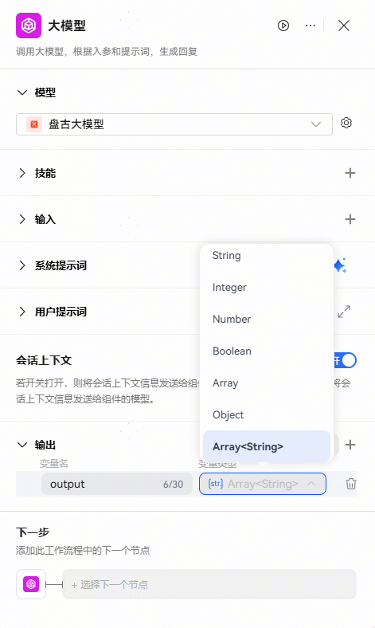
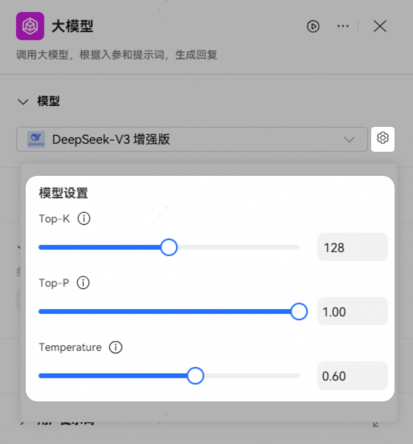
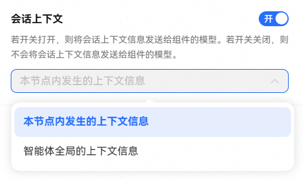
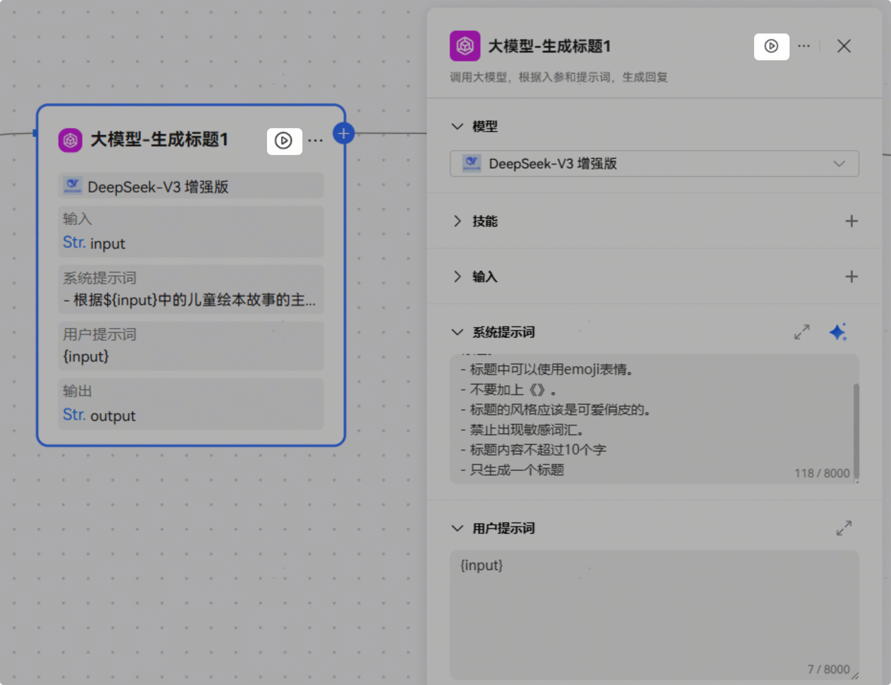
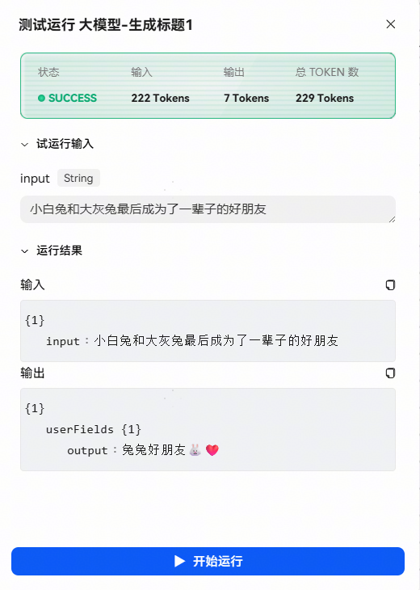

# 大模型节点

大模型节点是平台提供的基础节点之一，开发者可以在该节点使用大语言模型处理任务。

## 节点说明

大模型节点可以调用大型语言模型，根据输入参数和提示词生成内容，通常用于执行文本生成任务，例如文案制作、文本总结、文章扩写等。

大模型节点依赖大语言模型的语言理解和生成能力，可以处理复杂的自然语言处理任务，开发者可以根据效果选择不同的模型，并配置提示词来定义模型的人设和回复风格。

## 配置大模型节点

## 模型

选择要使用的模型。此节点的输出内容质量很大程度上受模型能力的影响，建议根据实际业务效果选择模型。

输入需要添加到提示词中的动态内容。提示词中支持引用输入参数，实现动态调整的效果。添加输入参数时需要设置参数名和变量值，变量值支持设置为固定值或引用上游节点的输出参数。

模型设置说明：

支持对模型超参：TopK、TopP、Temperature进行调整，实现回复效果的定制化；仅部分模型支持此配置（不一一列举，具体以实际为准）。

超参说明：

**Top-K**：用于控制候选词的选择范围（选概率最高的K个词）；支持调试范围：1-256，单步1。

**Top-P**：用于控制候选词的选择范围（选概率累计达P%的词堆）；支持调试范围：0-1，单步0.01。

**Temperature**：用于调整输出结果的随机性（温度越高越随机创新，越低越确定保守）；支持调试范围：0-1，单步0.01。

## 技能

支持为大模型节点配置插件、工作流技能，扩展模型能力的边界。配置的插件支持[参数设置](https://developer.huawei.com/consumer/cn/doc/service/plugin-parameter-setting-0000002493084596)，支持[使用模拟集](https://developer.huawei.com/consumer/cn/doc/service/plugin-mock-0000002517939356)。

大模型节点运行时，会根据用户提示词自动调用插件或工作流，综合各类信息输入后输出回复。

当选择技能为端插件时，可以添加不同版本的插件，在端侧运行时，会调用与端侧匹配版本的插件进行返回。

配置技能后，大模型节点的能力更接近一个独立运行的智能体，可以自动进行意图识别，并判断调用技能的时机和方式，大幅度提高此节点的文本处理能力和文本生成效果，简化工作流的节点编排。

例如：用户需求是某地区的旅游攻略，可以先通过插件节点查询车票信息，再由模型节点根据车票信息等，更详细地回复用户；现在你可以直接在大模型节点添加查询车票的插件，大模型会自动调用插件，查询车票并推荐。

## 输入

模型的输入可以选取前面节点的输入和输出的参数，也可以手动输入具体的值。

模型根据输入的参数，以及提示词，生成回复。

## 会话上下文

开关控制是否将会话上下文信息发送到模型，支持选择两种方式：

* 本节点内发生的上下文信息：该大模型节点产生的输入输出；
* 智能体全局的上下文信息：与智能体对话时用户可见的会话信息。

## 提示词

* 系统提示词：模型的系统提示词，用于指定人设和回复风格。编写系统提示词时，可以引用输入参数中的变量。例如$\{变量名\}表示直接引用变量，$\{变量名.子变量名\}表示引用JSON的子变量，$\{变量名[数组索引]\}表示引用数组中的某个元素。
* 用户提示词：模型的用户提示词是用户在本轮对话中的输入，用于给模型下达最新的指令或问题。用户提示词同样可以引用输入参数中的变量。

  假设我们需要构建一个友好且专业的健康咨询助手，以下是设置系统提示词和用户提示词的示例：
* 系统提示词示例：你是一个友好且专业的健康咨询助手，专注于为用户提供基于科学和医学知识的健康建议。在回答用户的问题时，你的回答应该既专业又易于理解，同时保持语言的温和和鼓励性。请确保所有建议都是基于最新的健康指南，并避免提供具体的医疗诊断。
* 用户提示词示例：我最近总是感到疲劳，这可能是什么原因呢？

## 输出

可以指定大模型节点输出的内容格式；输出格式支持设置为：

文本：纯文本格式，参数值为模型回复的文本内容。大模型节点添加了技能时，输出格式固定为文本输出。

Markdown：Markdown格式，参数值为模型回复的Markdown文本内容。

JSON：JSON格式，指定JSON时可自定义模型输出格式，层级嵌套最大支持三层。

## 单节点调试

大模型组件支持单节点调试，单节点调试时不要求连线完整，调试入参支持直接输入或引用参数，调试完成后展示此次调试的试运行结果。

如下图所示，点击调试按钮即可拉起执行：

执行结束后，正常返回此次调试的结果。

