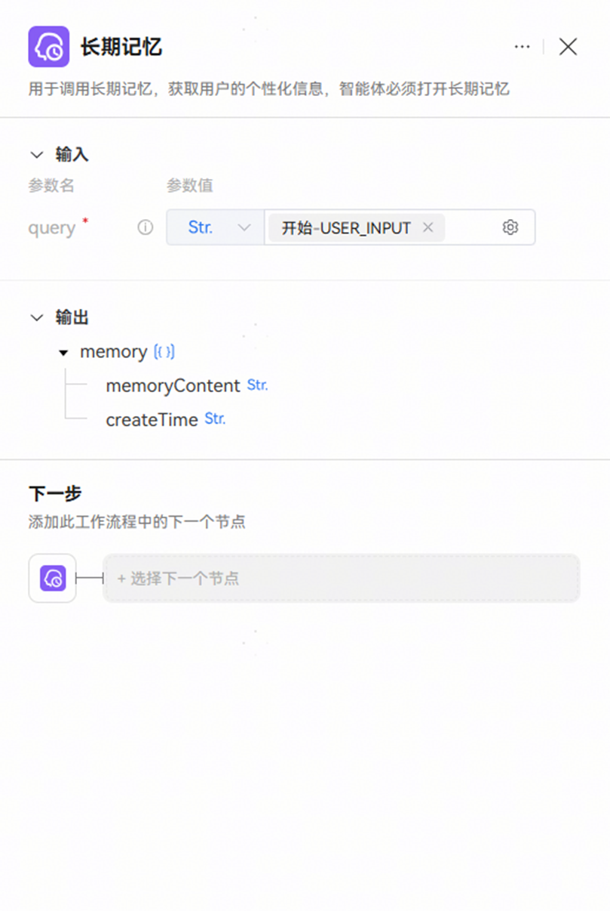

# 长期记忆节点

长期记忆节点需要召回智能体存储的长期记忆数据，所以试运行长期记忆节点或包含长期记忆节点的工作流时，需要关联一个已开启长期记忆功能的智能体。

如果智能体绑定了包含长期记忆节点的工作流，则智能体需要开启长期记忆功能，否则工作流执行会报错“This Bot does not have LTM enabled。”长期记忆节点用于在工作流中召回长期记忆中储存的用户个性化信息。

**节点说明**

在用户喜好推荐等个性化的场景中，通常需要基于用户画像、关键记忆点等个人数据进行推荐、筛选，让智能体效果更加贴合用户需求、提高用户体验。在工作流中，可以通过长期记忆节点调用智能体的长期记忆，查询智能体已记录的用户喜好、用户画像等信息，让工作流的效果更加个性化。

**长期记忆节点配置**

长期记忆节点的配置说明如下：

|  |  |
| --- | --- |
| <strong>配置</strong> | <strong>说明</strong> |
| <strong>输入参数</strong> | 输入参数固定为query，表示需要从长期记忆中匹配的关键信息，例如查询用户的喜好、性别、名字等信息。以生活助手的工作流为例，query可以固定为“你的性别是？”，基于用户性别推荐生活建议。  query可指定为引用或输入：  引用：引用上游节点的输出参数。  输入：指定为某个字符串。 |
| <strong>输出参数</strong> | 输出参数固定为memory，格式为Array`<Object>`，智能体会列举和query相关的长期记忆。如果下游节点引用了这个参数，智能体会总结长期记忆中的内容，并将总结内容作为下游节点的输入。 |

