# 输出节点

输出节点用于工作流中间过程的回答内容或思考内容输出。

## 节点说明

输出节点支持三种模式：输出模式、思考模式和暂态模式，单个节点只能选择使用一种模式。

* 输出模式用于输出中间过程回答内容，且此模式支持绑卡以卡片形式输出；
* 思考模式用于输出思考状态和思考内容，此模式不支持绑卡；
* 暂态模式用于当工作流执行时间较长时，系统将在智能体生成回复前，先向用户展示一段预设的提示语，以缓解用户等待焦虑；待真实返回结果开始输出后，该固定话术自动消失，实现自然、流畅的交互体验。此模式不支持绑卡。

## 输出模式

## 输出模式输出节点配置

|  |  |
| --- | --- |
| <strong>配置项</strong> | <strong>说明</strong> |
| <strong>输出</strong> | 输出节点支持引用前置节点的输入或者手动输入的赋值，支持选定参数类型，输出节点新增的参数不允许被后续节点引用。 |
| <strong>参考来源</strong> | 配置流式输出内容的参考来源，非流式输出不生效；字段格式按照小艺参考来源规范定义。回答内容中使用\<rsup\>index\</rsup\>，表示引用第index条参考来源（index从1开始）。 |
| <strong>用户问题建议</strong> | 自定义追问建议，字段格式按照小艺用户问题建议规范定义，配置后添加该工作流的智能体在对话时可展示自定义用户问题建议效果。 |
| <strong>回答内容</strong> | 设置需要添加到问题中的参数，参数值可以引用前置节点的输出参数，或指定文本内容。 |
| <strong>流式输出</strong> | 开启时，回复内容中支持流式输出的内容将跟随输出进度逐步输出；关闭时，回复内容将全部生成后一次性输出。 |
| <strong>会话上下文</strong> | 打开开关支持将输出组件的回答内容作为会话上下文带给大模型。 |
| <strong>输出流</strong> | 开关开启时，如果多个连续的输出节点配置了相同的输出流id，那么将会在同一流中答复输出内容，使用输出流时必须打开流式输出。 |


## 参考来源使用说明

1、点击参考来源右侧【+】，点击后自动添加一个reference参数。

注意：参考来源仅在流式输出时生效，使用时需打开流式输出开关；点击reference右侧小图标可查看数据示例及说明，开发者需按此结构规范返回。

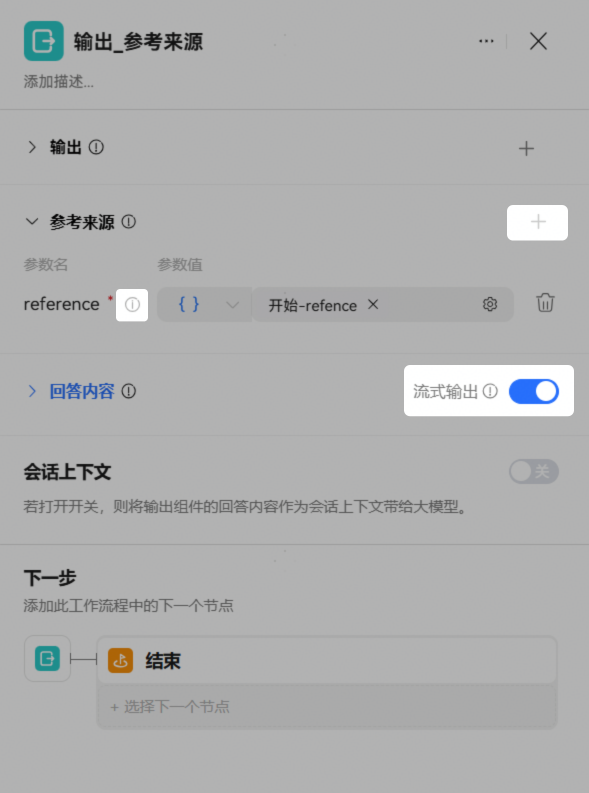

2、reference支持直接输入或引用前置节点输出。

方式1：直接输入

结构示例如下，根据实际替换参数值：

```
{
	"items": [{
		"params": {
			"name": "站点名称，如：环球网",
			"source": "站点来源类型，如：华为浏览器"
		},
		"card": {
			"type": "leftPictureRightText",
			"params": {
				"title": "网页标题",
				"subTitle": "站点名称-站点来源类型",
				"link": {
					"webLink": {
						"startMode": 0,
						"url": "//点击时的网页跳转链接"
					}
				}
			}
		}
	}]
}
```

参考来源输入格式有误时试运行时错误提示：

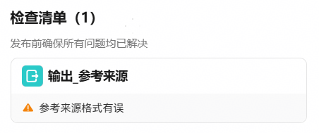

方式2：引用前置节点输出

例如可以结合代码节点获取参考来源内容：

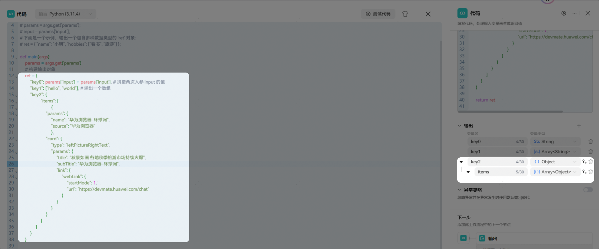

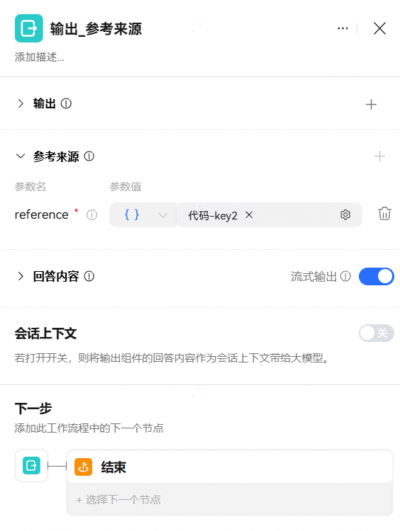

3、上架此工作流，上架后添加至智能体中使用。

参考来源手机端效果示例：

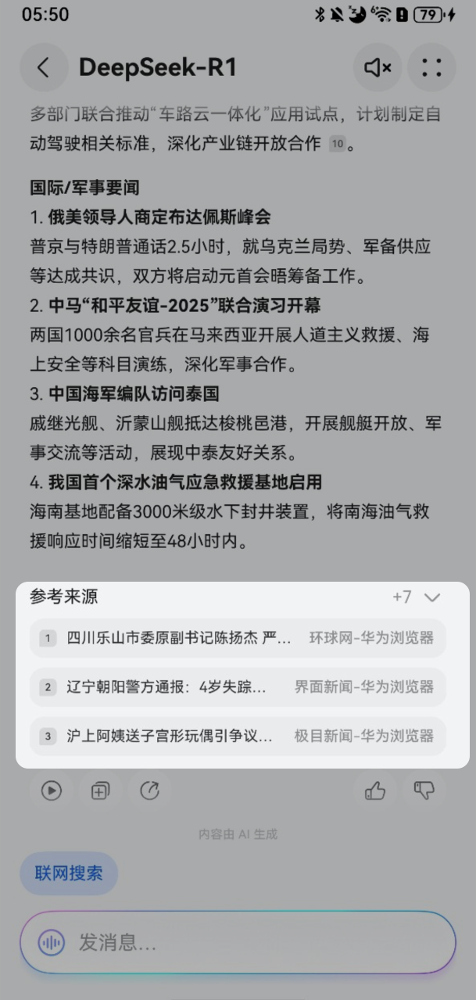

## 用户问题建议使用说明

1、点击用户问题建议右侧【+】，点击后自动添加一个suggestions参数。点击suggestions右侧小图标可查看数据示例及说明，开发者需按此结构规范返回。

注意：与智能体对话时，最多只会展示一组用户问题建议。如果工作流节点输出了用户问题建议，同时智能体编排中开启了用户问题建议开关，以工作流输出为准；如果工作流多个节点都配置了用户问题建议，那么只输出最后一个节点的用户问题建议。

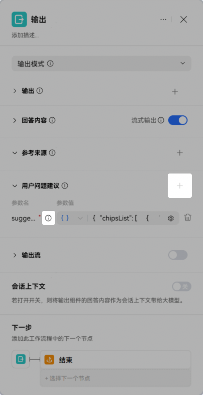

2、suggestions支持直接输入或引用前置节点输出。注意：与智能体对话时，最多只显示3条用户问题建议，每条追问建议不超过30个字符。

方式1：直接输入

结构示例如下，根据实际替换text的值：

```
{
  "chipsList": [
    {
      "content": "superlink://vassistant?text=如何缓解孩子的情绪压力？&startmode=recognize",
      "domain": "documentSummary"
    },
    {
      "content": "superlink://vassistant?text=孩子咬指甲的行为在多大年龄段最常见？&startmode=recognize",
      "domain": "documentSummary"
    },
    {
      "content": "superlink://vassistant?text=微量元素缺乏如何影响孩子健康？&startmode=recognize",
      "domain": "documentSummary"
    }
  ]
}
```

用户问题建议输入格式有误时试运行时错误提示：

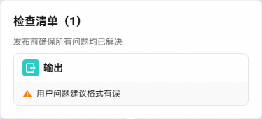

方式2：引用前置节点输出

例如可以结合代码节点获取用户问题建议内容：

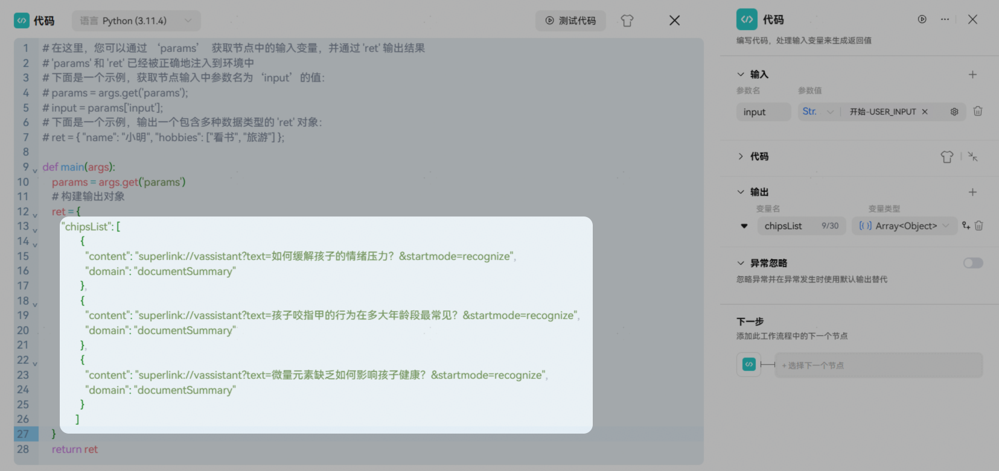

3、上架此工作流，上架后添加至智能体中使用。

用户问题建议使用效果示例：


## 思考模式

思考模式用于输出思考状态和思考内容，一般需要配合输出流id相同的输出模式输出节点或结束节点（用于输出回答内容）使用，思考模式的输出节点不支持绑定卡片。

## 思考模式输出节点配置

| 参数名称 | 参数含义 |
| --- | --- |
| <strong>输出流</strong><strong>开关</strong> | 默认开启，开启后可自定义思考状态、思考过程和输出流id。 |
| <strong>stepInfo</strong> | 思考状态，如“思考中”，输出思考内容时将展示此状态，注意：不可引用流式变量。 |
| <strong>streamingTextId</strong> | 输出流id，不可引用流式变量。输出流id且连续的组件将会同一流中输出。 |
| <strong>reasoningText</strong> | 思考内容，推荐使用流式输出内容。 |

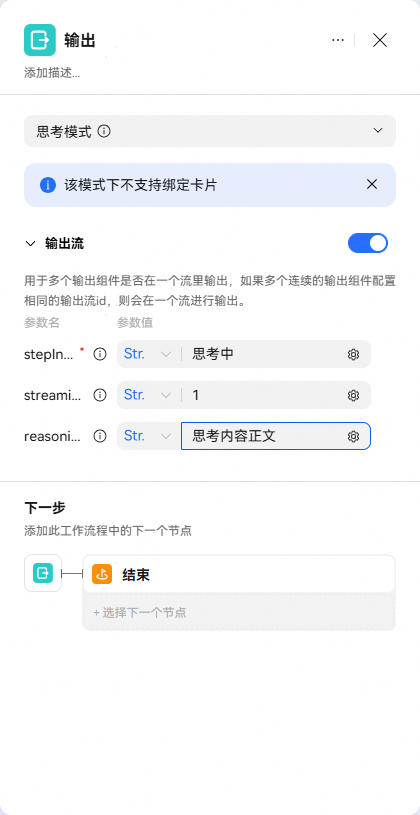

## 思考模式演示案例

当答复时期望同时需要输出思考过程与回答内容时，可以参照此编排：使用一个思考模式的输出节点输出思考状态及思考内容，一个输出模式的输出节点或结束节点，设置流式输出并打开输出流配置开关，用于输出回答内容，当两个节点配置的输出流id一致时，即可实现期望效果。

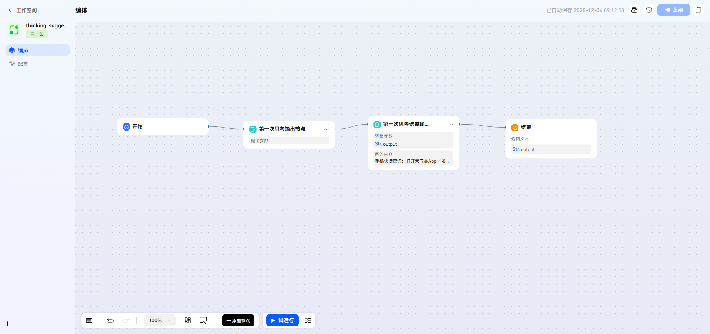

1、思考模式输出节点配置：

stepInfo：任务状态，如“思考中”，输出思考内容时将展示此状态。

streamingTextId：思考过程的输出流id，值需与输出回答内容的输出流id一致。

reasoningText：思考内容，推荐使用流式输出内容。

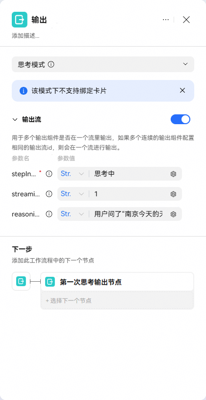

2、输出模式节点配置：

输出模式节点除正常输出回答内容外，还需要打开输出流配置开关，配置任务状态和输出流id。

回答内容：答复的正文内容。

stepInfo：任务状态，如“已深度思考”，回答正文内容时将展示此状态。

steamingTextId：回答内容的输出流id，其值需与输出思考过程的输出流id一致。

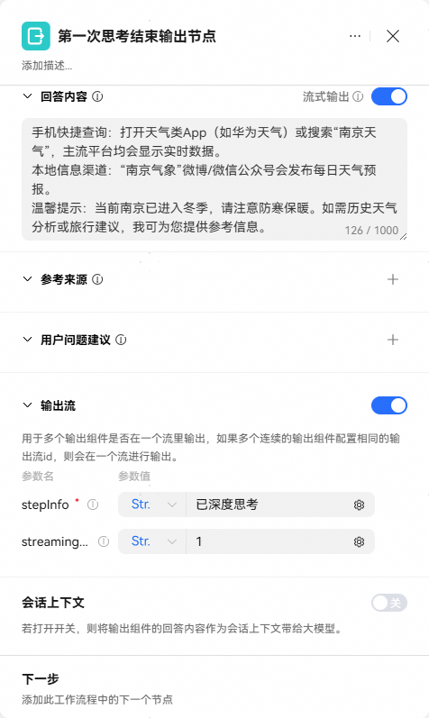

3、配置完成后上架此工作流，上架后将此工作流添加至智能体中使用。

使用效果示例：


## 暂态模式

暂态模式用于当工作流部分节点执行时间较长时，可以使用输出节点暂态模式先向用户展示一段预设的提示语，以缓解用户等待焦虑；待真实返回结果开始输出后，该固定话术自动消失，实现自然、流畅的交互体验。

## 暂态模式配置

| 配置项 | 说明 |
| --- | --- |
| <strong>输出</strong> | 输出参数，支持引用前置节点参数或者直接输入文本，输出节点的参数不允许被后续节点引用。 |
| <strong>回答内容</strong> | 安抚提示语，支持引用输出参数或者直接输入文本。 |

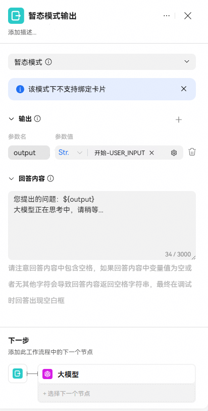

## 暂态模式演示案例

1、工作流编排：

本工作流依赖大模型节点生成结果，但节点响应时间较长，故在大模型节点前增加暂态模式的输出节点。

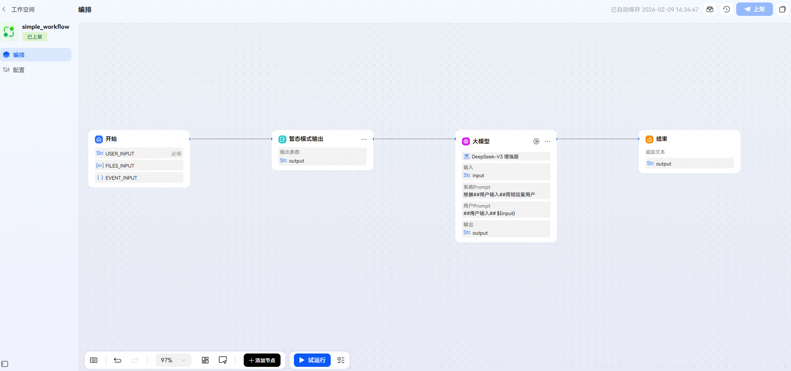

2、暂态模式输出组件配置：

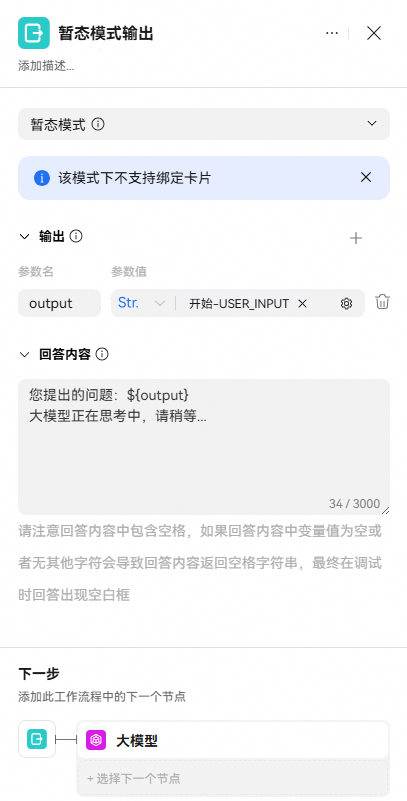

3、配置完成后上架此工作流，上架后将此工作流添加至智能体中使用。

使用效果示例：

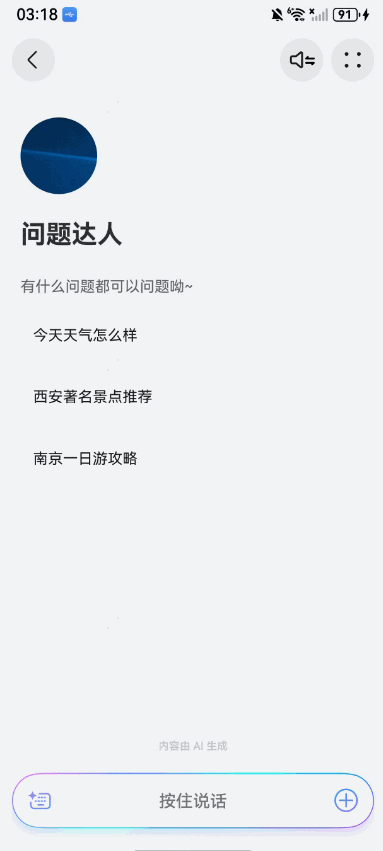