# 插件节点

插件节点用于在工作流中调用插件运行指定工具。

插件是一系列工具的集合，每个工具都是一个可调用的API。插件广场上架的插件或已上架的团队插件支持以节点形式被集成到工作流中，拓展智能体的能力边界。

## 添加使用云插件节点

在工作流画布下方单击添加节点，在弹出的节点面板中单击插件节点，并选择希望调用的插件。

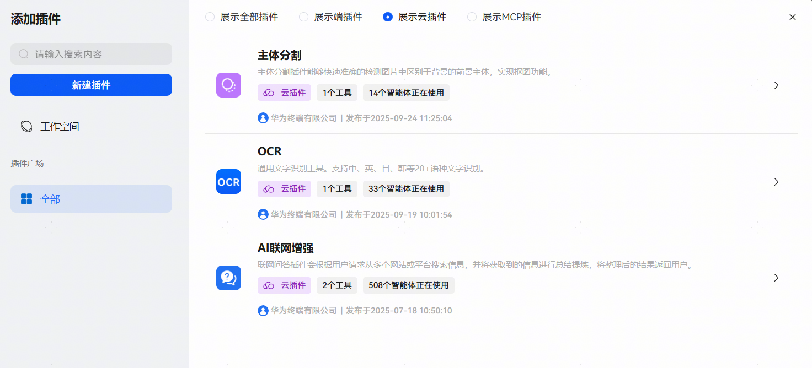

**配置插件节点**

插件节点的输入和输出结构取决于工具定义的输入输出结构，不支持自定义设置。在插件节点中开发者需要为必选的输入参数指定数据来源，支持设置为固定值或引用上游节点的输出参数。插件节点运行时，会调用工具处理输入参数，并以工具定义的输出结构输出处理后的数据。

## 添加使用端插件节点

在添加端插件的时候，同一个工具可以添加多个版本，用于兼容不同端侧版本下，工作流能够选择正确的工具版本。

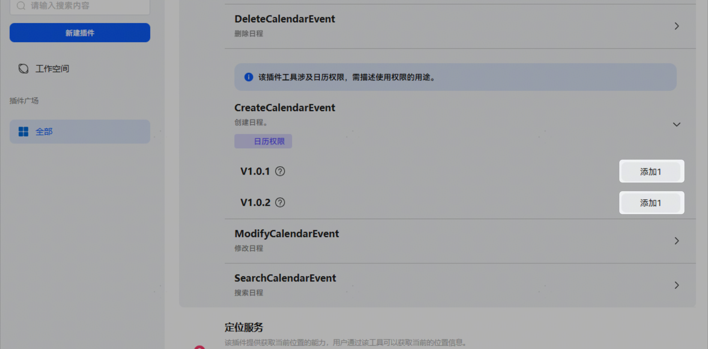

## 端插件节点设置

在端插件节点的详情界面，点击设置。

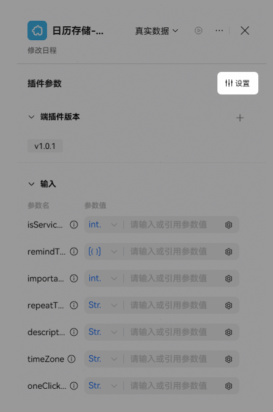

【执行方式】：可设置立即执行和打断播报两种类型。

* 立即执行：清空已下发指令，立即执行该指令。
* 打断播报：系统提供了“打断播报”功能。使用时必须开启“立即执行”开关方可生效。建议在涉及音视频播放的场景使用。

## 配置多版本端插件

当选择端插件时，选中两个及以上的版本时，界面就会呈现每个版本的输入和输出信息，开发者可以使用引用前置节点的参数作为输入，端插件的输出则需要配合代码组件一同使用。

当选择端插件时，会出现系统输出code和appName。

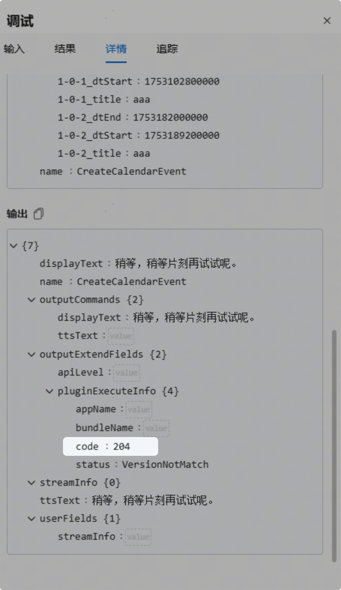

code变量可以用于判断端插件是否命中，当code为200时，代表插件命中，当code为204时，代表插件没有命中，开发者可以配合选择器组件对code的返回做判断，针对插件是否命中，做后续逻辑的处理。

appName变量则代表插件命中时，返回的应用名称。（由于平台侧在调试时未安装应用，所以在调试过程中，code肯定是204）。

**端插件多版本和代码组件的配合使用**

当使用选择器组件对code进行判断命中场景下，可以连接代码组件对于插件返回的结果进行聚合，使用代码组件对不同版本工具的命中情况做判断，输出想要的结果，用于后续节点的使用。

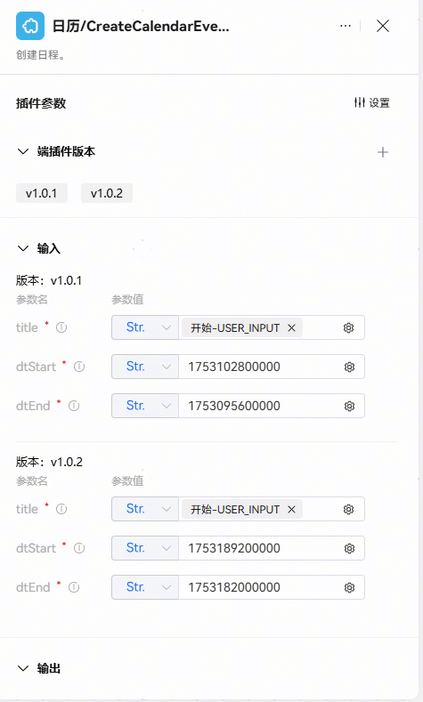

在使用代码组件对端插件结果聚合时，可以参考下图示例：

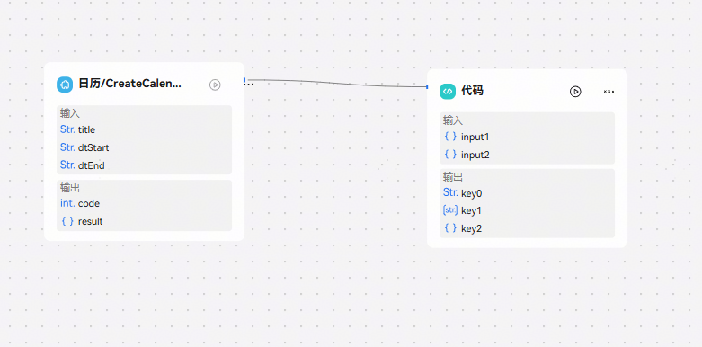

上图展示了引用关系链。

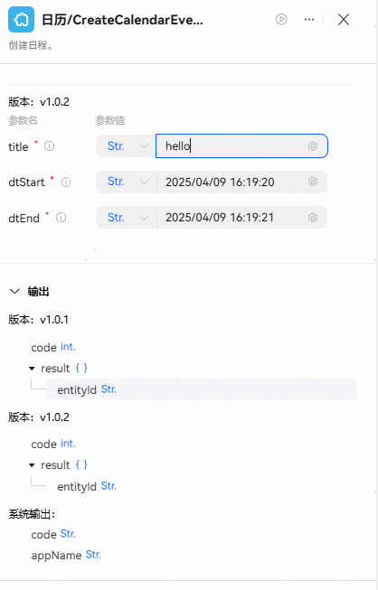

上图为插件组件的示例图：插件组件在选择多版本的情况下，会输出两组不同的值。

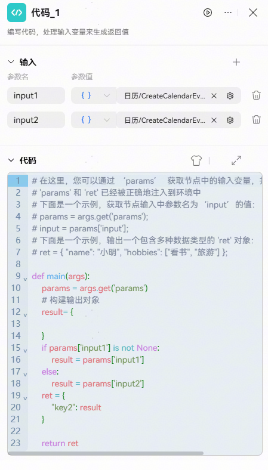

上图为代码组件的示例图：代码组件引用前置节点两个版本插件返回结果为input1和input2，在代码组件中对结果进行判断，输出正常返回的结果。

开发者可以根据自己的需求，使用代码组件对插件结果进行聚合。

当使用代码组件引用端插件结果进行汇总时，由于在平台侧无法调试获取到端插件的执行结果，在试运行时会有提示信息：当前工作流中存在端插件，无法完成在线测试，请在真机测试中完成端到端验证。

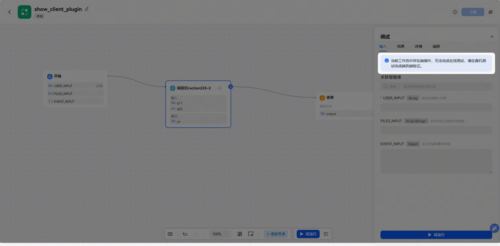

开发者针对这种情况，可以使用选择器组件针对code为204时，端插件不命中的情况，绕过代码组件的引用端插件的分路，让工作流能够试运行成功得以上架，而命中的分路可以在端侧进行验证。

## 模拟集使用

在工作流中调用插件节点时，支持使用Mock数据进行调试，无需依赖真实接口，提升开发效率。

如下图所示，在插件配置框中点击下拉按钮，选择使用模拟集数据，工作流运行时，插件节点将响应配置的模拟数据。创建模拟集可参考 [云插件模拟集](/docs/distribute/xiaoyi/cloud-plug-in-0000002471344189/cloud-plug-mock-0000002517832252)、[端插件模拟集](/docs/distribute/xiaoyi/end-plug-in-0000002471264313/end-plug-mock-0000002549594931)。

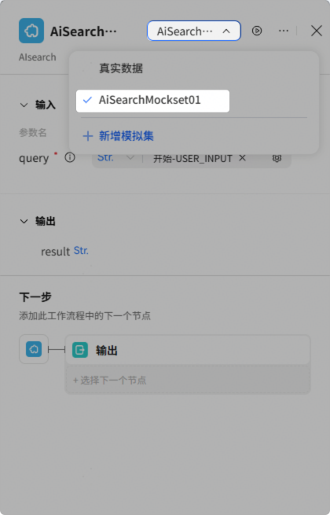

## 单节点调试

插件组件支持单节点调试（端插件不支持单节点调试），单节点调试时不要求连线完整，调试输入参数支持直接输入或引用，调试完成后展示此次调试的试运行结果。

如下图所示，点击调试按钮即可拉起执行：

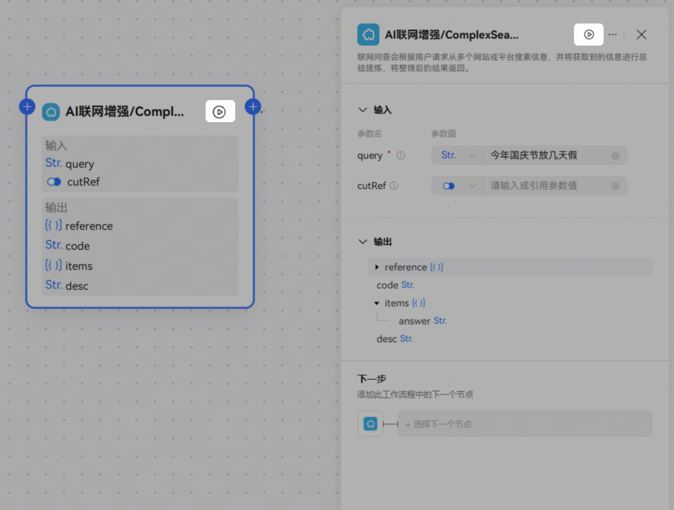

执行结束后，正常返回此次调试的结果。

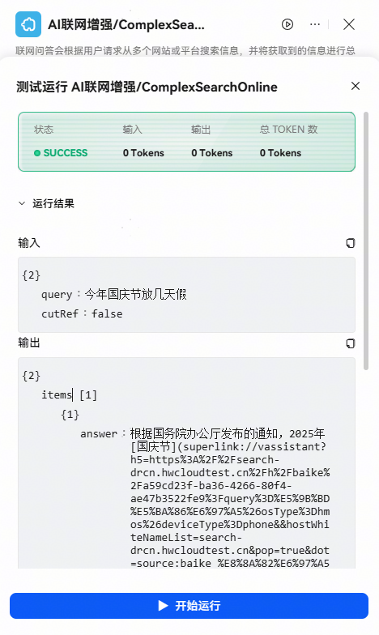

## 插件版本更新

工作流中添加的插件如果有版本更新，再次进入工作流，插件会自动更新版本。

注意：此处自动更新到插件新版本的工作流为测试态，且仅在工作流试运行时会执行新版本插件。如果工作流已被智能体或其他工作流引用，需更新发布工作流后在引用资源中升级到新版本工作流体验新版本插件。

## FAQ

1、智能体答复内容来自工作流中的流式云插件结果，智能体答复时无流式输出效果？

答：请检查用于回答的输出或结束节点是否**开启流式输出开关**，若开关关闭，答复节点接收到插件全部帧数据后才会答复。

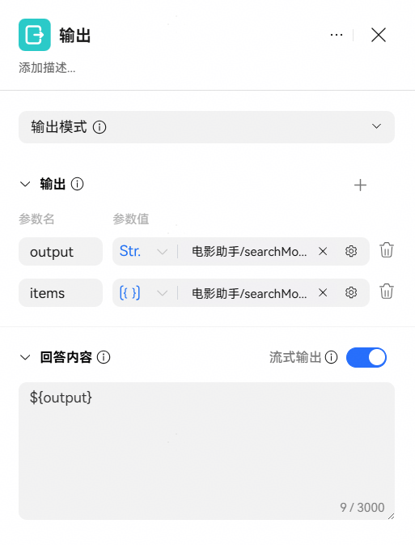

2、工作流中，流式云插件输出有 streamContent 字段，且插件有响应结果（streamContent不为空），但后续其他节点引用该字段时，获取不到插件结果？

答：流式云插件注册时含默认输出参数streamInfo（string类型），工作流中使用时，后续节点若需拿到插件的流式结果，必须通过引用 streamInfo 字段获取。

