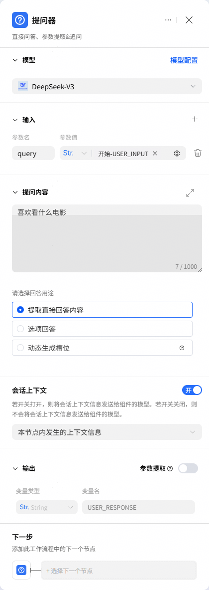
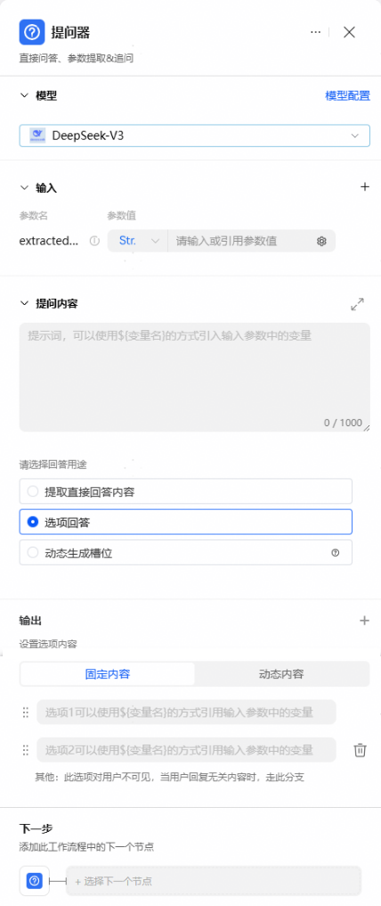
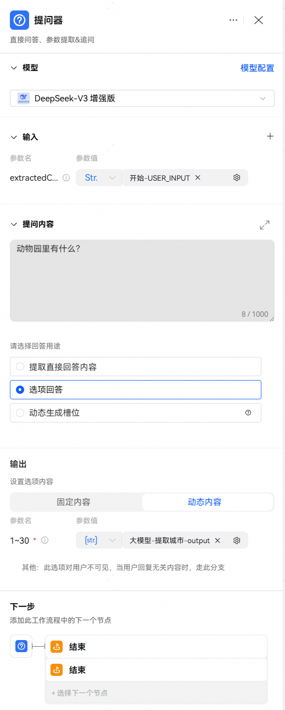
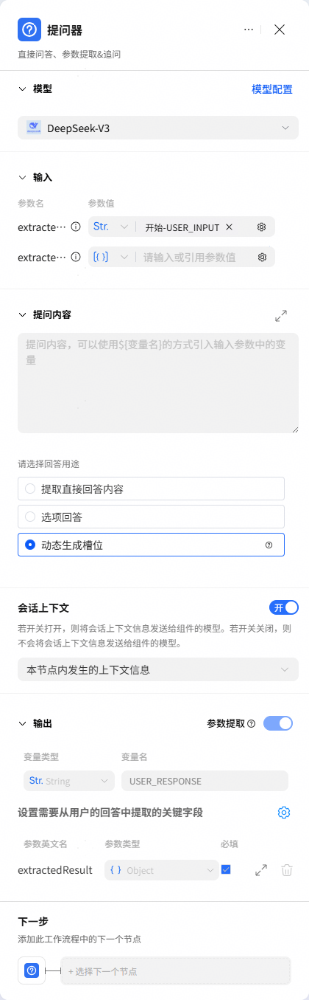
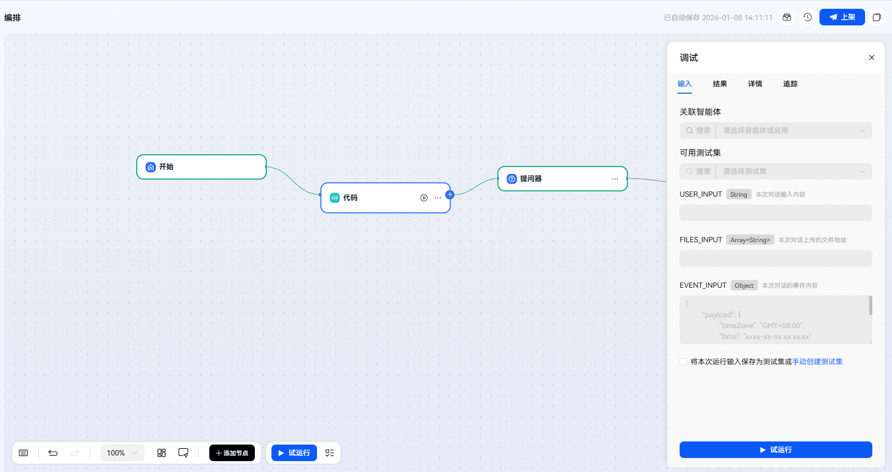

# 提问器节点

提问器节点用于主动收集用户的信息、明确用户意图。

## 节点说明

工作流中的某些节点依赖用户的信息输入或明确意图，提问器节点会以自然语言问题、选项问题以及动态生成问题与槽位的方式收集指定的信息，让对话更加顺畅。如果智能体对话中触发了包含问答节点的工作流，智能体会以指定问题向用户提问，并等待用户回答。

问答节点支持以下三种方式收集用户的信息：

|  |  |
| --- | --- |
| <strong>收集方式</strong> | <strong>说明</strong> |
| <strong>提取直接回答内容</strong> | 节点中指定一个开放式问题，用户直接以自然语言回复问题，智能体会提取用户回复，或提取回复中的关键字段。如果用户的响应和智能体预期提取的信息不匹配，例如缺少必选的字段，或字段数据类型不一致，智能体会主动再次询问，直到获取到关键字段。 |
| <strong>选项回答</strong> | 问答节点预置固定选项，用户以固定选项回复问题，通常用于聊天式的智能体中，推进对话进度、增强互动性。开发者可以将用户选择的操作设置为选项，帮助用户在指定范围内快速回复，也可以将常见的意图作为选项，作为用户输入的提示信息。每个选项通常对应不同的工作流分支处理，用户在选项之外的回复也需要有分支处理，例如可以引导用户再次选择或执行兜底逻辑。 |
| <strong>动态生成槽位</strong> | 该方式用于实现特定智能体动态生成追问问题及槽位的功能，需在提问器节点上游配置代码节点，将代码输出变量作为输入参数，驱动智能体提取信息、生成追问问题并填充对应槽位。 |

## 提取直接回答内容

## 配置

1、在工作流画布下方工具栏中，添加提问器节点。

2、为提问器节点添加以下配置。

3、将问答节点与其他节点连接，形成完整的调用链路。

直接回答模式下，问答节点下游无需设置多个分支分别处理用户选择。

|  |  |
| --- | --- |
| <strong>配置项</strong> | <strong>说明</strong> |
| <strong>模型</strong> | 选择执行此节点的模型。 |
| <strong>输入</strong> | 设置需要添加到问题中的参数，参数值可以引用前置节点的输出参数，或设置为固定文本内容。 |
| <strong>提问内容</strong> | 设置智能体在对话中向用户发起的问题内容。  直接回答模式下，问答内容通常是一个无固定答案的开放式的问题。 |
| <strong>回答用途</strong> | 设置用户回答问题的方式，此处应设置为提取直接回答内容。 |
| <strong>会话上下文</strong> | 控制历史对话信息是否在当前的请求中，默认关闭。支持选择两种方式。  智能体全局的上下文信息：与智能体对话时用户可见的会话信息；(默认)  本节点内发生的上下文信息：该意图分类节点的输入输出。 |
| <strong>输出</strong> | 提取直接回答内容模式下，问答节点的输出默认为USER\_RESPONSE变量，表示用户回复的具体内容。  你也可以开启从回复中提取字段，由模型从用户回复中自动提取关键信息并保存为变量，便于下游节点引用。 |
| <strong>参数提取</strong> | 开关开启后，提问器将提取配置的关键字段。  核心逻辑：提取出全部参数有效值则运行结束，缺值则追问；  提取来源：参数引用、用户回答内容、默认值（按优先级依次匹配）。  优先级规则：  参数引用有值，直接复用其值，否则从用户回答内容中抽取 ；  默认值作用：仅当达到最大回答次数，仍未提取到有效值时，才使用默认值填充。 |
| <strong>最多回答次数设置</strong> | 允许用户回答问题的最大次数，当用户的多次回答中获取不到必填的关键字段时，该工作流将会终止运行。 |



## 选项回答

## 配置

1、在工作流画布下方工具栏中，添加提问器节点。

2、为提问器节点添加以下配置。

3、将问答节点与其他节点连接，形成完整的调用链路。

问答类型为选项回答时，应为每个分类都设置后续的处理节点。问答节点应设置兜底策略，若意图未匹配到此处定义的任何分类，则流转到兜底策略处理。目前支持固定内容选项和动态内容两种方式：固定内容选项需要手动配置固定的几个选项；动态内容选项需要引用一个字符串数组，字符串数组可以通过大模型节点提取或代码节点生成，提问器会根据数组内容自动生成选项（注意：选项内容不能超过30，超过部分会被截断）。

|  |  |
| --- | --- |
| <strong>配置项</strong> | <strong>说明</strong> |
| <strong>模型</strong> | 选择执行此节点的模型。 |
| <strong>输入</strong> | 设置需要添加到问题中的参数，参数值可以引用前置节点的输出参数，或指定内容。 |
| <strong>提问内容</strong> | 设置智能体在对话中向用户发起的问题内容。 |
| <strong>回答用途</strong> | 设置用户回答问题的方式，此处应设置为选项回答，并填写选项内容。  此处设置的选项在对话中会展示为卡片选项形式，用户需要直接点击按钮或回复对应的内容来回答问题。 |
| <strong>选项内容</strong> | 问答节点选项回答模式提供的可选项，支持设置选项内容。 |

固定内容选项



动态内容选项



## 动态生成槽位

## 配置

1、在工作流画布下方工具栏中，添加提问器节点。

2、为提问器节点添加以下配置。

3、将问答节点与其他节点连接，形成完整的调用链路。

问答类型为动态生成槽位时，问答节点上游应设置代码块，并且代码块节点的输出变量为问答节点的输入参数，即动态提取的参数信息，问答节点下游无需设置多个分支分别处理用户选择。

|  |  |
| --- | --- |
| <strong>配置项</strong> | <strong>说明</strong> |
| <strong>模型</strong> | 选择执行此节点的模型。 |
| <strong>输入</strong> | extractedFields：设置需要添加到问题中的参数，参数值可以引用前置节点的输出参数，或指定内容。其中，根据extractedFields参数值动态提取信息，生成追问问题并映射槽位。  extractedContent：若有值，模型将优先从extractedContent中抽取内容，若未抽取到全部参数，将发起追问并从用户回答中抽取。 |
| <strong>会话上下文</strong> | 控制历史对话信息是否在当前的请求中，默认关闭。支持选择两种方式。  智能体全局的上下文信息：与智能体对话时用户可见的会话信息；(默认)  本节点内发生的上下文信息：该意图分类节点的输入输出。 |
| <strong>回答用途</strong> | 设置用户回答问题的方式，此处应设置为动态生成槽位。 |



## extractedFields说明

|  |  |  |
| --- | --- | --- |
| 参数名 | O/M | 参数描述 |
| fieldName | M | 必填，参数名 |
| description | M | 必填，参数详细描述 |
| cnFieldName | M | 必填，参数中文名称，生成首次问题以及后续追问问题会根据参数中文名称生成 |
| fieldType | M | 必填，参数类型，支持基本数据类型 ["String", "Boolean", "Float", "Integer"] |
| required | O | 是否必填，必选参数必须不断追问，直至获取到参数值或达到最大回答次数，默认为true。 |
| defaultValue | O | 参数的默认值，如果未提取到有效值，则使用默认值。 |

extractedFields字段的示例：

```
{
	"extractedFields": [{
			"fieldName": "depart_time",
			"description": "航班的起飞时间",
			"cnFieldName": "起飞时间",
			"fieldType": "String",
			"required": true,
			"defaultValue": "2025年1月8日12:00"
		},
		{
			"fieldName": "arrive_time",
			"description": "航班的到达时间",
			"cnFieldName": "到达时间",
			"fieldType": "String",
			"required": false
		},
		{
			"fieldName": "check_in_time",
			"description": "航班的值机时间",
			"cnFieldName": "值机时间",
			"fieldType": "String",
			"required": true
		}
	]
}
```

## 效果示例

