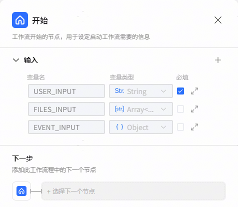
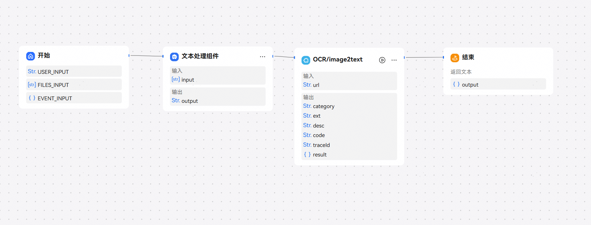
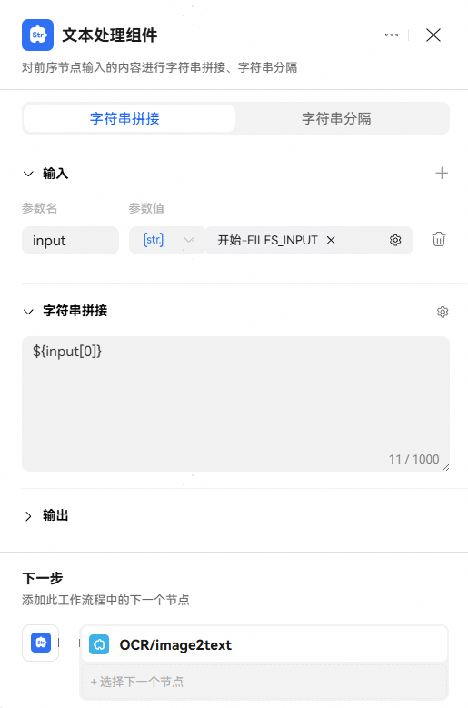
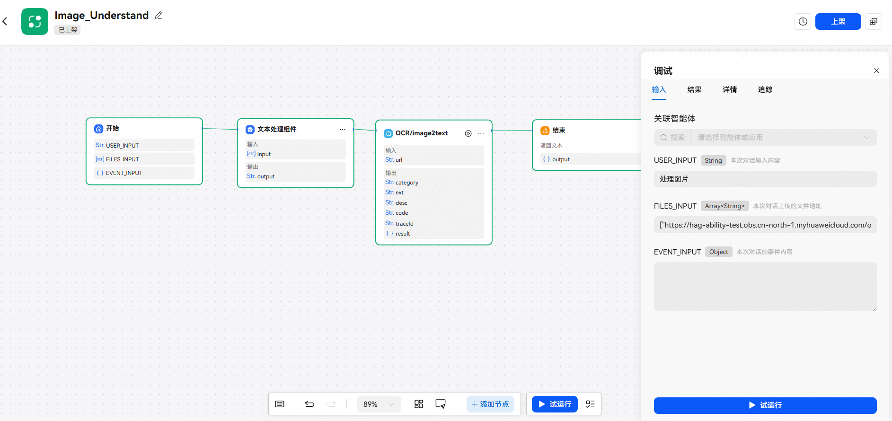

# 开始节点

开始节点是工作流的起始节点，用于设定启动工作流需要的输入信息。开始节点只有输入参数，没有输出等其他参数。开始节点中默认有一个输入参数USER\_INPUT，一个默认的输入参数FILES\_INPUT（非必填），和一个默认的输入参数EVENT\_INPUT（非必填）。表示用户在本轮对话中输入的原始内容。开发者也可以按需添加其他自定义输入参数。

开始节点配置说明如下：

## 输入参数说明

1、自定义参数：开始节点支持添加String、Boolean、Integer、Time、Object类型自定义参数，注意：因无法从用户输入中接收自定义参数内容，所以有自定义输入参数的工作流，不支持在工作流模式的智能体中使用，仅支持试运行工作流。

2、USER\_INPUT：将工作流添加到智能体中使用时，USER\_INPUT将接收用户发送的文本内容。

3、EVENT\_INPUT：接收触发智能体的事件消息，在动态快捷指令（详解参考[动态快捷指令](/docs/distribute/xiaoyi/ability-expansion-function-introduction-0000002437625858/quick-instructions-0000002471344125#section114821593712)），或Webhook事件触发器执行工作流任务时使用（详解参考[触发器](/docs/distribute/xiaoyi/trigger-0000002437625878/trigger-webhook-0000002525203283)）。

4、FILES\_INPUT：工作流添加到智能体中使用时，打开智能体“输入文件设置”中支持照片、拍摄或文件按钮，点击上传图片或文件时，FILES\_INPUT将接收用户发送的图片或文件。

## 处理非文本请求工作流演示案例

FILES\_INPUT是一个Array`<string>`类型参数，一般图片处理类工具需接收string类型入参，此时我们可以借助文本处理组件取出目标图片或文件链接进行传递。如图所示：

文本处理组件选择字符串拼接方式，输入引用FILES\_INPUT参数，通过$\\{input[0]\\}取出目标图片或文件链接并传递给后续节点处理，涉及多文件或多图场景，可通过多个文本处理组件分别提取。

试运行时，FILES\_INPUT输入：["https://xxx.jpg","https:xxx.jpg"](仅示例，实际需替换链接地址）调试，调试完成后上架工作流。将工作流添加到智能体中使用时，直接点击上传文件按钮发送图片或文件即可，多文件时会根据图片发送顺序取出。

