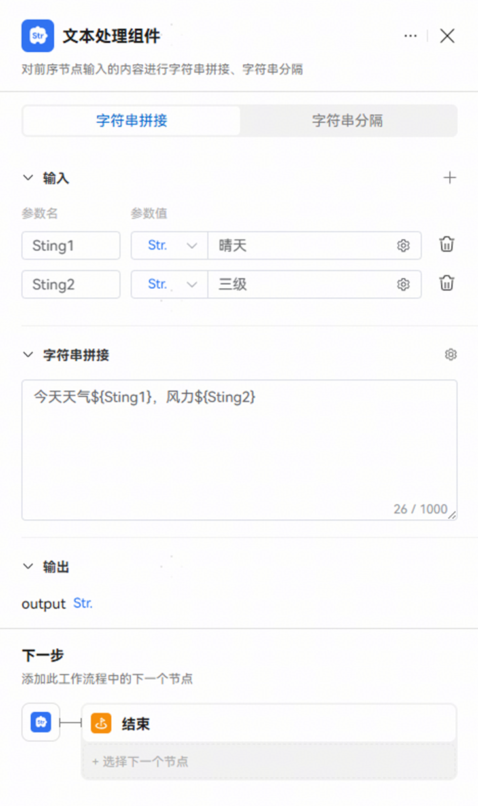
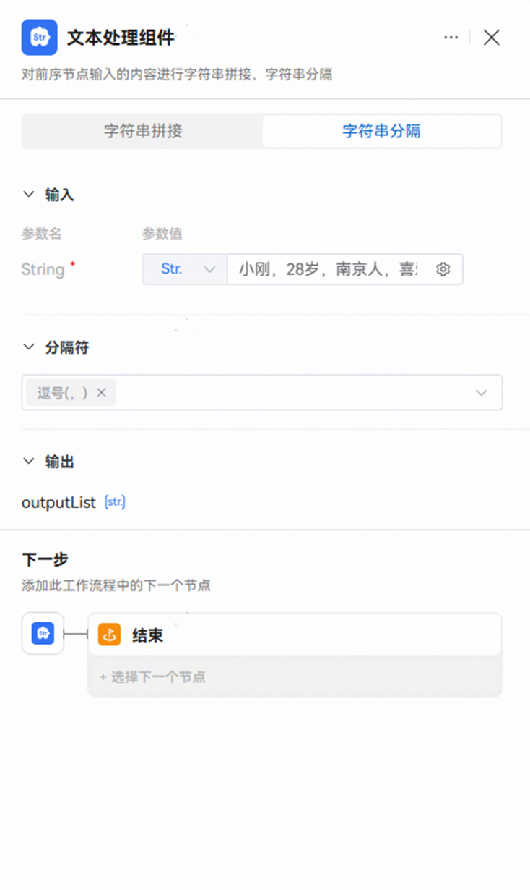

# 文本处理节点

文本处理节点用于将输入数据进行字符串处理，适用于内容二次总结、文本拼接、文本转义等场景，例如将关键字拼接为prompt。

文本处理节点的处理方式支持字符串拼接和字符串分隔。

|  |  |
| --- | --- |
| <strong>处理方式</strong> | <strong>说明</strong> |
| <strong>字符串拼接</strong> | 将输入中指定的内容根据一定顺序拼接为一个字符串，用于组合前置节点的关键信息，作为后置节点的输入。  支持引用输入参数中的变量，引用格式包括$\\{变量名\\}、$\\{变量名.子变量名\\}、$\\{变量名[数组索引]\\}。直接引用数组类型的参数时，默认通过逗号连接数组中的每个元素，你也可以引用数组中指定位置的元素。 |
| <strong>字符串分隔</strong> | 将输入中的内容用指定分隔符拆分为字符串数组，便于后续节点对不同内容进行差异化处理。  开发者需要指定分隔符来拆分内容，支持开发者自定义分隔符，例如设置多字符的分隔符，例如...。 |

字符串拼接示例：

输入示例：String1:晴天 String2:三级

输出示例："今天天气晴天，风力三级"

字符串分隔示例：

输入示例：小刚，28岁，南京人，喜欢篮球、看书。

输出示例：[ "小刚", "28岁", "南京人", "篮球、看书"]

