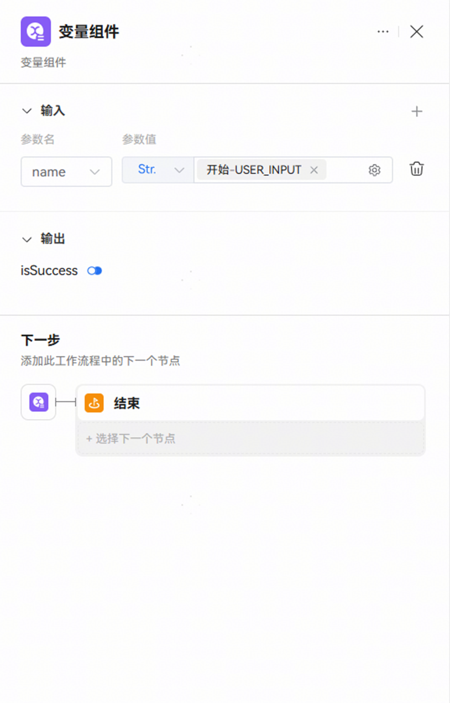

# 变量组件

变量节点是工作流中用于修改和存储用户变量值的节点。

**节点说明**

变量节点需要读取智能体设置的变量数据，所以试运行包含变量节点的工作流时，需要指定一个拥有变量且变量相应开关打开的智能体。

通过变量节点，将特定的值赋给变量，可以实现数据的动态更新和传递，使工作流能够根据实时数据做出相应的处理和决策。变量节点应用广泛，例如：

**存储中间结果**：在工作流中，将中间计算或处理的结果通过变量节点存储到变量中，以便后续节点使用。

**记录用户输入**：在与用户交互的工作流中，用户的输入信息是后续处理的重要依据。通过变量节点，可以将用户的输入存储到变量中。

**获取系统变量**：在工作流中，通过变量节点，可以将系统变量赋值给用户变量。在用户交互过程中，可以实时获取自动产生的系统变量数据。

**控制流程分支**：在工作流中，通常需要根据不同的条件来决定执行不同的分支流程。变量节点可以用来设置控制流程分支的条件变量，通过赋予变量不同的值，来引导工作流走向相应的分支。
