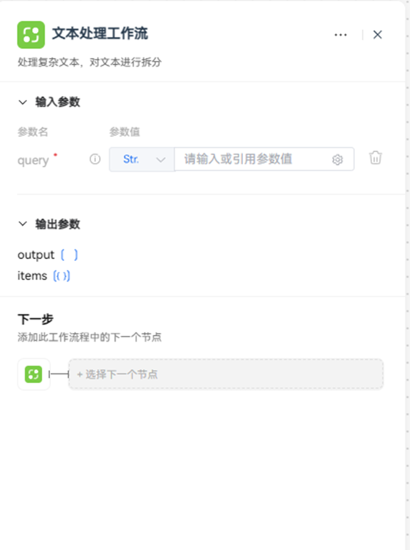
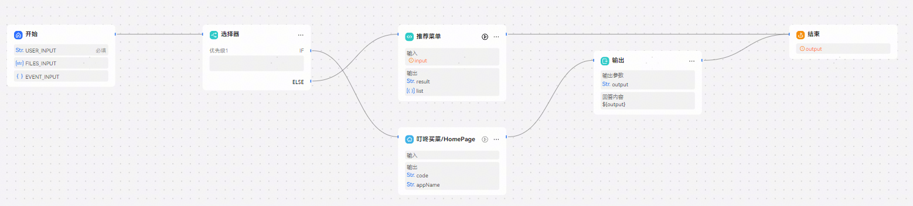
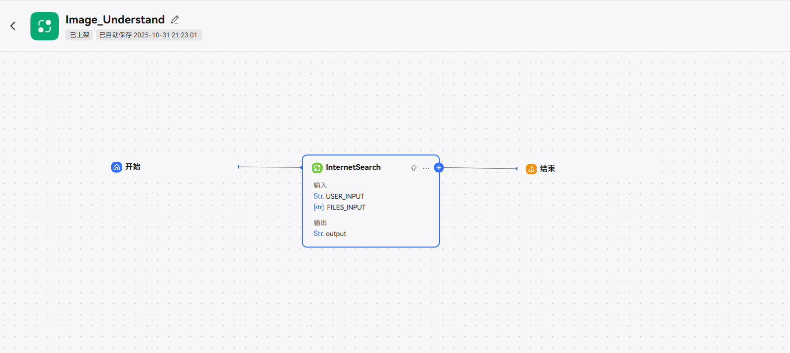

# 工作流节点

平台提供工作流节点，实现工作流嵌套工作流的效果。

## 节点说明

在一个工作流中，开发者可以将另一个工作流作为其中的一个步骤或节点，实现复杂任务模块化。例如将常用的、标准化的任务处理流程封装为不同的子工作流，并在主工作流的不同分支内调用这些子工作流执行对应的操作。工作流嵌套可实现复杂任务的模块化拆分和处理，使工作流编排逻辑更加灵活、清晰，更易于管理。

## 输入与输出

工作流节点的输入和输出结构取决于子工作流定义的输入输出结构，不支持自定义设置。在工作流节点中开发者需要为必选的输入参数指定数据来源，支持设置为固定值或引用上游节点的输出参数。

## 工作流详情和工作流解散

工作流详情：打开浏览器新页签进入此工作流节点对应的工作流详情页。

工作流解散：解散后，子工作流中的节点会重新添加到当前画布中，被解散的子工作流不会被删除，依然保留在智能体、应用内、资源库中。

完成解散后当前工作流：

子工作流解散后，刷新页面或重进此工作流之前，可通过【撤销】键恢复。

## 子工作流版本更新

工作流节点添加的工作流，如果有版本更新，需要在引用该工作流中点击升级按钮升级到最新版本，否则生效的仍是老版本。

