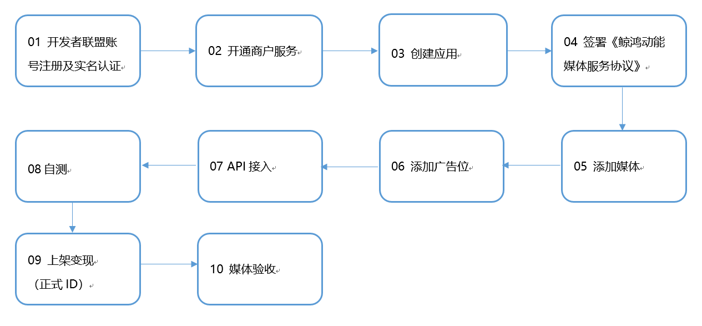
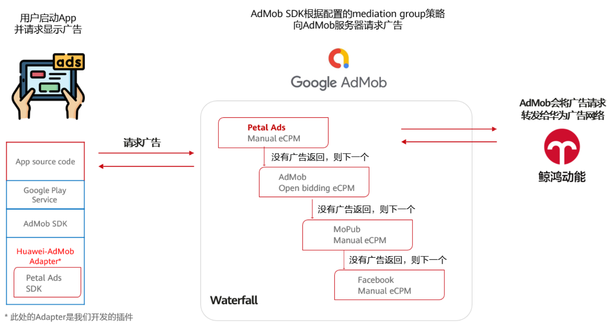
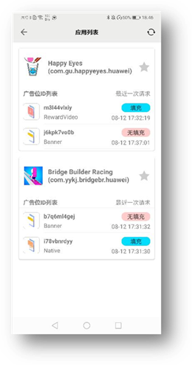
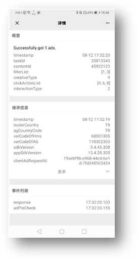

#### 媒体接入方案

Petal Ads支持Android应用通过SDK集成变现，快应用/快游戏API集成变现两种方式：

#### SDK集成变现

流量变现服务的**安卓应用SDK集成**变现需要完成以下几个步骤：

#### API集成变现

流量变现服务的**快应用/快游戏API**集成变现接入需要完成以下几个步骤：

#### 应用内H5变现

若您需要在App的Web页面呈现广告，请集成鲸鸿动能广告JavaScript API。您可以根据您的需求场景选择不同的广告形式进行集成：原生广告、Banner广告、激励广告、插屏广告。在集成鲸鸿动能广告JavaScript API之前，您需要先完成[集成HMS Core SDK的操作](https://developer.huawei.com/consumer/cn/doc/development/HMSCore-Guides/publisher-service-integrating-sdk-0000001050066913)。

#### Mediation变现

支持其他变现平台接入SDK，同时华为也支持Mediation插件，帮助开发者快速接入。

#### SDK自助测试工具

**适用场景**

您可以通过SDK自助测试工具检测自己的App是否正确集成了Petal Ads SDK、广告请求和广告返回是否成功、广告展示是否正常以及广告事件是否正常上报。

如果广告请求异常或未正确获取广告，SDK自助测试工具会提供相应的解决建议。

**下载方式**

您可以通过SDK自助测试工具检测自己的App是否正确集成了鲸鸿动能SDK、广告请求和广告返回是否成功、广告展示是否正常以及广告事件是否正常上报。如果广告请求异常或未正确获取广告，SDK自助测试工具会提供相应的解决建议。具体详情请扫描下方二维码或点击[链接下载APK](https://h5hosting.dbankcdn.com/cch5/pps-jssdk/app/HuaweiSdk-Helper-release.apk)。

此APK仅支持Android 4.4~10的设备。

 
