#### AppDownloadButton下载按钮控件

**场景描述**

为了提高应用下载类原生广告的转化效果，我们提供了AppDownloadButton下载按钮控件，当用户点击此下载按钮后广告无需跳转至广告落地页，可以直接下载安装推广的应用。

下载安装过程中按钮实时刷新进度，用户可进行暂停/继续，安装完成后可点击直接打开应用。

**方案/注意事项**

* 您需遵循应用分发所在区域的广告法规定，建议留意用户体验反馈意见，再决定是否使用下载按钮控件。
* 集成13.4.41.304及以上版本SDK。

**效果呈现**

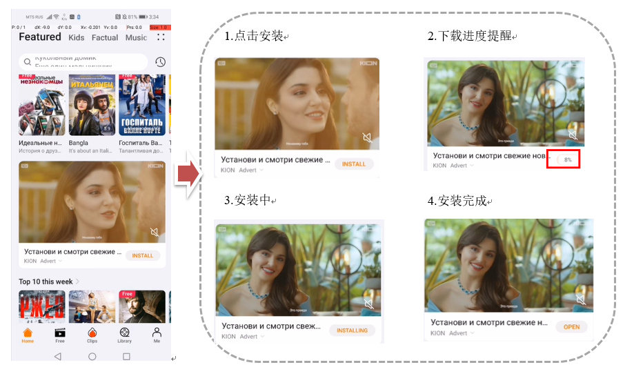

#### 买变一体的客户收益提升

**场景描述**

Petal Ads 开发了买卖量一体收益保障功能，自动识别既变现又买量的开发者，帮助其获得更多收益。当开发者变现收益和推广消耗不成正比，即ROI较低时，为帮助合作伙伴持续获得用户增涨，流量增涨，Petal Ads将保障其填充和eCPM，提升其ROI，助力其获得更多的收益。

**方案/注意事项**

开发者可将一部分收益作为用户流量增涨的投资，Petal Ads 将保障开发者的ROI。

**以下为注意事项**：

* 此规则是只适用于APP买量推广和变现。
* 买量推广的APP 和 变现的APP包名需要一致。
* 买量消耗只统计展示网络消耗。

#### 媒体广告位底价eCPM设置

**场景描述**

为提升媒体整体变现的eCPM,过滤部分底价广告主薅量，媒体侧可在SSP-Potal后台可以为展示位设置eCPM底价，即投放至此展示位的广告所需达到的预估每千次展示费用底限；设置eCPM底价时，支持分国家区域设置，未单独设置的国家/地区与全球eCPM 底价保持一致。

**方案/注意事项**

按照不同展示形式：在对eCPM较低的横幅广告和原生广告可进行合理底价设置（可参考该广告位形式在大盘的eCPM均值设置）可设置全球底价,再细化按照不同国家维度，针对流量较大，经济能力较好的国家可设置较高于eCPM均值。

**以下为注意事项**：

* 若预估eCPM低于您设置eCPM 底价，则不会返回该广告。
* 设置过高的eCPM 底价可能会影响到您的广告返回率，进而影响收入，请谨慎使用。
* 根据广告位后期数据表现，应灵活调整底价。

**效果呈现**

广告位底价调整：9.12日调整底价，eCPM得到显著提升，从0.5提升至0.9左右。

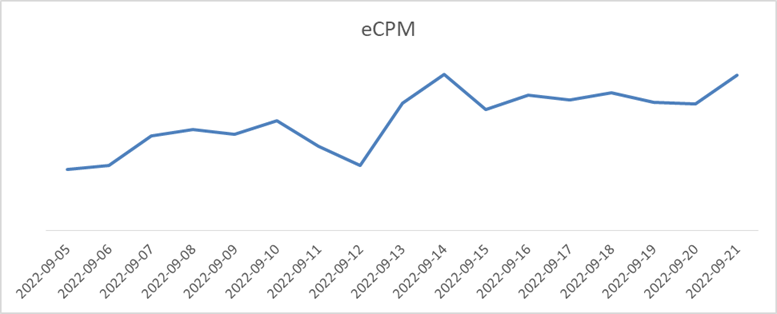

#### 推荐使用激励视频、插屏，实现收益最大化

**场景描述**

多种广告展示形式同时共存，各eCPM差异较大，拿量参差不齐，为保证流量合理利用，避免广告内容单一，实现用户互动性，体验感升级，建议多使用激励视频和插屏。

* 激励视频：一般用于观看广告获得任务奖励等。
* 插屏：一般可在用户退出当前页面或退出该应用前弹出。

**方案/注意事项**

激励视频和插屏eCPM高于其他展示形式，媒体可根据自己应用的场景，多设计高价值展示形式，丰富广告样式，满足不同应用场景的原生化植入，如激励视频和插屏等互动性高，eCPM较高的展示形式，沉浸式触达海量用户，保证流量变现收益最大化。

**效果呈现**

多种广告样式，Petal Ads激励视频和插屏的eCPM远高于其他展示形式。

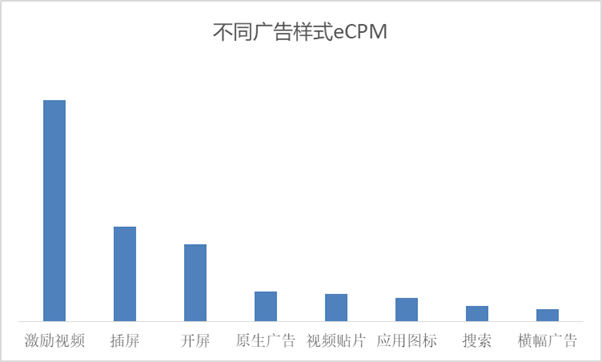

#### 华为渠道版本保持最新，避免洗包

**场景描述**

某CP广告请求从X月X日开始下降，连续下降未恢复，至最后无请求。

**方案/注意事项**

* 基本定位原因：AG的包在GP被更新，已被洗包，未安装鲸鸿动能广告SDK，广告请求每天逐步下降。
* 触发更新原因：同包名+同签名状态下，AG和GP谁的版本号高，谁就触发更新。

**优化建议**

* 华为渠道版本保持最新，保持AG版本号高于GP，及时触发更新。
* AG与GP上的包都含有华为SDK 避免洗包，保证流量不流失，留存率稳中有升，保持媒体量级稳定增长。

**效果呈现**

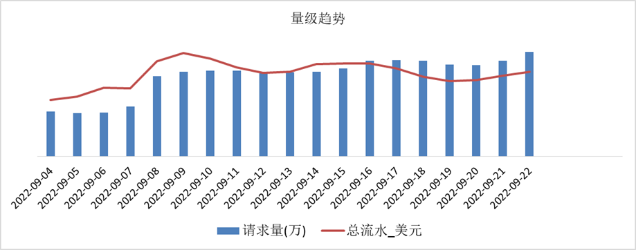

#### 原生替代Banner

**适用场景**

根据鲸鸿动能广告平台大盘数据，原生广告eCPM远高于横幅广告。建议开发者根据媒体的实际情况，将一些多规格的横幅广告位，替换为原生形式。

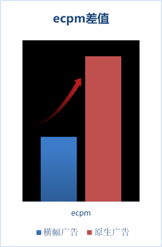 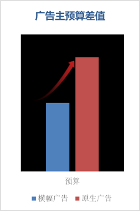

**方案/注意事项**

建议您将横幅广告替换成同尺寸的原生形式，以获得更好的广告效果。

|  |  |  |
| --- | --- | --- |
| 尺寸 | Banner | Native |
| 1080x150 | √ |  |
| 960x150 | √ |  |
| 1080x170 | √ | √ |
| 1404x180 | √ |  |
| 300x250 | √ |  |
| 1080x270 | √ |  |
| 2184x270 | √ |  |
| 960x300 | √ |  |
| 1080x432 | √ | √ |
| 300x50 | √ |  |
| 320x50 | √ |  |
| 900x750 | √ |  |
| 728x90 | √ |  |
| 1080x96 | √ |  |

**效果案例**

某媒体，流量集中在塞尔维亚，之前仅有横幅广告，后将横幅广告改为原生广告，eCPM提升275%。

|  |  |  |
| --- | --- | --- |
|  | 修改前 | 修改后 |
| eCPM | 0.08 | 0.3 |

#### 合理设置广告缓存时间

**场景说明**

目前鲸鸿动能广告平台所有广告形式的有效期均为12个小时（开屏样式除外）。建议开发者实时请求，实时展示。如果广告缓存超过12小时后再展示，所产生的数据都会被系统过滤掉，被认为是无效展示，无效展示后续的转化行为（点击、下载、安装、激活等）均被认为是无效数据，影响收益。

**案例介绍**

某开发者默认缓存时间为24小时，展示率仅为30%，修改缓存在有效时间内后，展示率提升约10%，媒体收益提升13%。

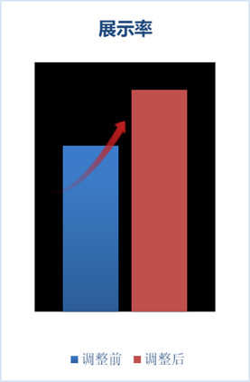 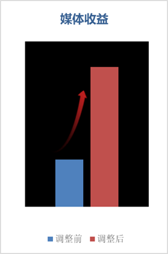

#### 广告内容分级

**场景描述**

媒体变现过程中，针对不符合媒体调性的内容或素材，通过内容分级，筛选符合媒体的用户群体。

**方案/注意事项**

内容分级主要有四级：

* W：适合广泛受众的内容；
* PI：适合家长陪同下观看的内容；
* J：适合青少年及以上观看的内容；
* A：适合成年人及以上观看的内容。

当您选择W时，PI，J，A等级的广告内容会被屏蔽。以此类推，当开发者选择A级别时，没有任何等级的广告内容被屏蔽。单击**内容分级**选择相应分级，单击**保存**即可。请谨慎设置您的App广告内容分级，内容分级设置会影响您的广告填充率，按照分级从低到高的排序分别为：A、J、PI、W。

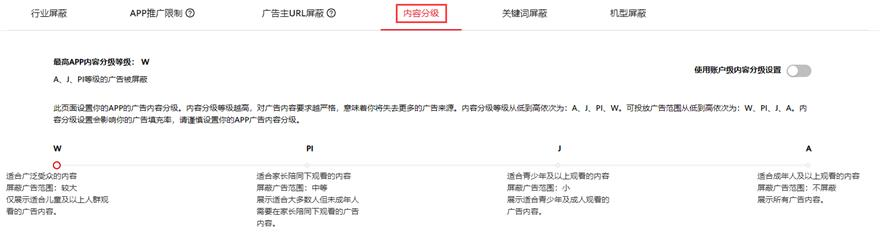

#### 请求个性化广告

**场景描述**

个性化广告是华为广告业务中重要的一块。它可以提高用户收到的广告相关性，也可以提高广告主的投资回报率，也会让媒体的变现更高效。

**方案/注意事项**

媒体侧发起广告请求时，要求携带是否个性化请求参数。如果媒体设置了非个性化请求，那将会导致广告位无法在广告引擎中匹配个性化广告。开发者可以检查请求参数nonPersonalizedAd取值是否有误。

#### 开屏广告建议采用竖屏样式

**场景描述**

开屏广告包括横屏、竖屏两种样式，有些开发者使用横频开屏，发现无法提升展示率，一是横版开屏的预算较低，二是未正确配置自适应横屏或者横版开屏；建议开发者使用竖屏开屏。

**方案/注意事项**

以下为配置方法：

* 勾选横版开屏尺寸

  新建展示位的时候支持横屏对应的规格，请求的时候携带方向传横版开屏，图片、视频里面分别要勾选如图设置；

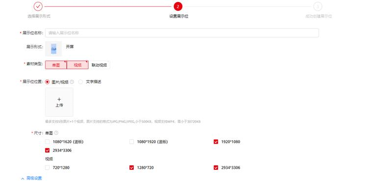

* 构造请求时使用的广告位的参数

  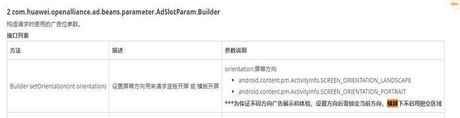

  Kotlin：

  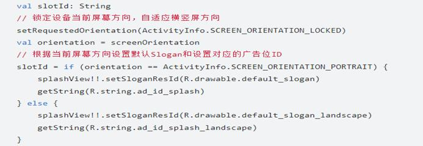

  Java：

  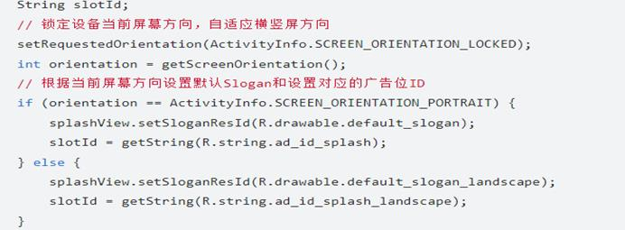

  **以下为注意事项**：

  + 海外媒体服务平台中，尺寸不可选，默认全选。
  + 出海开发者建议使用竖版开屏，横版需要设置广告请求参数，否则将影响横屏开屏的展示。
  + 关于自适应横版开屏设置，[具体可参考开发者文档](https://developer.huawei.com/consumer/cn/doc/development/HMSCore-Guides/publisher-service-splash-0000001050066919)。

#### 注意缓存时间，避免超出任务投放周期

**场景描述**

缓存导致任务素材无效展示的场景，主要是以下两种情况：

超出投放时间：广告主在投放任务时会在任务层级设置投放时间范围，而往往因为媒体侧缓存过多的广告素材，导致在任务投放日期结束后，还仍然对用户侧展示广告，那这部分展示会被视为无效展示。

预算消耗完毕：广告主预算已用完，部分广告内容还是展示给了用户，及计划日预算超投，也会视为无效展示。

**方案与注意事项**

媒体侧应及时清理缓存，以避免因缓存过多导致大量无效展示，建议缓存时间不超过3小时。

#### 填充率提升方法

**场景描述**

变现媒体填充率异常排查。

**方案与注意事项**

* 个性化请求

  媒体侧发起广告请求时，要求携带是否个性化请求参数。如果媒体设置了非个性化请求，那将会导致广告位无法在广告引擎中匹配个性化广告。开发者可以检查请求参数nonPersonalizedAd取值是否有误。

* 内容分级

  如果内容分级传的不对，也会导致无法匹配到任务。一般设置为A，表示流量是成人的，可以接受任意等级的广告。如果不是儿童类应用，不要设置成W，W表示流量是面向所有人的，包含了儿童，那么只能接受儿童类的广告。

#### 聚合SDK宽高比设置：提升原生广告的填充率

**场景描述**

聚合SDK请求参数中配置的宽高比的横向和纵向规格会影响广告位的填充率。当前华为广告平台上基本不支持高大于宽的此类规格素材的投放（即竖向的创意），建议配置“0-根据期望的宽和高来精确匹配广告”或者“3-期望的创意的尺寸可为任意尺寸”。

**方案/注意事项**

SDK提供了setMediaAspect()，设置原生广告请求的宽高比：

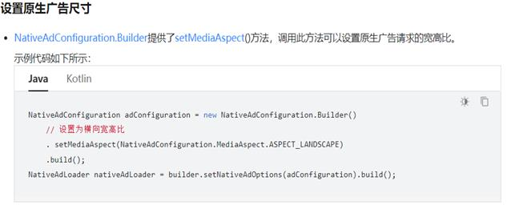

**以下为注意事项**：

所有预期的创意尺寸要求–isSmart：

0-根据期望的宽和高来精确匹配广告

1-根据期望的宽和高来智能匹配广告

2-期望的创意的尺寸未知

3-期望的创意的尺寸可为任意尺寸

4-期望的创意为横向的创意（宽大于高）

5-期望的创意为竖向的创意 (高大于宽）

6-期望的创意为方形的创意（宽等于高）

[具体您可参考开发者文档](https://developer.huawei.com/consumer/cn/doc/development/HMSCore-Guides/publisher-service-native-0000001050064968#section202331509271)。

**效果呈现**

某媒体使用聚合SDK，但之前未正确设置宽高比，修改后填充率上升。

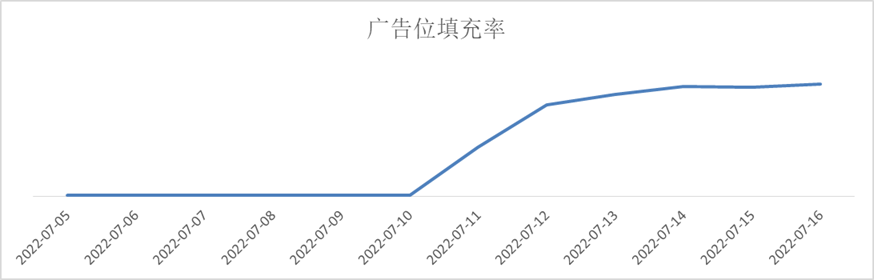

#### 合理设置广告样式，利用预加载提升变现效率

**场景描述**

开发者可根据自己APP的特征，请求固定规格的广告，以便适配好素材提升展示体验。可预加载一些视频类广告素材以提升展示率。

**方案/注意事项**

* 海外广告不限制尺寸返回。开发者可以通过代码中固定请求一组规格，以提升用户体验和展示率。但是填充可能会降低。
* 建议开发者先预加载广告，把广告缓存到本地，当需要展示广告时，即可直接展示，无需从网络上实时加载。尤其是针对视频类广告，视频文件比较大，实时加载可能会有卡顿，影响用户体验。此外，建议缓存时间不超过3小时。

#### 保持SDK版本最新

**场景描述**

鲸鸿动能广告平台会定期更新SDK版本，优化存量产品功能，提供丰富的新功能和修复已知问题。开发者应定期更新SDK版本，提升流量转化效果。

**方案/注意事项**

建议开发者定期（每月）[更新SDK版本](https://developer.huawei.com/consumer/en/doc/development/HMSCore-Guides/publisher-service-version-change-history-0000001050066909)。

#### 每次请求只展示一次

**场景描述**

鲸鸿动能广告平台的广告展示规则规定，同一次请求所返回的广告只能被记录一次有效展示，作为一次基础计费事件。若该次请求的广告重复展示，将会被记录重复展示事件，不再计费。

**方案/注意事项**

根据媒体用户的使用场景，适时刷新，请求新的广告。

* 应用内容刷新：如下拉、滑动等触发信息流刷新时，请求新的广告素材并及时展示。
* 应用热切：回到应用界面时，可考虑请求新的广告并及时展示。

#### 基于上下文的定向

**场景描述**

用户隐私保护意识提升，无法获取OAID等设备标识，非个性化广告无法有效定向到目标用户，非个性广告影响媒体变现效果。

**方案/注意事项**

上下文信息包括基于当前位置的粗略（例如城市级别）地理定位，以及当前应用程序的内容或当前应用搜索关键字上的内容。

媒体需传入用户浏览的上下文内容，包括媒体频道、内容标签等信息，[具体集成方法参考](https://developer.huawei.com/consumer/cn/doc/development/HMSCore-Guides/publisher-service-setcontentbundle-0000001214218860)。

**效果呈现**

无OAID/GAID时提升广告eCPM 15%。

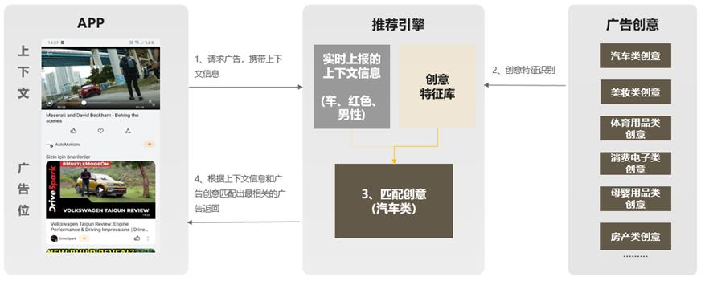

#### 优化激励视频和插屏的调用机制

**场景描述**

激励视频和插屏是鲸鸿动能广告平台变现效果较好的广告样式。但是开发者若未能正确使用这两种广告样式，反而会影响变现效果。

**注意事项**

不建议在应用启动时就请求激励视频或者插屏。

**效果呈现**

针对激励视频调用时机优化，展示率提升15%。

调整前：

* 进入游戏立即调用loadAd()获取广告。
* 用户点击时才调用RewardAd show()展示广告。

调整后：

* 简化逻辑，场景出现时再请求并展示出来。
* 用户点击激励视频时，加Loading页面，加载成功则立即展示广告，否则提示用户加载失败。

 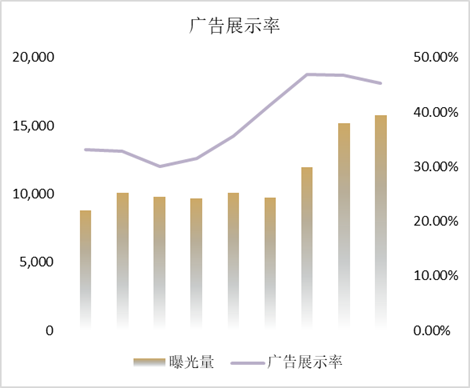

#### 使用大规格尺寸

**场景描述**

根据鲸鸿动能广告平台的大盘数据及用户的行为数据，我们观测到在同一个广告位下，规格越大，转化效果越好，相应的eCPM会更高。我们建议开发者在app里多设置视频类及大图的场景，以提升用户点击率。

**方案与注意事项**

开发者可根据自己APP的特征，请求大规格的广告。

**效果与数据呈现**

不同规格广告的eCPM：

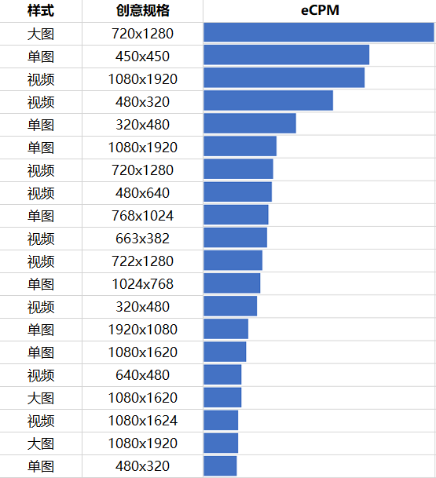

#### 质量分权重机制及优化方向

**场景描述**

媒体质量分是鲸鸿动能广告平台用以评估媒体是否优质的工具，质量分的高低，影响到媒体是否能参与优质媒体激励的评选，因此提高媒体质量分，有助于媒体获得更多政策扶持。

媒体总评分：由媒体数据真实性得分、媒体数据转化效果得分、媒体数据贡献得分、媒体数据规模与稳定性得分、生态贡献得分（加分项）组成。

* 媒体数据真实性得分：

  受媒体有效展示率、媒体有效点击率、媒体有效下载率影响。若媒体存在广告位违规场景，将极大影响媒体真实性得分。

* 媒体数据转化效果得分：

  受媒体展示下载率、媒体安装激活率、媒体次日留存率等因素影响。

* 媒体数据贡献得分：

  受媒体接入方式、媒体数据完整性影响。

* 媒体数据规模与稳定性得分：

  受媒体流量规模得分、媒体流量稳定性得分影响。

* 生态贡献得分：

  此项为加分项，即作为开发者变现，又作为广告主买量。

**优化方向**

* 媒体接入方式建议使用SDK，不建议方式API、三方SSP等。

* 优化媒体各展示形式的展示率和点击率。

#### 展示率对优质媒体评估影响

**场景描述**

鲸鸿动能广告平台对满足评估条件的优质媒体实施月度激励政策，以增加优质媒体流量收益。

**展示率对阶梯分成的影响**

对于满足激励媒体评估条件的三方媒体，根据过去一个自然月的端内广告请求量进行评估，对于超出日均广告请求量1M的部分，给予该三方媒体额外10%的分成收入，该笔收入将随月度结算收入一起打款至相应开发者账号。

鲸鸿动能广告平台与端内广告日均请求量低于1M的三方媒体分成比例为3:7；端内广告日均请求量高于1M的三方媒体，超出1M的部分分成比例为2:8。若该媒体的展示率≤30%，则不满足评估条件，并且无法获得额外10%的分成收入。

**展示率对质量分评估的影响**

媒体有效展示比率评分影响媒体数据真实性评分，媒体数据真实性得分影响媒体总评分；此外，若媒体存在广告位违规场景，将影响媒体总评分的评估。

#### 展示率提升方法

**场景描述**

变现媒体展示率异常排查。

**方案与注意事项**

* 广告位置调优：

  一个一级页面上的广告位会比一个三级或者四级页面上的广告位有更高的展示会，能拿到更多的展示。或根据用户喜好，调整页面频道布局，提升广告展示机会。

* 开屏广告超时时间设置在3s以上：

  开屏作为移动流量曝光的第一入口，值得各位开发者重点关注。开发者可以设置拉取广告的超时时间，如果在该时间内广告拉取成功，则进行广告展示；否则放弃本次广告展示。我们比较建议开发者将开屏广告超时时间设置在3s以上。如果时间过短，会造成请求的广告没有得到展示而被浪费，或是刚展示出来就一闪而过。

* 每次请求的广告建议只展示一次：

  鲸鸿动能广告平台的广告展示规则规定，同一次请求所返回的广告展示后，如果再次展示，展示会因为重复被去重。一次请求的广告，如果用户多次看到，只能算作一次有效展示。

* 设置合理预加载时间：

  建议开发者先预加载广告，把广告缓存到本地，当需要展示广告时，即可直接展示，无需从网络上实时加载。尤其是针对视频广告，视频文件比较大，实时加载可能会有卡顿，影响用户体验。需要注意的是，预加载广告并不是越早越好。如果预加载成功后，用户没有看，没有展示广告，就会影响到广告位的展示率。如果展示率过低，影响到系统对流量价值的判断，则会对广告位的填充率产生影响。因此，需要在预加载广告和展示率两者间保持一个平衡。正确的做法是，合理选择广告预加载的时间。
