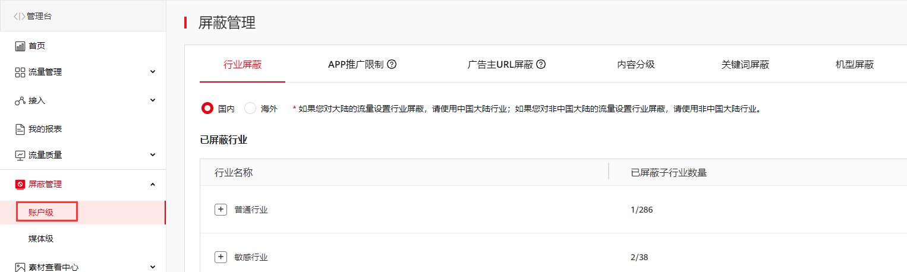
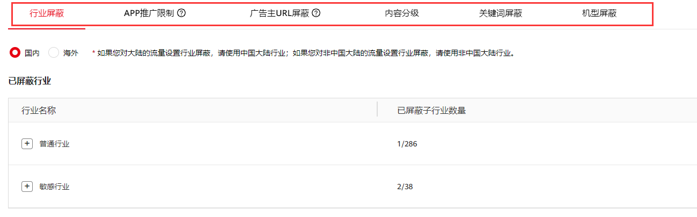
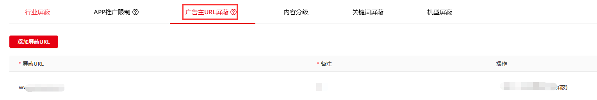
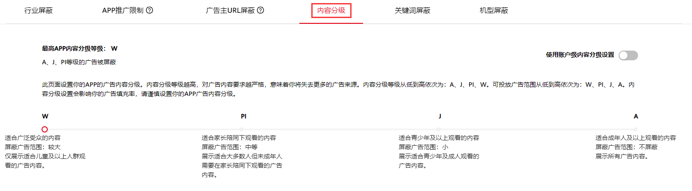
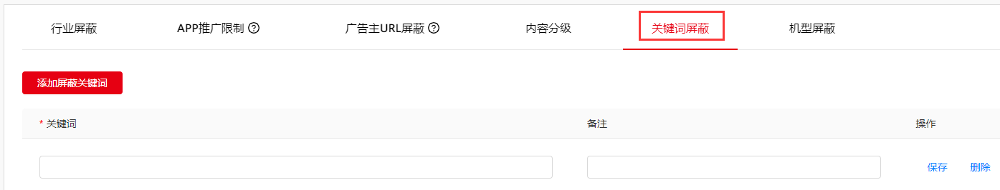

开发者还可以针对账户设置分级，此设置适用账户下已添加的所有媒体。

1. 登录媒体服务平台，单击屏蔽管理，选择**账户级**；

   

   

   * SDK设置的内容分级优先级高于媒体服务平台设置的内容分级。若同时设置，以SDK设置的内容分级为准。请参见：[高级设置](https://developer.huawei.com/consumer/cn/doc/development/HMSCore-Guides/publisher-service-advanced-settings-0000001050064972)。
   * 媒体层级的屏蔽与账户层级的屏蔽二者之间不存在优先级，最终屏蔽效果是按照二者的并集。
2. 选择需要屏蔽的类型，单击状态列中的选择按钮，完成屏蔽设置。

   

设置广告屏蔽可能会影响广告填充率，请评估后谨慎选择。

#### 按行业屏蔽

如选择屏蔽某行业，则所有该行业的广告不会在您的展示位上显示。一般用于屏蔽同行业的竞争对手。

1. 单击 **行业屏蔽**，选择“**普通行业**”或者“**敏感行业**”。搜索筛选相关行业，选择需要屏蔽的行业。您已经屏蔽的行业会在“**已屏蔽行业**”中显示。

   

   另外，为保证广告内容的合法合规，鲸鸿动能平台默认屏蔽法律法规禁止的行业。

#### 按APP推广限制屏蔽

如果您不希望某个或多个应用在您的展示位上进行展示，您只需在**APP推广限制**中添加一条记录，填写屏蔽应用的名称、包名，单击**保存**即可。

#### 按广告主URL屏蔽

您可以按广告主URL进行屏蔽操作，可屏蔽广告主的广告落地页。单击**广告主URL屏蔽**，填写屏蔽URL以及备注，单击**保存**即可。

您最多可屏蔽50个URL，支持具体广告素材URL、落地页URL和域名屏蔽。

#### 按内容分级屏蔽

为您的账户选择内容分级。内容分级主要有四级：

1. Widespread (content suitable for all audiences)：适合广泛受众的内容；
2. Parental instruction (content suitable for most audiences with parental instruction)：适合家长陪同下观看的内容；
3. Junior (content suitable for junior and older audiences)：适合青少年及以上观看的内容；
4. Adult (content only suitable for adults)：适合成年人及以上观看的内容。

当您选择W时，PI，J，A等级的广告内容会被屏蔽。以此类推，当开发者选择A级别时，没有任何等级的广告内容被屏蔽。单击**内容分级**选择相应分级，单击**保存**即可。

#### 按关键词屏蔽

您可指定关键词屏蔽广告的文案（标题和品牌名）。单击**添加屏蔽关键词**，填写关键词以及备注，单击**保存**即可。

