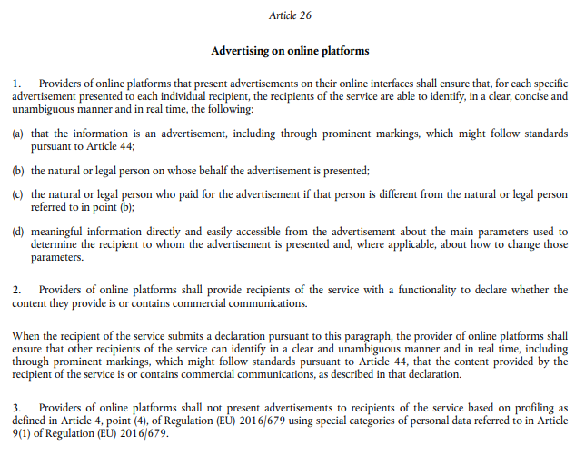

[欧盟数字服务法案(DSA)](https://eur-lex.europa.eu/legal-content/EN/TXT/?uri=celex:32022R2065)于2024年2月17日生效，旨在制定一套**在欧盟范围内适用**的规则，从而对在线内容、广告透明度和虚假信息进行规范。它还引入了关于在线广告透明度的新规则（DSA第26条）。

（图为DSA第26条法案原文）

**开发者应声明是否需要DSA第26条规定的广告内透明度信息（非必选）。**

对于受影响的开发者（DSA定义的“在线平台”），我们提供了展示广告内信息的界面，这些信息包括广告主名称和广告定向信息。

如果开发者要求买方仅在欧洲经济区（EEA）的应用中显示DSA第26条要求展示包含透明度信息的广告，Petal ads会向买方表明，广告必须包含广告标志（由Petal Ads提供）、广告主名称和定向信息。**如果买方未确认广告中是否包含这类信息，相应广告将被拒绝展示，可能会导致广告收入大幅下降。**

**因此，如果需要广告透明度信息，接入petal Ads的开发者需要使用以下模板尽快发送邮件至****petalads@huawei.com****。在告知我们其他情况之前，我们将假定开发者默认显示没有DSA广告透明度信息的广告。**

答复模板：

**邮件主题：DSA广告内透明度信息声****明**

1.开发者id：xxxxx

2.请选择其一进行回复：

（1）只展示提供了DSA透明度信息的广告

（2）展示所有广告，不加限制

DSA透明度信息展示对开发者的适配要求：

* Petal Ads SDK渲染的广告，不需要进行适配。
* 对于自渲染的原生广告，开发者需接入[“不再显示此广告”图标（x）或“为什么显示此广告”图标（i）。](https://developer.huawei.com/consumer/cn/doc/HMSCore-Guides/publisher-service-native-0000001050064968#section9702124013162)
