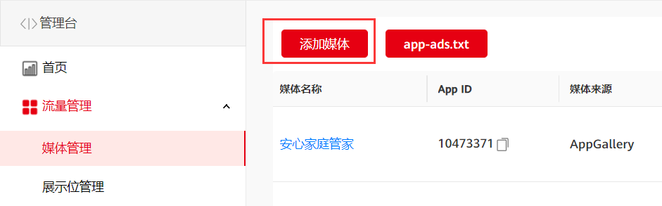
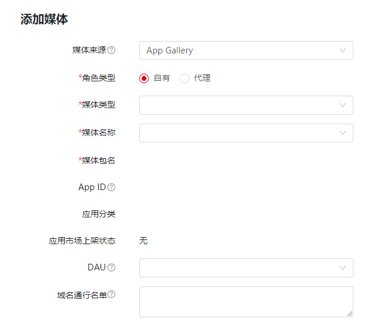
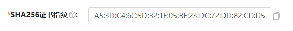
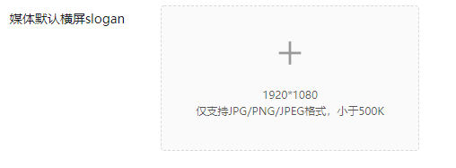
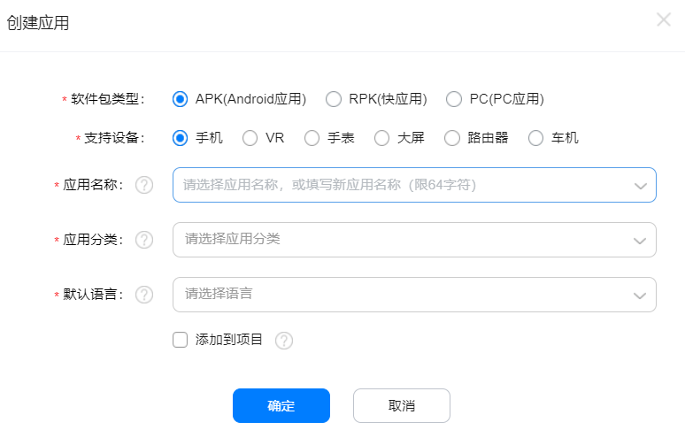
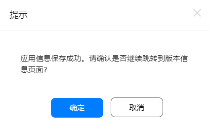
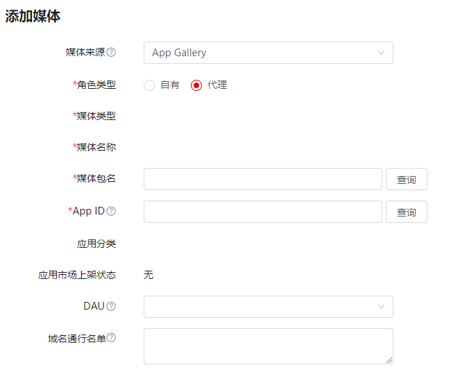
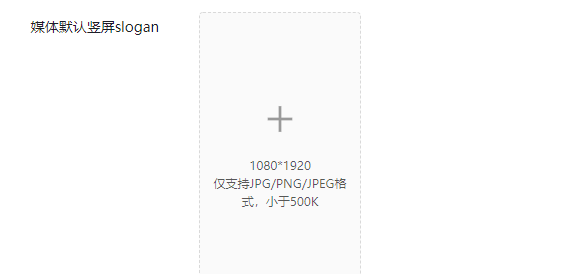

如果您的应用在AppGallery上架，或者会在AppGallery上架，请参考本节介绍。

如果您的应用在Google Play上架，请参考[Google Play上架](https://developer.huawei.com/consumer/cn/doc/monetize/addmedia-gp-0000001149967192)。

如果您的应用在AppGallery和Google Play都已经上架，包名一致的情况下，只能选择媒体来源为AppGallery。

如有您[媒体服务平台](https://developer.huawei.com/consumer/cn/monetize/)应用包有变更请务必及时更新，否则会影响您的变现收益。

HarmonyOS 应用暂不支持出海。

#### **AppGallery媒体添加步骤**

若您的应用**已在AppGallery上架**，无需创建应用。

1. **在鲸鸿动能广告媒体服务平台添加媒体**
   1. 登录[媒体服务平台](https://developer.huawei.com/consumer/cn/monetize/)，选择 **流量管理>媒体管理>****添加媒体。**

      
   2. **选择媒体来源为AppGallery，****角色类型分为自有和代理**
      1. **自有**：自有指的是您自己开发的APP，您需要选择**媒体类型**：支持选择安卓应用和快应用，媒体名称选择完成后，系统自动拉取媒体包名、APP ID、应用分类、应用市场上架状态。

         
      2. **代理：**代理指的是您添加的媒体应用为其他HUAWEI开发者账号发布到AppGallery的应用。将**媒体包名**输入查询框，点击查询，系统自动拉取媒体类型、媒体名称、APP ID、应用分类、应用市场上架状态；仅支持添加已在AppGallery的应用。

         
   3. **DAU：**指的是您应用的每日活跃数，请如实填写真实规模。
   4. **域名通行名单：**如果您的应用内有WAP网页，并且希望在应用内的网页上展示广告进行变现，您需要补充主域名，例如：www.huawei.com，如有多个主域名请以逗号隔开，**并****[在线提单](https://developer.huawei.com/consumer/cn/doc/monetize/support-0000001061434261)申请接口权限，否则会影响您的变现收益。**目前WAP变现支持的开放广告形式包括原生、插屏、激励视频、banner，具体请参考[开发指南](https://developer.huawei.com/consumer/cn/doc/development/HMSCore-Guides/publisher-service-js-dev-process-0000001179595231)。
   5. **SHA256证书指纹：**如果您需要使用HMS能力，必须配置证书指纹，具体请参考：[证书指纹](https://developer.huawei.com/consumer/cn/doc/app/agc-help-signature-info-0000001628566748#section1766216380372)。如果您修改了证书指纹，必须要同步修改鲸鸿动能广告媒体服务平台上的SHA256证书指纹，修改SHA256证书指纹必须手动更新，不支持自动更新。

      
   6. **slogan：**当您的应用无广告展示或者等待广告返回时，您在这里上传的slogan将会展现在您APP上，slogan必须要与应用相关，支持上传竖屏或横屏，如果您的应用集成开屏广告（包含极速开屏），则必须填写**slogan**。

      

      
2. **填写完成后点击提交。**

若您的应用**未在AppGallery上架**，需要您先在AppGallery创建一个应用。您需要准备应用的相关信息，包括：包体类型、意向发布设备类型、应用名称、应用类别、预设语言以及软件包文件，并按照页面指引完成应用创建。

1. **创建应用**
   1. 登录 [AppGallery Connect](https://developer.huawei.com/consumer/cn/service/josp/agc/index.html) ，选择**我的应用。**
   2. 单击**新建**进入创建应用界面，选择**APK(Android app应用)**或**RPK (quick app快应用)**填写应用信息。

      

      1. 单击**确认**，自动跳转到**分发**选项卡中的**应用信息**界面，填写app信息**。**
      2. 填写完成后，单击页面上方**保存**，单击提示信息的**确认**。

         
      3. 设置应用的版本信息，版本信息填写完成后，单击**提交**完成创建。具体可参考[创建应用](https://developer.huawei.com/consumer/cn/doc/distribution/app/agc-create_app)。

         

         后续完成鲸鸿动能广告SDK接入后，在应用能够正常变现前必须完成在应用市场的上架发布，应用在应用市场上架后，上架状态同步到媒体服务平台会有最长24小时的延迟，需在媒体服务平台的上架状态也刷新为“已上架”之后才能有变现收入。
2. **在鲸鸿动能广告媒体服务平台添加媒体**
   1. 登录[媒体服务平台](https://developer.huawei.com/consumer/cn/monetize/)，选择 **流量管理>媒体管理>添加媒体。**

      
   2. **选择媒体来源为AppGallery，****角色类型分为自有和代理**
      1. **自有**：自有指的是您自己开发的APP，您需要选择**媒体类型**：支持选择安卓应用和快应用，媒体名称选择完成后，系统自动拉取媒体包名、APP ID、应用分类、应用市场上架状态。

         
      2. **代理：**代理指的是您添加的媒体应用为其他HUAWEI开发者账号发布到AppGallery的应用。将**应用包名**输入查询框，点击查询，系统自动拉取媒体类型、媒体名称、APP ID、应用分类、应用市场上架状态；仅支持添加已在华为应用市场上架的应用。

         
   3. **DAU：**指的是您应用的每日活跃数，请如实填写真实规模。
   4. **域名通行名单：**如果您的应用内有WAP网页，并且希望在应用内的网页上展示广告进行变现，您需要补充主域名，例如：www.huawei.com，如有多个主域名请以逗号隔开，**并****[在线提单](https://developer.huawei.com/consumer/cn/doc/monetize/support-0000001061434261)申请接口权限，否则会影响您的变现收益。**目前WAP变现支持的开放广告形式包括原生、插屏、激励视频、banner，具体请参考[开发指南](https://developer.huawei.com/consumer/cn/doc/development/HMSCore-Guides/publisher-service-js-dev-process-0000001179595231)。
   5. **SHA256证书指纹：**如果开发者需要使用HMS能力，必须配置证书指纹，具体请参考：[证书指纹](https://developer.huawei.com/consumer/cn/doc/app/agc-help-signature-info-0000001628566748#section1766216380372)，如果您修改了证书指纹，必须要同步修改鲸鸿动能广告媒体服务平台上的SHA256证书指纹。

      
   6. **slogan：**当您的应用无广告展示或者等待广告返回时，您在这里上传的slogan将会展现在您APP上，slogan必须要与应用相关，支持上传竖屏或横屏，如果您的应用集成开屏广告（包含极速开屏），则必须填写**slogan**。

      

      
3. **填写完成后点击提交。**
