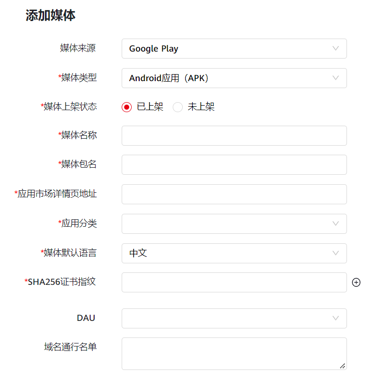
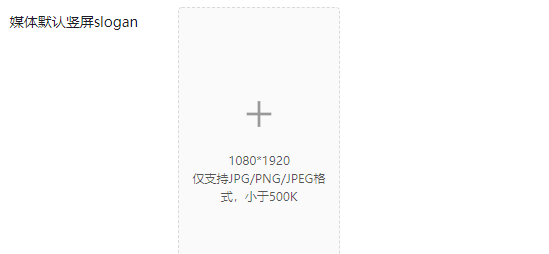
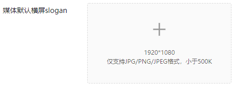
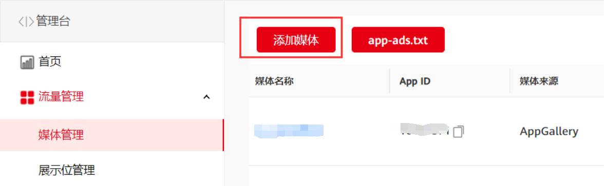
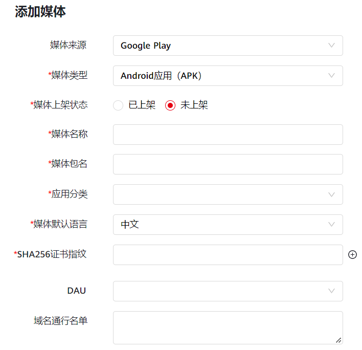
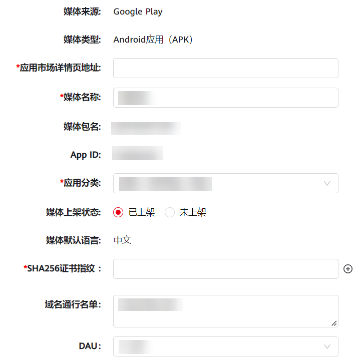

#### **Google Play****媒体添加步骤**

如果您的应用只在Google Play发布，没有同时发布到AppGallery，需要对您发布的应用按照下述步骤提交变现申请，审核通过后才能进行流量变现获取收益。

1. 如果您的应用发布在Google Play的包名与AppGallery的包名不一致，需要对发布到Google Play的应用按照新应用申请变现，并确保使用的展示位ID是新应用申请的展示位ID。
2. **媒体来源只能选择Google Play****。**
3. 请勿删除Google Play应用在[AppGallery Connect](https://developer.huawei.com/consumer/cn/service/josp/agc/index.html#/)上的草稿，否则影响您的收入结算。

**若您的应用****已在GooglePlay上架****：**

1. **在媒体服务平台添加媒体**
   1. 登录[媒体服务平台](https://developer.huawei.com/consumer/cn/monetize/)，选择 **流量管理>媒体管理>****添加媒体**。

      
   2. **选择媒体来源为Google Play**。
   3. 您需设置媒体名称、媒体包名、[应用分类](https://developer.huawei.com/consumer/cn/doc/distribution/app/50103)、媒体默认语言（媒体默认语言：中英俄）、应用市场详情页地址。

      
   4. **DAU：**指的是您应用的每日活跃数，请如实填写真实规模。
   5. **SHA256指纹证书****：**针对媒体来源为Google Play的媒体做指纹证书鉴权，点击加号可添加多个指纹证书，最多支持5个指纹证书。
   6. **域名通行名单：**如果您的应用内有WAP网页，并且希望在应用内的网页上展示广告进行变现，您需要补充主域名，例如：www.huawei.com，如有多个主域名请以逗号隔开，**并****[在线提单](https://developer.huawei.com/consumer/cn/doc/monetize/support-0000001061434261)申请接口权限，否则会影响您的变现收益。**目前WAP变现支持的开放广告形式包括原生、插屏、激励视频、banner，具体请参考[开发指南](https://developer.huawei.com/consumer/cn/doc/development/HMSCore-Guides/publisher-service-js-dev-process-0000001179595231)。
   7. **slogan：**当您的应用无广告展示或者等待广告返回时，您在这里上传的slogan将会展现在您APP上，slogan必须要与应用相关，支持上传竖屏或横屏，如果您的应用集成开屏广告（包含极速开屏），则必须填写**slogan**。

      

      
2. **填写完成后点击提交并审核。**
   * 媒体未审核，支持在设置媒体中修改除媒体包名、媒体默认语言之外的其它信息，系统会按照修改后的信息继续提交审核；
   * 媒体审核已通过，只允许修改DAU、默认slogan、域名同行名单，修改后不用再审核；
   * 媒体审核未通过，支持在设置媒体中修改除“媒体默认语言”之外的其它信息并重新提交审核。

**如果您的应用未在Google Play上架：**

1. **在媒体服务平台添加媒体**
   1. 登录[媒体服务平台](https://developer.huawei.com/consumer/cn/monetize/)，选择 **流量管理>媒体管理>添加媒体。**

      
   2. **选择媒体来源为Google Play**。
   3. 您需选择“媒体上架状态”为“未上架”，此时不需要填写“应用市场详情页地址”信息。

      
   4. **DAU：**指的是您应用的每日活跃数，请如实填写真实规模。
   5. **SHA256指纹证书****：**针对媒体来源为Google Play的媒体做指纹证书鉴权，点击加号可添加多个指纹证书，最多支持5个指纹证书。
   6. **域名通行名单：**如果您的应用内有WAP网页，并且希望在应用内的网页上展示广告进行变现，您需要补充主域名，例如：www.huawei.com，如有多个主域名请以逗号隔开，**并****[在线提单](https://developer.huawei.com/consumer/cn/doc/monetize/support-0000001061434261)申请接口权限，否则会影响您的变现收益。**目前WAP变现支持的开放广告形式包括原生、插屏、激励视频、banner，具体请参考[开发指南](https://developer.huawei.com/consumer/cn/doc/development/HMSCore-Guides/publisher-service-js-dev-process-0000001179595231)。
   7. **slogan：**当您的应用无广告展示或者等待广告返回时，您在这里上传的slogan将会展现在您APP上，slogan必须要与应用相关，支持上传竖屏或横屏，如果您的应用集成开屏广告（包含极速开屏），则必须填写**slogan**。

      

      
2. **填写完成后点击提交，提交后您的媒体状态为未启用，不进入审核。**
3. **把应用上架到Google Play**，然后在媒体变现后台，点击“媒体管理”—“设置媒体”，变更Google Play上架状态并补齐应用市场详情地址并提交审核，审核一般2个工作日内，在审核通过后您的媒体状态会变成“已启用“，这时才能获得变现收入。

   
