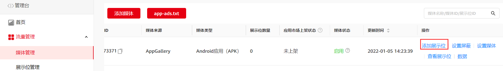
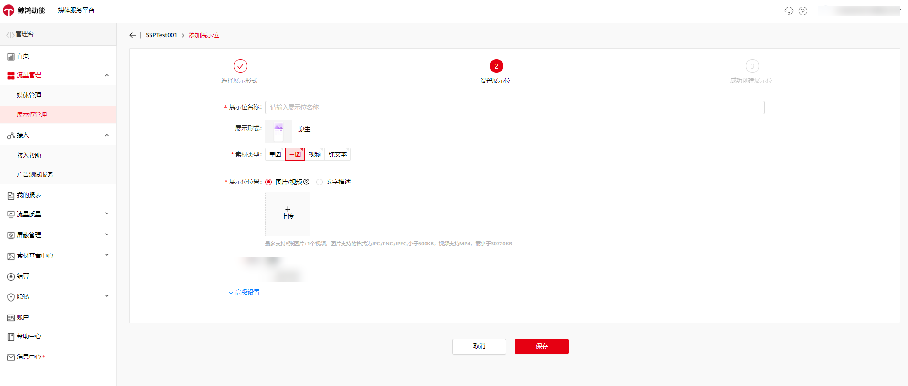
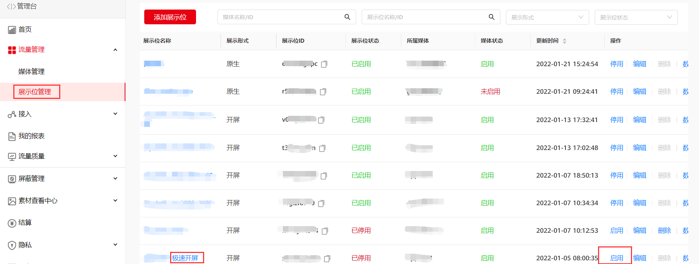

#### 概述

当前流量变现服务平台支持接入的展示位形式包括：横幅、原生、插屏、开屏、激励视频、视频贴片和大屏开屏。您可以根据应用运营情况，有针对性的选择添加展示位。

#### 操作步骤

目前，安卓应用支持添加以上七种展示位形式，快应用仅支持Banner展示位、原生展示位和激励视频展示位。

#### 添加展示位

1. 选择 **流量管理>媒体管理>****添加展示位**，即可为目标媒体添加展示位。

   

   选择您需要接入的展示形式，填写展示位的相关信息，包括名称、素材类型（限制媒体类型会导致收入下降），并上传展示位位置，选填高级设置，其中素材类型可多选。

   展示位位置说明：开发者需要上传触发广告时的图片/视频或者文字对广告的展示位置进行说明，用于平台对媒体进行验收及巡检。当前支持图片最多上传5个，同时视频最多上传1个。

   展示位接入后不需要审核，展示位保存后立刻生效。您在创建展示位的时候请注意提交展示位位置信息，我们会根据您提供的信息进行巡检。广告位设置需符合[开发者行为规范](https://developer.huawei.com/consumer/cn/doc/monetize/policy3-0000001100075600)。

   

   

   海外媒体服务平台中，尺寸不可选，默认全选。
2. 单击**保存****，**成功创建展示位。

* 在创建激励视频展示位时，您还需要填写对应的奖励信息，包括：奖励类型、奖励数量，并设置服务器端验证。
  + 奖励类型：输入用户将会获得的奖励。示例：金币、额外的生命数。
  + 奖励数量：输入用户将会获得的奖励的数量。
  + 服务器端验证：对每一次激励视频广告观看行为进行验证，确保只有实际看完应用内视频广告的用户才能获得奖励。
* 新增Banner刷新频率的设置：在创建和编辑Banner广告位的高级设置项内增加自动刷新设置，分别是默认刷新时间、自定义刷新时间以及不刷新，只可单选。
  + 设置路径：添加展示位>选择Banner>高级设置>自动刷新设置。
  + 在SDK中设置Banner刷新时间的优先级高于在SSP上的设置，若您在SDK中设置Banner的刷新时间，则以SDK中设置的刷新时间为准；若要生效SSP上的刷新时间设置，需要清空之前在SDK中的设置。
  + 若您没有在SDK进行刷新时间的设置，且未对广告变现后台的自动刷新设置进行操作，则默认选择“默认刷新时间”，默认刷新时间为60s，每经过系统默认时间后自动刷新该广告位的banner广告；若设置自定义刷新时间时，则每经过设定时间后刷新该广告位的banner广告；设置为不刷新时，除非产生新的请求广告时才会刷新banner广告。

#### **启用极速开屏展示位**

极速开屏广告**无需集成SDK和创建展示位**，近乎零开发；展示率更具优势；有利于用户更快看到开屏广告内容，并快速进入应用主页面，用户体验更佳。

1. 应用添加后会自动创建极速开屏展示位，但默认状态为关闭，需在“[媒体服务平台](https://developer.huawei.com/consumer/cn/service/ads/publisher/html/index.html?lang=zh#/mainContent/dashbordContent)”选择“**展示位管理**”，找到极速开屏展示位（应用名称-极速开屏），单击**启用**开启。目前仅支持华为设备。
2. 极速开屏功能使用条件：目前仅支持竖版应用，暂不支持横版应用。
3. 默认优先展示极速开屏，展示极速开屏后禁止再展示其他开屏广告。
4. 极速开屏不支持删除，不删除的状态不影响应用转移。

   

#### **展示位高级设置：**

* **底价设置**
  + 您可以为展示位设置底价值，即投放至此展示位的广告所需达到的预估每千次展示费用底限。
  + 设置底价值时，支持分国家区域设置，未单独设置的国家/地区与全球ecpm底价保持一致。
  + 若预估eCPM低于您设置底价值，则不会返回该广告。设置过高的底价可能会影响到您的广告返回率，请谨慎设置。
* **频次控制**

  为保证媒体用户的体验，您可以使用此功能对广告展示次数进行控制。频次控制的时间单位可以为分钟、小时和天。选择分钟时，不能超过60分钟；选择小时时，不能超过24小时；选择天时不能超过30天。

  **例：**您设置了某展示位在每1个小时内，每位用户看到的广告不超过1次。某用户在使用您的APP时，从看到该广告展示时起，一个小时内在对应的展示位上最多只能看到一次广告展示。

* 仅开屏、插屏和激励视频支持频次控制设置。
* 展示位底价说明：当您在展示位设置了底价时，鲸鸿动能广告平台可能需要至少一周的时间来保障底价生效；

  若您的展示位累积流量不足以支撑有效每千次展示费用计算，则系统无法对每次点击付费的广告进行投放限制；

  底价eCPM值为预估每千次展示费用底限，可能高于您在报表中查询的eCPM。如果您在报表中查询到的展示位eCPM低于您设置的底价eCPM，则说明鲸鸿动能广告平台尚在持续根据用户行为进行优化和调整。

  如果您最近遇到以下情况，展示位eCPM可能不会准确：

  1. 流量小且碎片化，分布在不同的广告位上，且每个广告位的流量很小。

  2. 流量波动大，隔天数据差异较大。

  3. 更新了应用到展示位的底价eCPM值或展示位设置。
