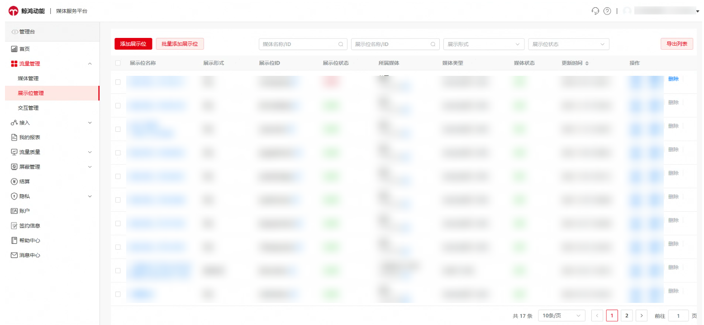

**Q1：怎么删除展示位？**

A**：**单击“删除” 完成对展示位的删除，只有在“已停用”状态下的展示位才可被删除。注意：极速开屏展示位不支持删除。

**Q2：创建的重复ads媒体如何删除？**

A**：**目前，不支持删除Ads媒体

您可以尝试删除广告位。详情请参阅[媒体管理-变现管理-鲸鸿动能流量变现（非中国大陆区） - 华为HarmonyOS开发者](/docs/monetize/monetization/mediamanagement-0000001051201925)

**Q3：想要将app-ads.txt文件保存到应用中，但一直看不到相关信息，怎么办？**

A**：**您好，app-ads.txt目前仅开放给在Google Play上架的应用，请检查您的应用是否符合要求，详情请参考：[媒体管理-变现管理-鲸鸿动能流量变现（非中国大陆区） - 华为HarmonyOS开发者](/docs/monetize/monetization/mediamanagement-0000001051201925)

**Q4：添加app-ads.txt文件时提示应用链接不匹配怎么办？**

A**：**点击“检查更新”重新触发，请等待至少48小时， 以便系统更新app-ads.txt状态即可。

**Q5：AGD Pro和鲸鸿动能流量变现有什么区别？同时接入的话，广告展现的时机和逻辑会冲突吗？**

A**：**AGD Pro和鲸鸿动能流量变现服务的广告主来源不同，同时接入可以提升您的填充率和收益。

**Q6：广告有效展示是多长时间?**

A**：**广告可见50%+展示时长超过500ms。：：
