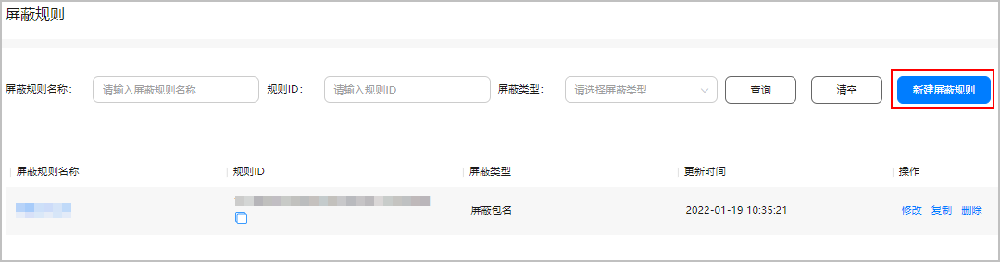

在接入AGD Pro服务调试过程中，请根据需要配置对应屏蔽规则，以及基于测试状态的展示位进行调试。

#### 接入测试

如需将“测试”状态的展示位用于请求调试，请将测试设备的OAID添加到“接入测试”菜单中，否则将报错1013错误。

1. 登录[AppGallery Connect](https://developer.huawei.com/consumer/cn/service/josp/agc/index.html#/)，点击“我的项目”。
2. 在项目列表中找到您的项目，在左侧导航栏选择“盈利 > AGD Pro应用变现服务 > 接入测试”。
3. 点击右侧“添加设备”，填写“设备OAID”和设备“国家/地区”。

   
4. 配置完成后，即可将对应的测试设备，用于请求和调试测试状态的展示位。

#### (可选)屏蔽管理

1. 登录[AppGallery Connect](https://developer.huawei.com/consumer/cn/service/josp/agc/index.html#/)，点击“我的项目”。
2. 在项目列表中找到您的项目，在左侧导航栏选择“盈利 > AGD Pro应用变现服务 > 屏蔽管理”。
3. 点击右侧“新建屏蔽规则”。

   

   在“屏蔽规则设置”页面，设置规则名称、屏蔽关键词、屏蔽包名、屏蔽广告行业，设置完成后点击“提交”。

   

   “屏蔽关键词”和“屏蔽包名”最多配置100个，请按要求进行配置。

   
