应用变现服务只支持将已在架应用设置为媒体，如您的应用尚未上架，请参考[发布应用](https://developer.huawei.com/consumer/cn/doc/distribution/app/agc-help-releaseapkrpk-0000001106463276)。

#### 前提条件

* 使用在架应用的主帐号、或者该团队下拥有应用市场【开发】权限的子帐号，登录AGC网站进行操作。具体请参见[团队帐号](https://developer.huawei.com/consumer/cn/doc/start/mta-0000001059655998#section13103440145018)。
* 如果您的在架应用尚未添加到项目中，请在[AppGallery Connect](https://developer.huawei.com/consumer/cn/service/josp/agc/index.html)先创建您的AGC项目，并在项目的添加应用中，下拉选择已在架的应用，具体请参见[在项目下添加应用](https://developer.huawei.com/consumer/cn/doc/distribution/app/agc-help-createapp-0000001146718717#section1032785795611)。
* 创建媒体及展示位操作建议由产品或运营角色人员完成。

#### 新建媒体

1. 登录[AppGallery Connect](https://developer.huawei.com/consumer/cn/service/josp/agc/index.html#/)，点击“我的项目”。
2. 在项目列表中找到您的项目，在左侧导航栏选择“盈利 > AGD Pro应用变现服务 > 媒体管理”。
3. 点击右侧“新建媒体”，将本应用创建为一个媒体，作为媒体去分发广告。

   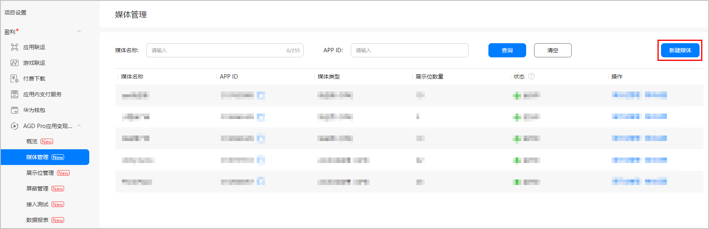
4. 在“媒体应用”后的输入框中根据应用名称输入关键字，在下拉的搜索框中选择您的应用，选择应用后“APP ID”, “媒体应用包名”和“媒体类型”会根据您的应用信息自动补充。

   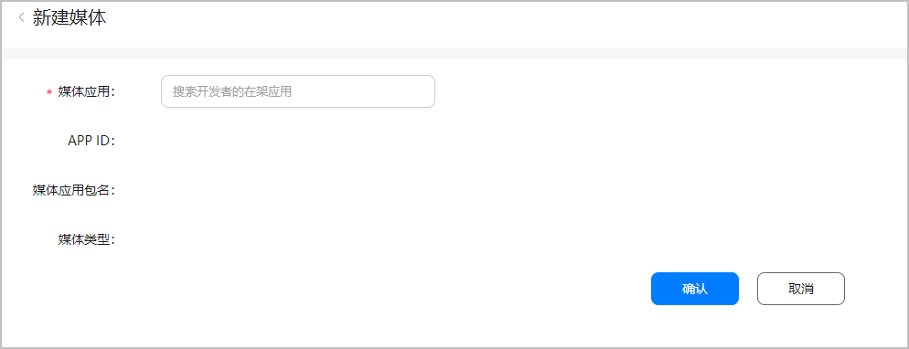
5. 点击“确认”，完成媒体创建。

   

   若媒体中已创建展示位，您必须先删除展示位，方可删除媒体。
6. 在“媒体管理”页面下，您可以在管理列表中找到您需要查看的媒体。

   您可以点击“操作”列中的“展示位管理”设置相关内容，也可以点击“媒体管理”删除已创建的媒体。

   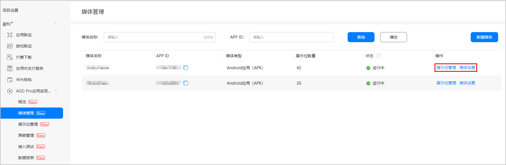

#### 创建展示位

* 展示位创建完成并且转正式使用前，请联系华为运营确认已经配置广告资源。
* 同一媒体创建同一类型展示位不要超过20个。

1. 登录[AppGallery Connect](https://developer.huawei.com/consumer/cn/service/josp/agc/index.html#/)，点击“我的项目”。
2. 在项目列表中找到您的项目，在左侧导航栏选择“盈利 > AGD Pro应用变现服务 > 展示位管理”。
3. 点击右侧“添加展示位”。

   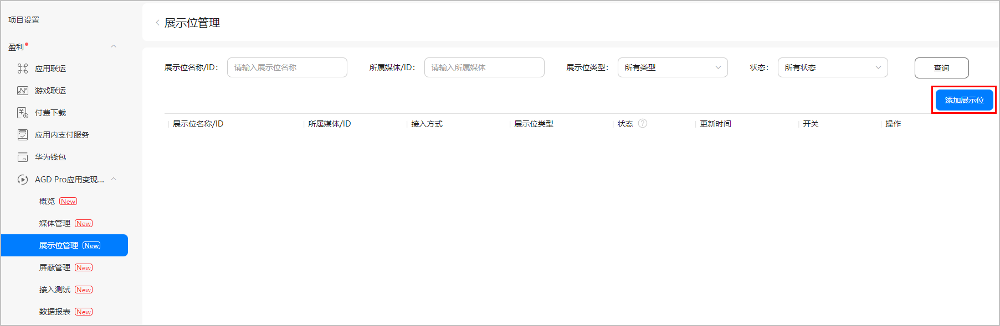
4. 进入“添加展示位”页面，选择所属媒体，并选择接入方式为“API”。

   

   AGD Pro API当前处于允许清单开放阶段，使用此服务前，您需要向华为运营发送申请邮件，使用该服务。请按如下格式填写申请邮件发送到邮箱：

   * 邮件标题：AGD Pro API权限申请
   * 邮件内容：媒体应用名称，应用ID，媒体应用包名，开发者名称

   申请内容申请审核时间为1~3个工作日，审核结果将以邮件进行反馈。

   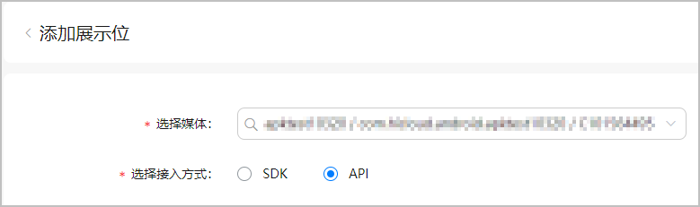
5. 根据您的需求选择“展示位类型”。
   * 如果您需要展示原生广告，在“原生广告”页签下选择合适的展示位类型。

     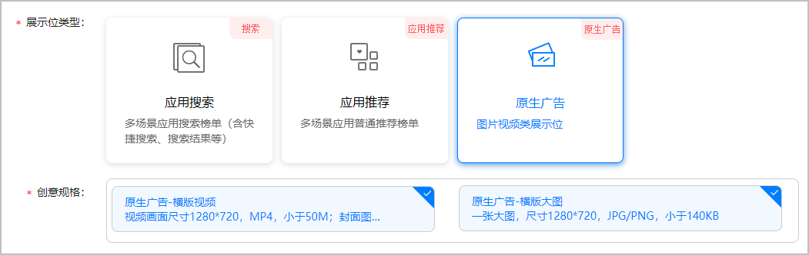
   * 如果是关键词搜索的广告，在“应用搜索”页签下选择“搜索结果”或“快捷联想”。

     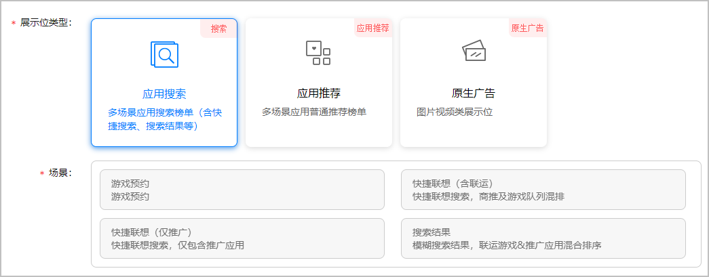
   * 如果是推荐类型的广告，在“应用推荐”页签下选择“普通推荐榜单”。

     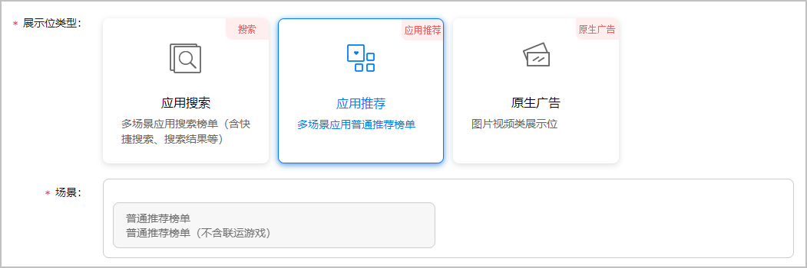
   * 如果是针对元服务关键词搜索类型的广告，在“元服务搜索”页签下选择“元服务搜索”。

     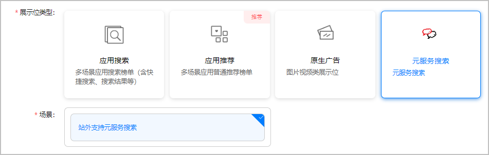
6. 如果是**原生广告**或**应用推荐**的展示位类型，则可以选择是否开启激励发放的功能。

   为了保证激励广告的转化效果，可以开启激励发放的功能，实现对激励动作的控制。

   如果需要开启激励发放的功能，则开启“激励发放功能”开关，并选择“激励发放条件”。

   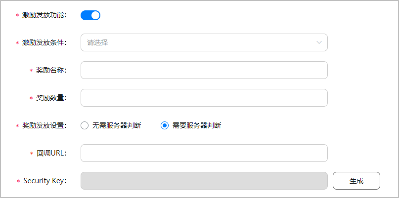

   | 参数 | 说明 |
   | --- | --- |
   | 激励发放功能 | 如果需要开启激励发放的功能，则开启“激励发放功能”开关。  **说明**：当“激励发放功能”开关打开时，以下参数才可见。 |
   | 激励发放条件 | 具体触发激励发放的条件。  取值范围：  * 安装完成 * 安装并试用 * 安装并试用30s |
   | 奖励名称 | 奖励名称。 |
   | 奖励数量 | 奖励数量。 |
   | 奖励发放设置 | 此参数配置为“需要服务器判断”，以保证奖励发放请求的安全性。  取值范围：  * 无需服务器判断 * 需要服务器判断 |
   | 回调URL | 配置此参数以保证奖励发放请求的安全性。  **说明**：当“奖励发放设置”参数配置为“需要服务器判断”时，此参数才可见。 |
   | Security Key | 配置此参数以保证奖励发放请求的安全性。  点击“生成”，界面自动生成对应的密文。  **说明**：当“奖励发放设置”参数配置为“需要服务器判断”时，此参数才可见。 |
7. 填写“展示位名称”，并选择展示位属性。

   

   * “测试”展示位主要用户能否正常读取广告及端测能否正常展示测试，不会进行广告计费，只有“正式”展示位才会计费并产生收益。
   * 如需将“测试”状态的展示位用于请求调试，请将测试设备的OAID添加到AGC页面的“接入测试”菜单中，否则将报错1013错误，具体可参见[接入测试](https://developer.huawei.com/consumer/cn/doc/monetize/agd_pro_api_commission-0000001411154350#section16922317523)。

   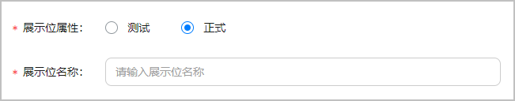
8. 点击“高级设置”，选择“屏蔽规则”，完成选择后点击“提交”。

   

   * 一个展示位最多可选择5个屏蔽规则。
   * 您可以点击“屏蔽规则管理”自行设置屏蔽规则，详见[屏蔽管理](https://developer.huawei.com/consumer/cn/doc/monetize/agd_pro_api_commission-0000001411154350#section16131135163311)。

   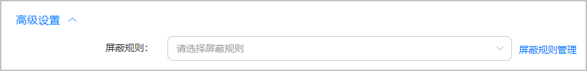
