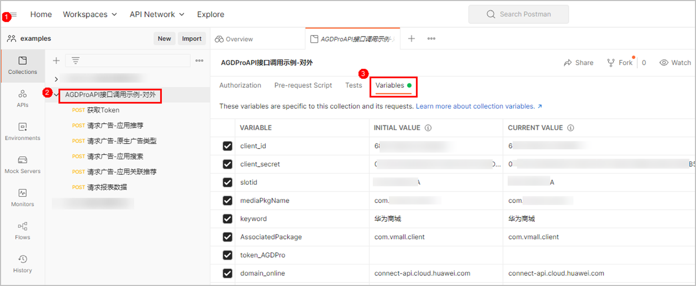

* 获取广告接口的调用建议由开发或测试角色人员完成。
* 为了提高广告的点击率、转化率及其带来的收入，请您尽可能多地提供请求参数（包括可选参数），AG能够根据开发者的请求，返回更相关、⽤⼾更喜欢的⼴告。
* **如您无法获取相应参数，请不要随意填写参数**，随意填写可能导致匹配到不相关的广告，进⽽降低点击率、转化率。对于接口中要求但媒体侧无法传递的参数，请同步知会到AG运营和产品人员。
* 华为云侧已安装应用的过滤无法100%生效，为保证用户体验，建议媒体自行在设备端侧再做一层已安装过滤。

#### 前提条件

1. 以团队所有者帐号登录[AppGallery Connect](https://developer.huawei.com/consumer/cn/service/josp/agc/index.html)，并创建API客户端，详情请参见[创建API客户端](https://developer.huawei.com/consumer/cn/doc/development/AppGallery-connect-Guides/agcapi-getstarted-0000001111845114#h2创建api客户端)。
2. 调用接口，获取访问API的Token，详情请参见[获取访问API的Token](https://developer.huawei.com/consumer/cn/doc/development/AppGallery-connect-References/agcapi-obtain_token-0000001158365043)。

#### 接口原型

|  |  |
| --- | --- |
| 承载协议 | HTTPS POST |
| 接口方向 | 开发者服务器 > 应用市场服务端 |
| 接口URL | https://connect-api.cloud.huawei.com/api/mas/v1/media/open/query   * 中国站点domain：connect-api.cloud.huawei.com * 德国站点domain：connect-api-dre.cloud.huawei.com * 新加坡站点domain：connect-api-dra.cloud.huawei.com * 俄罗斯站点domain：connect-api-drru.cloud.huawei.com |
| 数据格式 | 请求消息：Content-Type: application/json  响应消息：Content-Type: application/json |

#### 请求参数

#### header

| 参数名称 | 必选(M)/可选(O) | 类型 | 参数说明 |
| --- | --- | --- | --- |
| client\_id | M | `String` | 客户端ID，获取方法请参见[创建API客户端](https://developer.huawei.com/consumer/cn/doc/development/AppGallery-connect-Guides/agcapi-getstarted-0000001111845114#h2创建api客户端)。 |
| Authorization | M | `String` | 认证信息，格式为"Authorization: Bearer ***| 参数名称 | 必选(M)/可选(O) | 类型 | 参数说明 |
| --- | --- | --- | --- |
| rtnCode | M | `Integer` | 返回码。  0代表成功，其他返回请参见[错误码](/docs/monetize/monetization/agd_pro_api_if_error-code-0000001263223153)。 |
| rtnDesc | O | `String` | 返回描述。 |
| requestId | O | `String` | 请求时的requestId参数，原值返回。 |
| adInfos | O | Iist [AdInfo](/docs/monetize/monetization/agd_pro_api_if_adinfo-0000001294726909) | 广告信息。 |
| hasNextPage | O | `Integer` | 是否有下一页地址。  仅搜索场景返回此字段。  取值范围：   * 0：无。 * 1：有。 |
| defaultData | O | `Integer` | 是否是默认推荐数据。  仅关联推荐场景下使用此字段。  取值范围：   * 0：表示返回的应用为宿主应用的关联推荐应用。 * 1：表示没有宿主应用或宿主应用没有关联推荐应用，返回兜底应用 |

#### 响应示例

```
{
    "adInfos": [
        {
            "adId": "promote.202211211441564l18f975064",
            "adTagDesc": "广告",
            "material": {
                "adFlag": 1,
                "appInfo": {
                    "appId": "C10049053",
                    "appName": "华为商城",
                    "clickDeepLink": "hiapp://com.huawei.appmarket?activityName=activityUri|appdetail.activity&params=****&referrer=agdproapilink",
                    "clickWapUrl": "https://appgallery.cloud.huawei.com/app/C10049053",
                    "description": "【华为商城（VMALL）】是华为公司旗下官方电商平台，秉持*******并努力改进。",
                    "developerName": "华为软件技术有限公司",
                    "downloadDesc": "143 亿次安装",
                    "downloadLink": "hiapplink://com.huawei.appmarket?appId=C10049053&callType=AGDAPI&channelId=com.huawei.photoplaza.agd&******&referrD",
                    "downloads": "14368117440",
                    "icon": "https://appimg.dbankcdn.com/application/icon144/634d52cb0a5b4e7fb5c2ef021126df96_1.png",
                    "memo": "智慧生活，精选好物",
                    "packageName": "com.vmall.client",
                    "packageType": 0,
                    "permission": [{
                    	"permissionDesc": "1.相机\n2.******\n16.读取日历\n17.新建/修改/删除日历",
                    	"permissionLabel": "检测出此应用获取 17 个敏感隐私权限："
                    },
                    {
                    	"permissionDesc": "1.允许应用拍摄照片和视频。\n2.允许应用*****应用新建、修改、删除或发起邀请他人的日历活动。",
                    	"permissionLabel": "敏感隐私权限用途说明："
                    }],
                    "privacyUrl": "https://agreement.itsec.hihonor.com/asm/agrFile/getHtmlFile?agrNo=1024&country=cn&branchId=0&langCode=zh-cn",
                    "releaseDate": "2022-10-31 15:05:16",
                    "secCategory": "购物比价",
                    "size": 111474763,
                    "sizeDesc": "106.3MB",
                    "thirdCategory": "商城",
                    "versionCode": "12210301",
                    "versionName": "1.22.10.301"
                },
                "interactType": 1,
                "clickUrl": "https://store-drcn.hispace.dbankcloud.cn/agd/mediareport?clickType=__CLICKTYPE__&param=c2Vj******RJg%3D%3D&extInfo=__EXTINFO__",
                "showUrl": "https://store-drcn.hispace.dbankcloud.cn/agd/mediareport?param=c2VjdXdH*****%3D%3D&event=show&time=__TIME__&extInfo=__EXTINFO__",
                "styleType": 5
            }
        }
    ],
    "defaultData": 1,
    "requestId": "1f9cd8bf2ab4438772296a2d1806339",
    "rtnCode": 0,
    "rtnDesc": "SUCCESS"
}
```

#### 接口调用实例

如果您想快速调试获取广告接口，可以使用PostMan工具导入示例文件进行调试。


需要使用公网环境进行调试。

1. 下载[AGD Pro API接口调用示例文件.zip](https://communityfile-drcn.op.dbankcloud.cn/FileServer/getFile/cmtyPub/011/111/111/0000000000011111111.20250314174004.05099281164613019621332294264045%3A50001231000000%3A2800%3A2BA2C8EF71118C38BC99030BDE70F7FAD6798B0D60810A24180BB4610BA85327.zip)文件，解压获取**AGDProAPI接口调用示例.postman\_collection.json**文件。
2. 打开PostMan工具，在左上角选择“菜单 > File > Import”，导入接口调用示例文件**AGDProAPI接口调用示例.postman\_collection.json**。
3. 点击项目名称，点击“Variables”页签，配置环境变量如下图所示。

   

   具体配置说明如下：

   * 配置从AGC页面创建的**client\_id**、**client\_secret**，具体请参考[创建API客户端](https://developer.huawei.com/consumer/cn/doc/development/AppGallery-connect-Guides/agcapi-getstarted-0000001111845114#h2创建api客户端)。
   * 配置从AGC页面申请的媒体包名**mediaPkgName**，以及媒体展示位**slotid**，具体请参考[创建媒体及展示位](/docs/monetize/monetization/agd_pro_api_creat-media-display-position-0000001246432546)。
4. 点击**获取Token**的POST方法，点击“Send”进行Token的获取。
5. 点击请求广告场景对应的POST方法，点击“Send”进行广告内容的请求。
