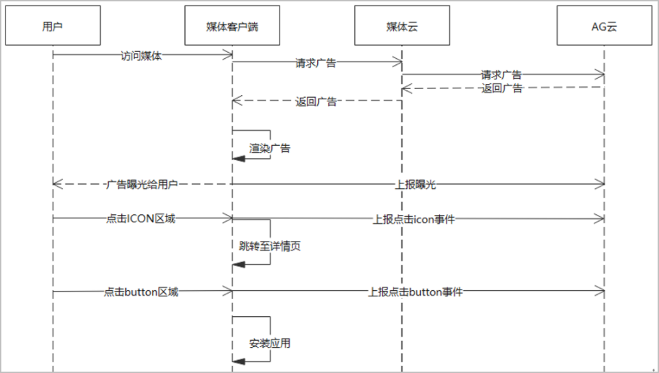

AGD Pro应用变现服务（简称AGD Pro服务）是华为应用市场（AppGallery，以下简称AG）针对内媒或者外部媒体提供的应用推荐搜索服务，媒体可以通过集成AGD Pro服务提供的API接口，从华为应用市场请求获取App广告信息，并且将App的广告队列数据通过json体返回给媒体，媒体自行渲染、展示，用户下载后实现流量的变现与收入分成。

#### 接入流程

| 序号 | 步骤 | 详情 |
| --- | --- | --- |
| 1 | 申请使用并澄清需求 | 与运营沟通合作需求后上报申请，澄清需求场景。具体请参见[申请使用](https://developer.huawei.com/consumer/cn/doc/monetize/agd_pro_api_gett-started-0000001246419770)。 |
| 2 | 创建媒体和展示位 | 在AppGallery Connect控制台创建媒体及展示位。具体请参见[创建媒体及展示位](https://developer.huawei.com/consumer/cn/doc/monetize/agd_pro_api_creat-media-display-position-0000001246432546)。 |
| 3 | 获取广告 | 调用AGD Pro API请求获取广告。具体请参见[获取广告](https://developer.huawei.com/consumer/cn/doc/monetize/agd_pro_api_get-ads-0000001216778368)。 |
| 4 | 事件上报 | 将曝光和用户点击事件上报到服务器。具体请参见参见[事件上报](https://developer.huawei.com/consumer/cn/doc/monetize/agd_pro_api_event-report-0000001262218943)。 |

#### 广告请求流程

1. 广告请求：您需要先通过服务器请求广告，如希望通过端侧直接请求广告，建议使用SDK方式接入。
2. 曝光上报：App将广告展示给用户后，App必须实时、直接向AppGallery（简称AG）上报曝光，不允许通过服务器上报，具体请参见[曝光事件上报](https://developer.huawei.com/consumer/cn/doc/monetize/agd_pro_api_event-report-0000001262218943#section19744105116289)。
3. 点击上报：用户点击广告后，App必须实时、直接向AG上报点击，不允许通过服务器上报，具体请参见[点击事件上报](https://developer.huawei.com/consumer/cn/doc/monetize/agd_pro_api_event-report-0000001262218943#section19264141592910)。

#### 产品形态说明

1. 广告形态：当前AG支持应用搜索、应用推荐、原生广告三种形态广告。不同的形态，对应不同的使用场景，由创建展示位时的展示位类型决定。
2. 广告请求：所有类型广告需要实时请求，数据尽可能实时上报，如不及时上报可能会判定为无效数据影响收入。
3. 广告渲染：根据接口中返回的提供icon、名称、分类、下载量等元素，由媒体自行渲染样式，开发测试完成后需要由相关AG运营⼈员确认。
