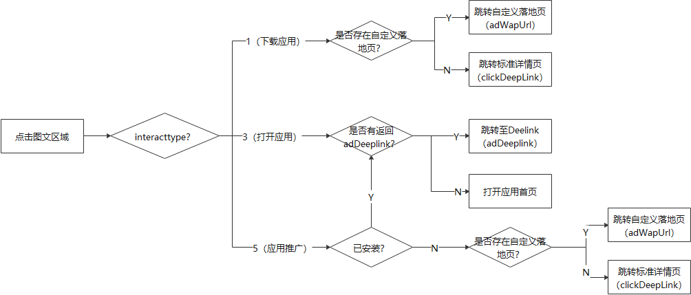
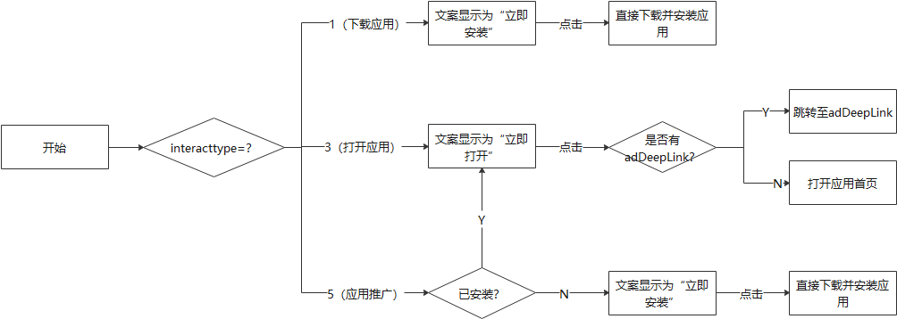

#### 广告过滤与处理

华为应用市场云侧的已安装过滤无法做到100%生效，为保证用户体验，请媒体自行在设备端侧再做一层已安装过滤。

在展示广告前，媒体端侧需要根据返回体中的广告交互类型（interactType）进行过滤，过滤规则如下：

* interactType=1 （即下载应用）时，如果被推广应用已安装，则过滤掉该广告。
* interactType=3 （即打开应用）时，如果被推广应用未安装，则过滤掉该广告（如果为快应用，则不需要过滤）。
* interactType=5 （即应用推广）时，此时有可能是下载广告也有可能打开广告，媒体无需做过滤。

#### 链接优先级处理

API接口场景下，响应体中存在不同的链接返回，使用逻辑可以参考如下步骤：

1. 为了保证原有的纯APP广告的兼容性，[AdCreative](https://developer.huawei.com/consumer/cn/doc/monetize/agd_pro_api_if_adcreative-0000001294886337)和[AdAppInfo](https://developer.huawei.com/consumer/cn/doc/monetize/agd_pro_api_if_adappinfo-0000001248246048)两个结构体中的adWapUrl和adDeeplink是等价的，建议优先使用AdCreative结构体中的值，可以自行考虑历史版本如何处理。
2. 链接的处理优先级：AdCreative.adDeeplink> AdAppInfo.adDeepLink> AdAppInfo.downloadLink> AdAppInfo.clickDeepLink。
3. 大部分情况下，adDeeplink返回空；因此对于下载类应用，可使用如下处理逻辑：
   1. 用户点击“下载”按钮，使用downloadLink跳转迷你页；
   2. 点击其他广告素材位置时，使用clickDeepLink跳转全屏详情页。

#### 交互体验处理

交互按钮文案可根据媒体侧场景自行定义文案以契合用户体验，需要给用户明确的交互指引。

* 图文区域处理逻辑：

  

* 交互按钮处理逻辑：

  
