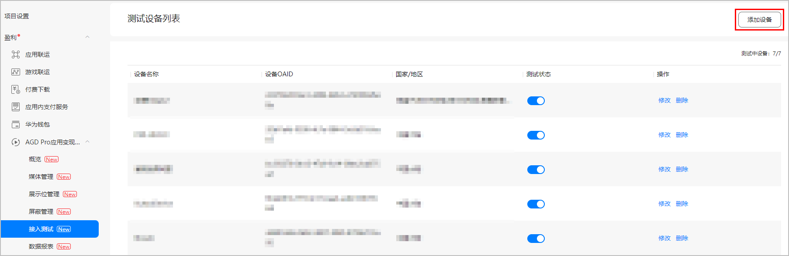
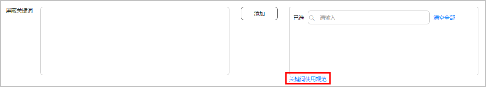
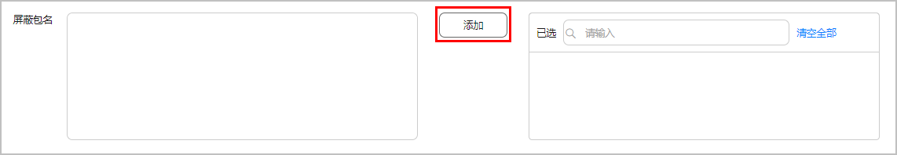
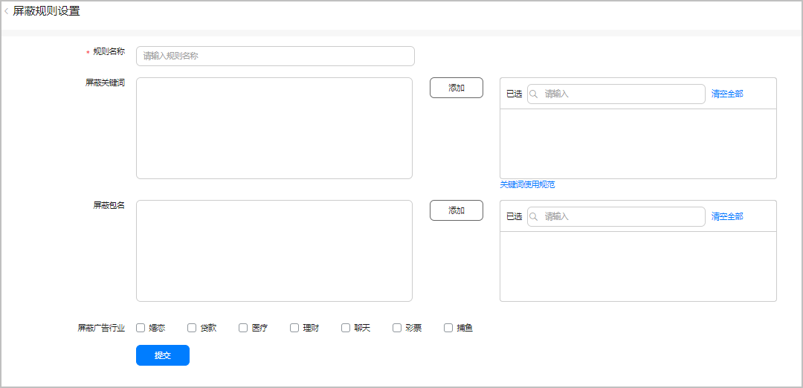

在接入AGD Pro服务调试过程中，请根据需要配置对应屏蔽规则，以及基于测试状态的展示位进行调试。

#### 接入测试

如需将“测试”状态的展示位用于请求调试，请将测试设备的OAID添加到“接入测试”菜单中，否则将报错1013错误。

1. 登录[AppGallery Connect](https://developer.huawei.com/consumer/cn/service/josp/agc/index.html#/)，点击“我的项目”。
2. 在项目列表中找到您的项目，在左侧导航栏选择“盈利 > AGD Pro应用变现服务 > 接入测试”。
3. 点击右侧“添加设备”，填写“设备OAID”和设备“国家/地区”。

   
4. 配置完成后，即可将对应的测试设备，用于请求和调试测试状态的展示位。

#### (可选)配置屏蔽规则

您可以设置屏蔽规则以屏蔽与规则相关联的广告。屏蔽规则有按关键词屏蔽、按包名屏蔽和按广告行业3种。

“屏蔽关键词”和“屏蔽包名”最多配置100个，请按要求进行配置。

#### 按关键词屏蔽

您可以指定广告中标题或文案出现的某些关键词进行屏蔽。

1. 在项目列表中点击您需要设置屏蔽规则的项目。
2. 在左侧导航栏选择“盈利 > AGD Pro应用变现服务 > 屏蔽管理”，点击“新建屏蔽规则”。

   
3. 在屏蔽规则管理界面，填写屏蔽规则名称后，在屏蔽关键词输入框中输入您希望屏蔽的关键词，点击“添加”。

   

   “屏蔽关键词”最多配置100个，请按要求进行配置。

   

   

   添加屏蔽关键词前，请先点击“关键词使用规范”了解关键词设置说明，以防造成收入损失。

#### 按包名屏蔽

如果您不希望一个或多个应用在您的展示位上展示，您可以添加包名按包名屏蔽。

1. 在项目列表中点击您需要设置屏蔽规则的项目。
2. 在左侧导航栏选择“盈利 > AGD Pro应用变现服务 > 屏蔽管理”，点击“新建屏蔽规则”。

   
3. 在屏蔽包名输入框中输入您希望屏蔽的应用的包名，点击“添加”。

   

   “屏蔽包名”最多配置100个，请按要求进行配置。

   

#### 按行业屏蔽

您可以选择屏蔽来自某个行业的广告，屏蔽后该行业的广告将不会在您的展示位上展示，一般用于屏蔽同行业竞争对手。

1. 在项目列表中点击您需要设置屏蔽规则的项目。
2. 在左侧导航栏选择“盈利 > AGD Pro应用变现服务 > 屏蔽管理”，点击“新建屏蔽规则”。

   
3. 在屏蔽行业栏勾选您想要屏蔽的行业类型，点击“提交”。
