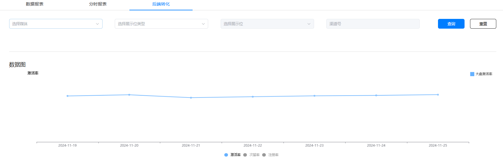

媒体接入AGD Pro应用变现服务后，可通过后端转化趋势了解媒体自身转化与大盘转化均值的对比情况，以及媒体分展示位/渠道号2个维度的后端转化趋势，便于及时调整流量策略，提升流量变现效率。具体查看方法如下：

1. 进入“数据报表”模块>切换到“后端转化”Tab页
2. 根据后端转化趋势观测需求选择对应查询条件，不同筛选配置与趋势图交互说明如下：
   * 仅选择媒体：该媒体与大盘转化趋势对比
   * 选择媒体、展示位：该展示位和媒体整体转化趋势对比
   * 选择媒体、展示位、渠道号：该展示位下所选渠道号与媒体整体转化趋势对比
   * 选择媒体、渠道号：该渠道号与媒体转化趋势对比
   * 不填写任何筛选项：仅展示大盘转化趋势

1、筛选渠道号时需手动输入ID，请确保ID输入无误。

2、固定展示近七天离线转化趋势，不支持自定义选择时间，如需对比实验效果请及时关注趋势表现。

3、根据筛选条件未查询到后端转化数据时，无折线趋势显示。

4、流量量级较小时，转化量累积少可能导致部分转化指标趋势参考价值低，建议更关注较前端的转化指标并同时提升量级。
