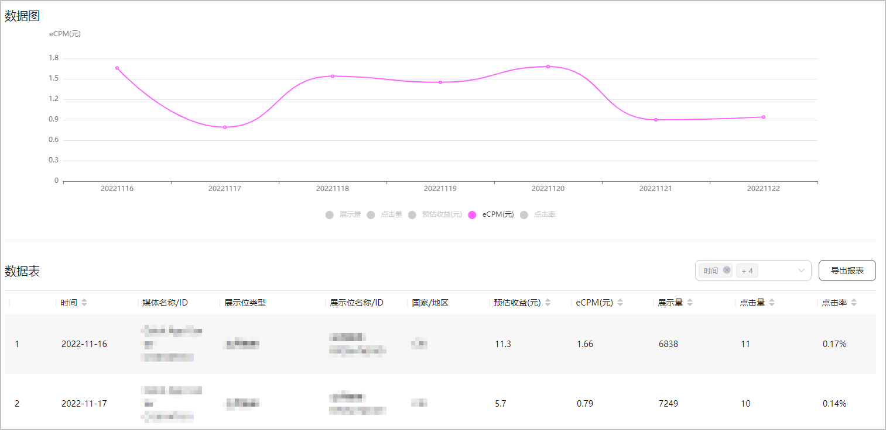

待集成AGD Pro SDK的应用正式上线后，即可通过数据报表查看对应的广告收益。

1. 登录[AppGallery Connect](https://developer.huawei.com/consumer/cn/service/josp/agc/index.html)，选择“我的项目”。
2. 在项目列表中点击您的媒体应用所在的项目。
3. 在左侧导航栏选择“盈利 > AGD媒体增值服务 > 数据报表”。
4. 在查询条件区域，选择具体的查询条件，点击“查询”。

   

   即可查看到对应的数据图和数据表。

   

   应用榜单的后台报表数据是10分钟更新一次。

   
