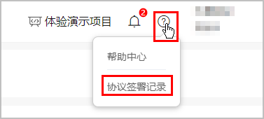
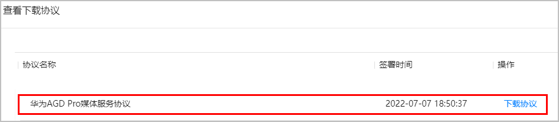

#### 集成SDK前了解

#### 快应用可以接入AGD Pro吗？

是的，快应用同样也可以接入AGD Pro，轻松开启变现。

#### 个人开发者可以接入AGD Pro吗？

个人开发者同样也可以接入AGD Pro，在自己的应用内实现流量变现。

#### 个人开发者可以同时接入AGD Pro和鲸鸿动能流量变现服务SDK吗？

可以。

#### 已经接入鲸鸿动能流量变现服务SDK，还可以接入AGD Pro吗？

可以。AGD Pro和鲸鸿动能流量变现服务的广告主来源不同，同时接入可以提升您的填充率和收益。

#### AGD Pro和鲸鸿动能流量变现的收益是分开结算还是合并结算？

分开结算。

#### 是否可以有游戏类的广告？

有。华为应用市场有游戏类的广告主。

#### 媒体是否可以接多家DSP，是否冲突？

可以接多家。以SDK方式接入AGD Pro时，多家DSP之间无法竞价混排。

#### AGD Pro是否有接入第三方广告聚合平台的计划？

暂时无接入计划。

#### 是否支持先获取到广告，媒体自己审核后再展示，即第一天获取广告，第二天展示？

暂不支持。

#### 接入AGD Pro有多少开发工作量？

以SDK方式为例，接入AGD Pro仅涉及端侧开发，具体工作量视场景数量而定，预估8-20人天，依赖媒体侧发布版本。

#### 接入AGD Pro后请求广告有什么限制？

接入AGD Pro后广告会有如下限制：

* 请求失败会禁止频繁重试。
* 禁止设置定时器循环请求。
* 实时请求实时展示。

#### AGD Pro SDK有不是AndroidX的版本吗？

没有，目前不支持。

#### 集成SDK前准备

#### 如何签署AGD Pro服务协议？如何查看已签署的AGD Pro服务协议？

在[AppGallery Connect 网站](https://developer.huawei.com/consumer/cn/service/josp/agc/index.html)上首次访问AGD媒体增值服务的入口，则系统会弹出AGD Pro服务协议。

如果已已签署的AGD Pro服务协议，则在AGC控制台点击右上角即可查看。

#### 使用AGD Pro时，在项目中添加应用，报错包名已经存在？

AGD Pro只支持将已在架应用设置为媒体，无需创建新应用。

如果您的在架应用尚未添加到项目中，请在[AppGallery Connect 网站](https://developer.huawei.com/consumer/cn/service/josp/agc/index.html)先创建您的AGC项目，并在项目的添加应用中，下拉选择已在架的应用，具体请参见[在项目下添加应用](https://developer.huawei.com/consumer/cn/doc/distribution/app/agc-help-createapp-0000001146718717#section1032785795611)。

#### 接入调试

#### AGD Pro需要媒体针对华为区分独立包体吗？

媒体可自行选择是否区分包体。

* 如果区分包体，则华为侧上架的包，需要包含接入AGD Pro SDK的代码。
* 如果不区分包体，则应用打开以后，应用可自行读取设备厂商，厂商如果是非华为设备，将不运行接入AGD Pro SDK的代码。

#### 媒体侧是否可以屏蔽某一行业或者某一应用？

可以。可以按行业、包名、关键词设置屏蔽。

#### 是否会过滤已安装？

SDK侧可以过滤已安装，端侧也可以进行过滤已安装。

#### 开发者集成AGD Pro SDK后需要自行设计渲染吗？

AGD Pro SDK是包渲染的，无需开发者自行渲染。渲染过程中SDK支持的部分是风格一致的，媒体侧部分需要自行适配。

#### 无法获取OAID，怎么解决？

在华为手机上选择“设置 > 隐私 > 广告与隐私”，开启“允许App跟踪”开关，关闭媒体进程，等待几分钟，重新获取即可。

#### 结算收益

#### 在哪个平台上管理展示位，以及查看效果数据和收益？

可以在[AppGallery Connect 网站](https://developer.huawei.com/consumer/cn/service/josp/agc/index.html)上[创建媒体并管理展示位](https://developer.huawei.com/consumer/cn/doc/monetize/agd_pro_sdk_andriod_media-position-0000001237628421)，且可以[查看展示位的分日数据](https://developer.huawei.com/consumer/cn/doc/monetize/agd_pro_sdk_andriod_report-0000001461263269)。可以看到当天实时数据，具体收益以结算单为准，报表数据仅作参考。

#### 结算方式及账期天数

月结，即本月收益次月结算。

#### 收益分成比例是多少？

除去平台运营成本，广告流水都是媒体的收益。媒体在AGC控制台可以看到预估收益。

#### 媒体侧是否可以针对广告位设置底价？

媒体侧无法设置底价。底价由华为应用市场投放的推广任务决定。

#### 开发者对接AGD Pro时，与华为进行合同签署、财务结算的主体与开发者提交应用上架的主体不一致，是否会有影响？

有影响。 AGC控制台上签约和应用上架的帐号需要为同一个，即公司主体需要一致，默认以该公司主体进行财务结算。
