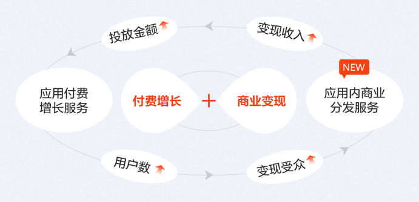
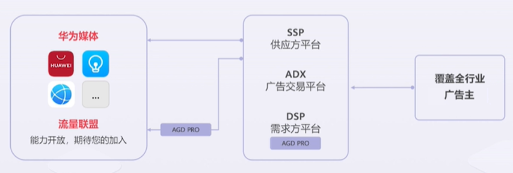
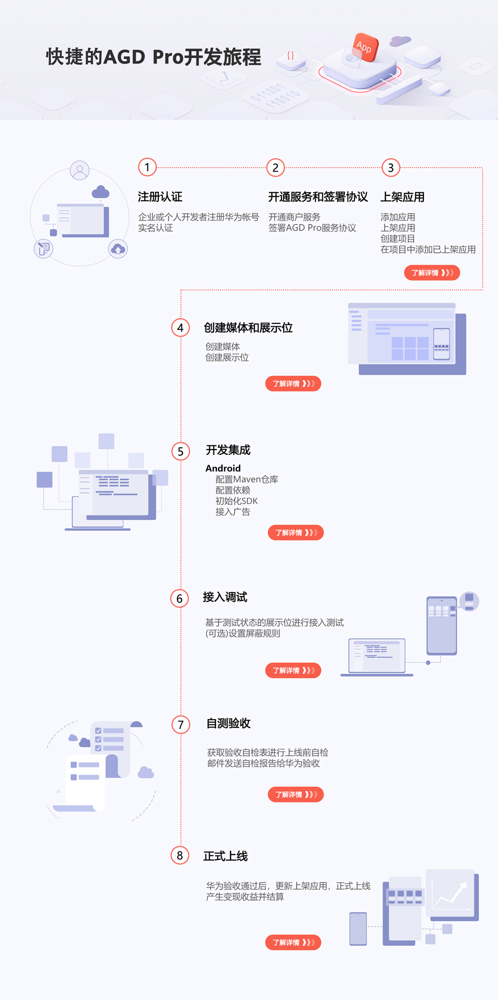

#### 业务概述

**AGD Pro应用变现服务（简称AGD Pro服务）**是华为应用市场为在架应用提供的媒体增值服务。AGD Pro**兼顾广告主投放效果、用户体验和媒体收益**为服务宗旨，为开发者提供**一键应用分发**、**高效商业变现**的产品服务，覆盖开户接入、策略优化、数据分析及运营服务，通过智能流量分发策略、全链路数据分析、精细化运营服务，一站式、多维度助力开发者实现增长+变现闭环，快速获得**商业成功**。

* 如果您想通过短视频了解，可以观看[视频课程](https://developer.huawei.com/consumer/cn/training/course/video/C101659929765295544)。
* 当前AGD Pro服务暂**不支持游戏开发者接入**。

#### 生态现状

目前华为应用市场的广告主覆盖全行业。当前这些广告主的推广任务会投放在华为应用市场和其他的华为媒体上，例如华为浏览器、华为天气、华为音乐等等。AGD Pro上线后，欢迎更多的应用和快应用加入华为应用市场的流量联盟，共同实现流量变现的飞跃增长。

#### 接入流程

此处以Android应用接入AGD Pro举例说明。

#### 平台支持说明

| 一级分类 | 二级分类 | 是否已支持 |
| --- | --- | --- |
| 客户端SDK | Android |  |
| 快应用 |  |
| iOS |  |
| Web |  |
| Server SDK | Java | 不涉及 |
| REST API | 不涉及 |
| 跨平台框架 | - | 不涉及 |
