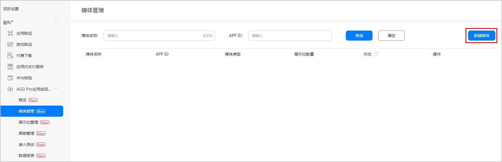
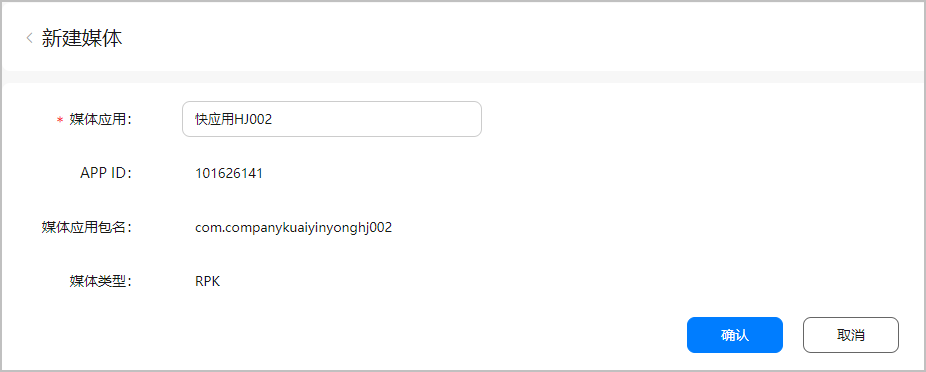
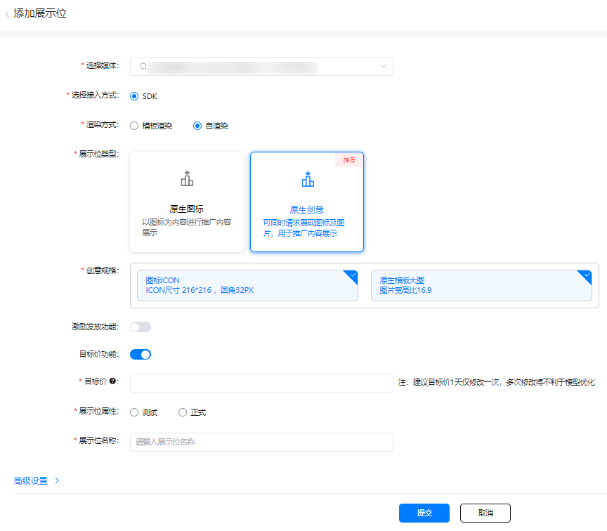
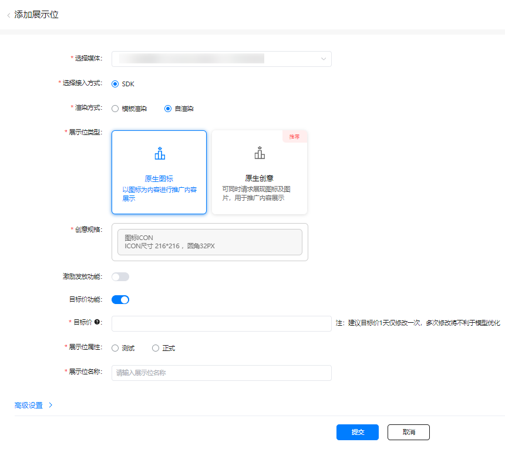
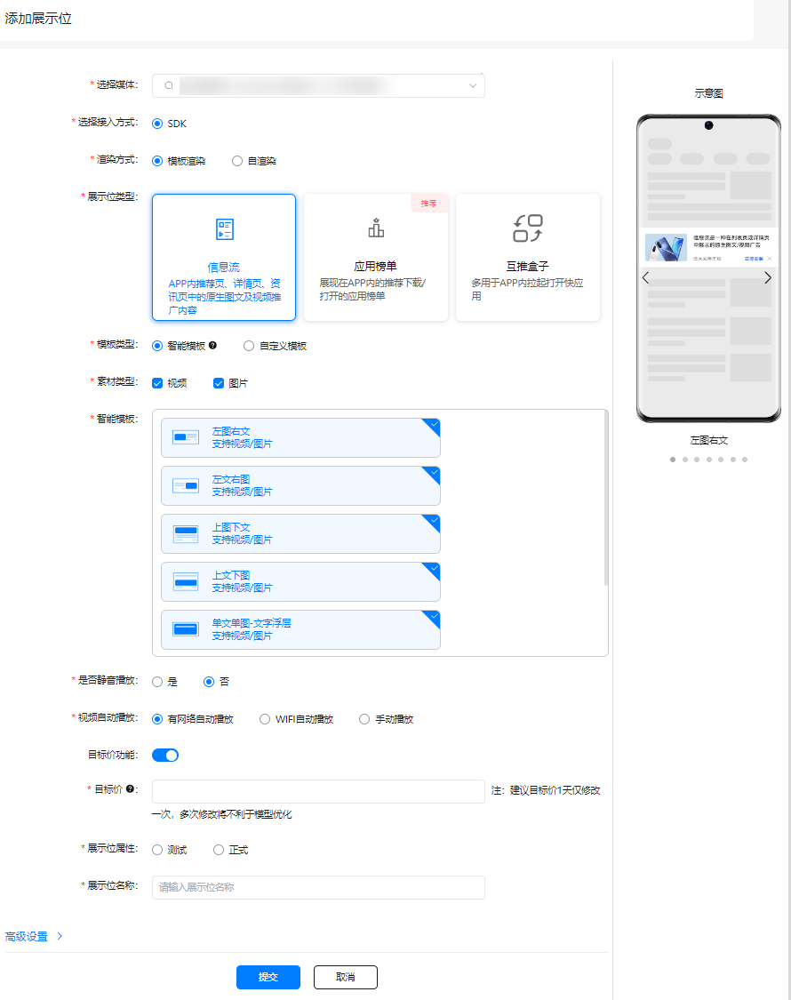
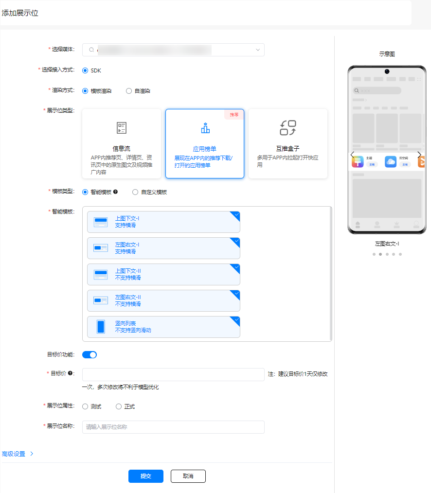
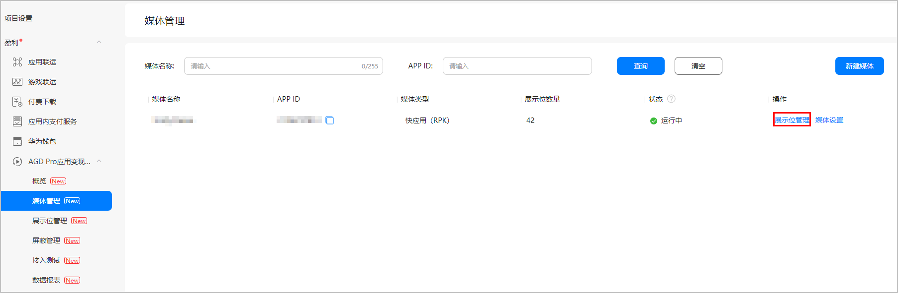
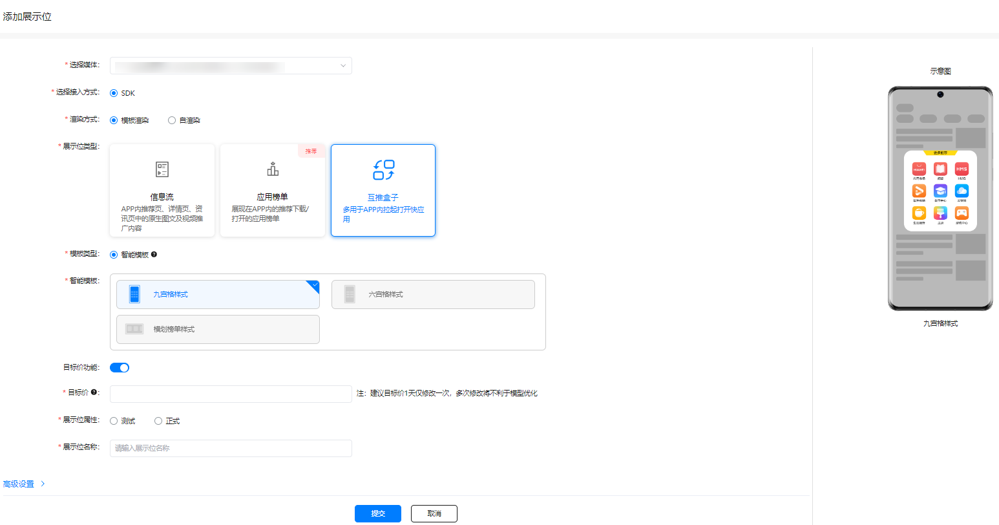

#### 前提条件

您的媒体应用已上架。

* AGD Pro服务只支持将华为应用市场在架应用设置为媒体，并在媒体中新增展示位推广其他应用，如您的应用尚未上架，请参考[发布应用](https://developer.huawei.com/consumer/cn/doc/distribution/app/agc-help-releaseapkrpk-0000001106463276)。
* 当前AGD Pro服务暂**不支持游戏开发者接入**。

#### 创建媒体

1. 登录[AppGallery Connect](https://developer.huawei.com/consumer/cn/service/josp/agc/index.html)，选择“我的项目”。
2. 在项目列表中点击您的媒体应用所在的项目。
3. 在左侧导航栏选择“盈利 > AGD Pro应用变现服务 > 媒体管理”，点击“新建媒体”。

   
4. 在“媒体应用”后的输入框中根据应用名称输入关键字，在下拉的搜索框中选择您的应用，选择应用后“APP ID”, “媒体应用包名”和“媒体类型”会根据您的应用信息自动补充。

   

   仅能针对您项目下的在架应用新建媒体且每个应用仅能创建一个媒体。

   
5. 点击“确认”，完成媒体创建。

   

   若媒体中已创建展示位，您必须先删除展示位，方可删除媒体。

#### 创建展示位

* 展示位创建完成并且转正式使用前，请联系华为运营确认已经配置广告资源。
* 同一媒体创建同一类型展示位不要超过20个。

#### 添加原生创意广告展示位

1. 在“媒体管理”界面点击对应媒体后的“展示位管理”，系统进入“展示位管理”页面。

   
2. 在“展示位管理”界面点击“添加展示位”。

   
3. 配置展示位的相关参数。

   

   关键参数具体说明如下表所示。

   | 参数 | 说明 |
   | --- | --- |
   | 选择媒体 | 选择对应的的快应用RPK媒体。 |
   | 选择接入方式 | 保持默认选择“SDK”。 |
   | 渲染方式 | 选择“自渲染”。 |
   | 展示位类型 | 选择“原生创意广告”。 |
   | 创意规格 | 选择对应的规格。  **说明：**如果同时选择原生图标和横版大图两种创意规格，则默认生效原生图标。 |
   | 激励发放功能 | 为了保证激励广告的转化效果，可以选择开启激励发放的功能，实现对激励动作的控制。  如果需要开启激励发放的功能，则开启“激励发放功能”开关。  **说明：**当“激励发放功能”开关打开时，此“激励发放条件”、“奖励名称”、“奖励数量”、“奖励发放设置”、“回调URL”和“Security Key”参数才可见。 |
   | 激励发放条件 | 具体触发激励发放的条件。  取值范围：  * 安装完成 * 安装并试用 * 安装并试用30s |
   | 奖励名称 | 奖励名称。 |
   | 奖励数量 | 奖励数量。 |
   | 奖励发放设置 | 此参数配置为“需要服务器判断”，以保证奖励发放请求的安全性。  取值范围：  * 无需服务器判断 * 需要服务器判断 |
   | 回调URL | 配置此参数以保证奖励发放请求的安全性。  **说明：**当“奖励发放设置”参数配置为“需要服务器判断”时，此参数才可见。 |
   | Security Key | 配置此参数以保证奖励发放请求的安全性。  点击“生成”，界面自动生成对应的密文。  **说明：**当“奖励发放设置”参数配置为“需要服务器判断”时，此参数才可见。 |
   | 目标价功能 | 可根据开发者自身变现需求选择是否开启目标价，设置目标价后单天平均eCPM将在您设定的价格上下浮动 |
   | 展示位属性 | “测试”展示位主要用户能否正常读取广告及端测能否正常展示测试，不会进行广告计费，只有“正式”展示位才会计费并产生收益。  如果需将“测试”状态的展示位用于请求调试，请将测试设备的OAID添加到AGC页面的“接入测试”菜单中，具体可参见[接入测试](https://developer.huawei.com/consumer/cn/doc/monetize/agd_pro_sdk_quickapp_commission-0000001411145018#section9164163104614)。  取值范围：  * 测试 * 正式 |
   | **高级设置** | |
   | 屏蔽规则 | 选择对应的屏蔽规则。  一个展示位最多可选择5个屏蔽规则。  如果您尚未创建屏蔽规则，可点击“屏蔽规则管理”自行设置屏蔽规则，具体操作请参见[配置屏蔽规则](https://developer.huawei.com/consumer/cn/doc/monetize/agd_pro_sdk_quickapp_commission-0000001411145018#section9571854134311)。 |
4. 配置完成后，点击“提交”。

   

   * 展示位选择“正式”提交后需要运营审核，审核通过并正常运行后，应用开发者方可使用该展示位。
   * 具体的展示位状态请参见[展示位状态说明](https://developer.huawei.com/consumer/cn/doc/monetize/agd_pro_sdk_appd_display-position-status-0000001461022605)。

#### 添加原生图标广告展示位

1. 在“媒体管理”界面点击对应媒体后的“展示位管理”，系统进入“展示位管理”页面。

   
2. 在“展示位管理”界面点击“添加展示位”。

   
3. 配置展示位的相关参数。

   

   关键参数具体说明如下表所示。

   | 参数 | 说明 |
   | --- | --- |
   | 选择媒体 | 选择对应的的快应用RPK媒体。 |
   | 选择接入方式 | 保持默认选择“SDK”。 |
   | 渲染方式 | 选择“自渲染”。 |
   | 展示位类型 | 选择“原生图标广告”。  **说明：**为了提升聊天/婚恋/理财/贷款等类别应用的原生广告投放展示效果，所以建议选择此展示位类型。避免选择“原生创意广告”展示位类型时，展示一些不合适的风险预警相关文案，影响用户点击。 |
   | 创意规格 | 选择对应的规格。 |
   | 激励发放功能 | 为了保证激励广告的转化效果，可以选择开启激励发放的功能，实现对激励动作的控制。  如果需要开启激励发放的功能，则开启“激励发放功能”开关。  **说明：**当“激励发放功能”开关打开时，此“激励发放条件”、“奖励名称”、“奖励数量”、“奖励发放设置”、“回调URL”和“Security Key”参数才可见。 |
   | 激励发放条件 | 具体触发激励发放的条件。  取值范围：  * 安装完成 * 安装并试用 * 安装并试用30s |
   | 奖励名称 | 奖励名称。 |
   | 奖励数量 | 奖励数量。 |
   | 奖励发放设置 | 此参数配置为“需要服务器判断”，以保证奖励发放请求的安全性。  取值范围：  * 无需服务器判断 * 需要服务器判断 |
   | 回调URL | 配置此参数以保证奖励发放请求的安全性。  **说明：**当“奖励发放设置”参数配置为“需要服务器判断”时，此参数才可见。 |
   | Security Key | 配置此参数以保证奖励发放请求的安全性。  点击“生成”，界面自动生成对应的密文。  **说明：**当“奖励发放设置”参数配置为“需要服务器判断”时，此参数才可见。 |
   | 目标价功能 | 可根据开发者自身变现需求选择是否开启目标价，设置目标价后单天平均eCPM将在您设定的价格上下浮动 |
   | 展示位属性 | “测试”展示位主要用户能否正常读取广告及端测能否正常展示测试，不会进行广告计费，只有“正式”展示位才会计费并产生收益。  如果需将“测试”状态的展示位用于请求调试，请将测试设备的OAID添加到AGC页面的“接入测试”菜单中，具体可参见[接入测试](https://developer.huawei.com/consumer/cn/doc/monetize/agd_pro_sdk_quickapp_commission-0000001411145018#section9164163104614)。  取值范围：  * 测试 * 正式 |
   | **高级设置** | |
   | 屏蔽规则 | 选择对应的屏蔽规则。  一个展示位最多可选择5个屏蔽规则。  如果您尚未创建屏蔽规则，可点击“屏蔽规则管理”自行设置屏蔽规则，具体操作请参见[配置屏蔽规则](https://developer.huawei.com/consumer/cn/doc/monetize/agd_pro_sdk_quickapp_commission-0000001411145018#section9571854134311)。 |
4. 配置完成后，点击“提交”。

   

   * 展示位选择“正式”提交后需要运营审核，审核通过并正常运行后，应用开发者方可使用该展示位。
   * 具体的展示位状态请参见[展示位状态说明](https://developer.huawei.com/consumer/cn/doc/monetize/agd_pro_sdk_appd_display-position-status-0000001461022605)。

#### 添加信息流展示位

1. 在“媒体管理”界面点击对应媒体后的“展示位管理”，系统进入“展示位管理”页面。

   
2. 在“展示位管理”界面点击“添加展示位”。

   
3. 配置展示位的相关参数。

   

   关键参数具体说明如下表所示。

   | 参数 | 说明 |
   | --- | --- |
   | 选择接入方式 | 选择“SDK”。 |
   | 渲染方式 | 选择“模板渲染”。 |
   | 展示位类型 | 选择“信息流”。 |
   | 模板类型 | 取值范围：  * 智能模板 * 自定义模板 |
   | 素材类型 | 取值范围：  * 视频 * 图片 |
   | 智能模板/自定义模板 | 选择对应的模板，选择后会在右侧“示意图”中呈现预览效果。 |
   | 是否静音播放 | 开关参数，用于控制播放视频时默认是静音还是有声音。  取值范围：  * 是 * 否 |
   | 视频自动播放 | 开关参数，用于控制哪种条件下视频可以自动播放。  取值范围：  * 有网络自动播放 * WIFI自动播放 * 手动播放 |
   | 目标价功能 | 可根据开发者自身变现需求选择是否开启目标价，设置目标价后单天平均eCPM将在您设定的价格上下浮动 |
   | 展示位属性 | “测试”展示位主要用户能否正常读取广告及端测能否正常展示测试，不会进行广告计费，只有“正式”展示位才会计费并产生收益。  如果需将“测试”状态的展示位用于请求调试，请将测试设备的OAID添加到AGC页面的“接入测试”菜单中，具体可参见[接入测试](https://developer.huawei.com/consumer/cn/doc/monetize/agd_pro_sdk_quickapp_commission-0000001411145018#section9164163104614)。  取值范围：  * 测试 * 正式 |
   | **高级设置** | |
   | 屏蔽规则 | 选择对应的屏蔽规则。  一个展示位最多可选择5个屏蔽规则。  如果您尚未创建屏蔽规则，可点击“屏蔽规则管理”自行设置屏蔽规则，具体操作请参见[配置屏蔽规则](https://developer.huawei.com/consumer/cn/doc/monetize/agd_pro_sdk_quickapp_commission-0000001411145018#section9571854134311)。 |
4. 配置完成后，点击“提交”。

   

   * 展示位选择“正式”提交后需要运营审核，审核通过并正常运行后，应用开发者方可使用该展示位。
   * 具体的展示位状态请参见[展示位状态说明](https://developer.huawei.com/consumer/cn/doc/monetize/agd_pro_sdk_appd_display-position-status-0000001461022605)。

#### 添加应用榜单展示位

1. 在“媒体管理”界面点击对应媒体后的“展示位管理”，系统进入“展示位管理”页面。

   
2. 在“展示位管理”界面点击“添加展示位”。

   
3. 配置展示位的相关参数。

   

   关键参数具体说明如下表所示。

   | 参数 | 说明 |
   | --- | --- |
   | 选择接入方式 | 选择“SDK”。 |
   | 渲染方式 | 选择“模板渲染”。 |
   | 展示位类型 | 选择“应用榜单”。 |
   | 模板类型 | 取值范围：  * 智能模板 * 自定义模板 |
   | 素材类型 | 取值范围：  * 视频 * 图片 |
   | 智能模板/自定义模板 | 选择对应的模板，选择后会在右侧“示意图”中呈现预览效果。  **说明：**  * “应用榜单”类型默认请求15个广告，且会根据渲染情况自适应展示，媒体无需关注广告数量。 * 当模板选择“竖向列表”时，仅支持展示3个广告位。 |
   | 目标价功能 | 可根据开发者自身变现需求选择是否开启目标价，设置目标价后单天平均eCPM将在您设定的价格上下浮动 |
   | 展示位属性 | “测试”展示位主要用户能否正常读取广告及端测能否正常展示测试，不会进行广告计费，只有“正式”展示位才会计费并产生收益。  如果需将“测试”状态的展示位用于请求调试，请将测试设备的OAID添加到AGC页面的“接入测试”菜单中，具体可参见[接入测试](https://developer.huawei.com/consumer/cn/doc/monetize/agd_pro_sdk_quickapp_commission-0000001411145018#section9164163104614)。  取值范围：  * 测试 * 正式 |
   | **高级设置** | |
   | 屏蔽规则 | 选择对应的屏蔽规则。  一个展示位最多可选择5个屏蔽规则。  如果您尚未创建屏蔽规则，可点击“屏蔽规则管理”自行设置屏蔽规则，具体操作请参见[配置屏蔽规则](https://developer.huawei.com/consumer/cn/doc/monetize/agd_pro_sdk_quickapp_commission-0000001411145018#section9571854134311)。 |
4. 配置完成后，点击“提交”。

   

   * 展示位选择“正式”提交后需要运营审核，审核通过并正常运行后，应用开发者方可使用该展示位。
   * 具体的展示位状态请参见[展示位状态说明](https://developer.huawei.com/consumer/cn/doc/monetize/agd_pro_sdk_appd_display-position-status-0000001461022605)。

#### 添加互推盒子展示位

1. 在“媒体管理”界面点击对应媒体后的“展示位管理”，系统进入“展示位管理”页面。

   
2. 在“展示位管理”界面点击“添加展示位”。

   
3. 配置展示位的相关参数。

   

   关键参数具体说明如下表所示。

   | 参数 | 说明 |
   | --- | --- |
   | 选择媒体 | 选择对应的的快应用RPK媒体。 |
   | 选择接入方式 | 保持默认选择“SDK”。 |
   | 渲染方式 | 选择“模板渲染”。 |
   | 展示位类型 | 选择“互推盒子”。 |
   | 模板类型 | 保持默认选择“智能模板”。 |
   | 智能模板 | 选择对应的模板，选择后会在右侧“示意图”中呈现预览效果。 |
   | 目标价功能 | 可根据开发者自身变现需求选择是否开启目标价，设置目标价后单天平均eCPM将在您设定的价格上下浮动 |
   | 展示位属性 | “测试”展示位主要用户能否正常读取广告及端测能否正常展示测试，不会进行广告计费，只有“正式”展示位才会计费并产生收益。  如果需将“测试”状态的展示位用于请求调试，请将测试设备的OAID添加到AGC页面的“接入测试”菜单中，具体可参见[接入测试](https://developer.huawei.com/consumer/cn/doc/monetize/agd_pro_sdk_quickapp_commission-0000001411145018#section9164163104614)。  取值范围：  * 测试 * 正式 |
   | **高级设置** | |
   | 屏蔽规则 | 选择对应的屏蔽规则。  一个展示位最多可选择5个屏蔽规则。  如果您尚未创建屏蔽规则，可点击“屏蔽规则管理”自行设置屏蔽规则，具体操作请参见[配置屏蔽规则](https://developer.huawei.com/consumer/cn/doc/monetize/agd_pro_sdk_quickapp_commission-0000001411145018#section9571854134311)。 |
4. 配置完成后，点击“提交”。

   

   * 展示位选择“正式”提交后需要运营审核，审核通过并正常运行后，应用开发者方可使用该展示位。
   * 具体的展示位状态请参见[展示位状态说明](https://developer.huawei.com/consumer/cn/doc/monetize/agd_pro_sdk_appd_display-position-status-0000001461022605)。
