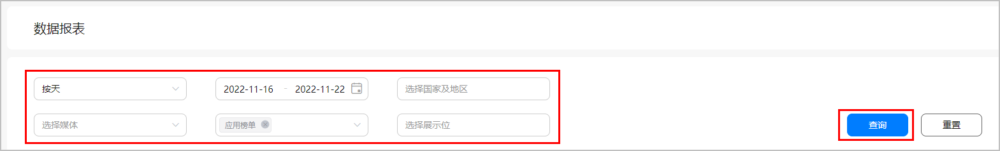
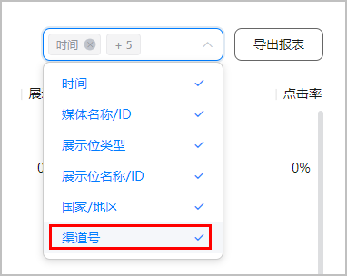
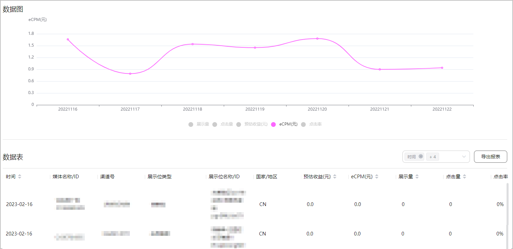

待集成AGD Pro SDK的应用正式上线后，即可通过数据报表查看对应的广告收益。

1. 登录[AppGallery Connect](https://developer.huawei.com/consumer/cn/service/josp/agc/index.html)，选择“我的项目”。
2. 在项目列表中点击您的媒体应用所在的项目。
3. 在左侧导航栏选择“盈利 > AGD Pro应用变现服务 > 数据报表”。
4. 在查询条件区域，选择具体的查询条件，点击“查询”。

   

   

   如果需要针对不同投放渠道来查看流量变现收益，则可以在“数据表”区域字段选择栏中点击下拉框选择“渠道号”后查询。

   

   即可查看到对应的数据图和数据表。

   

   原生广告的后台报表数据是隔天更新，应用榜单的后台报表数据是10分钟更新一次。

   

   其中部分字段说明如下表所示。

   | 字段名称 | 说明 |
   | --- | --- |
   | 渠道号 | 对应投放渠道的渠道号。  此字段用于针对不同投放渠道来查看流量变现收益。  区分不同渠道的查询能力，需要对应的快应用已将[channel字段](https://developer.huawei.com/consumer/cn/doc/development/quickApp-References/quickapp-api-ad-0000001074754667#section443419211957)传递到AGD Pro才支持。  针对不同投放渠道来查看流量变现收益，支持**按小时**维度呈现报表，并勾选“渠道号”来查询小时级别的不同投放渠道的流量变现收益。 |
