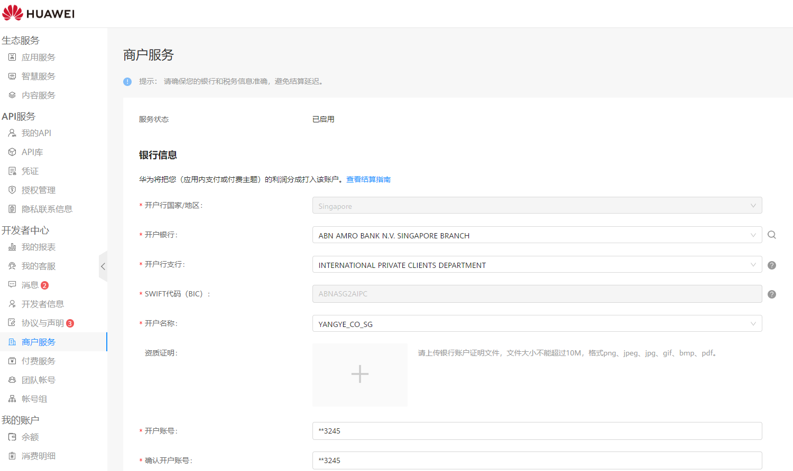

**Q1****：结算单币种为什么显示欧元？**

中国大陆开发者未维护跨境收款账户，那在生成结算单时，结算单默认币种为EUR，而且会导致账户无法收款。请及时维护您的[跨境收款账户](/docs/monetize/monetization/registration-0000001061752683#ZH-CN_TOPIC_0000001061752683__li12391182604817)。

**Q2：为什么收到两个不同主体开具的结算单？**

在使用流量变现服务时，您签约的华为主体会根据业务发生区域而定。因此当您的业务包含多个业务区域时，会由相应区域的华为主体生成对应的结算单。业务区域及签约主体划分遵循开发者服务协议相关内容，详情可参考： [分发区域和签约主体](https://developer.huawei.com/consumer/cn/doc/start/agreement-0000001052728169#ZH-CN_TOPIC_0000001052728169__section193661656462)。

**Q3：流量变现服务页面报表中显示的收益是开发者的最终收益吗？**

流量变现服务页面报表显示的是预估收益，最终收益以结算单为准。

**Q4：什么时候可以查看上个月的结算单？**

华为会在每月15日前提供上个月的结算单，您可以在每月15日之后登录华为开发者页面查看并确认上个月的结算单。

**Q5：为什么一直没有收到流量变现的收益付款****？**

华为将在您确认结算单后的30个日历日，付款至商户服务中您设置的银行账户，如果您一个结算周期内与华为单个主体的累计交易金额小于200欧元，则结算日期会顺延至累计满200欧元。如果6个月内未达到200欧元，华为将按6个月内累计的金额进行结算，详细结算流程请参照 [自助结算指南](https://developer.huawei.com/consumer/cn/doc/start/checkoutguide-0000001053128363)。

**Q6****：为什么开发者中心>我的账户>账单显示“支付中”，但一直未收到款？**

请确认：

1.账单是否已经满足[支付条件](/docs/monetize/monetization/settlement-0000001051321850#ZH-CN_TOPIC_0000001051321850__li34721630124714)。如果您的单个签约主体：Aspiegel SE和华为服务（香港）有限公司的账单未满足支付条件时，系统会暂缓支付。账单满足[支付条件](/docs/monetize/monetization/settlement-0000001051321850#ZH-CN_TOPIC_0000001051321850__li34721630124714)后，财务会对您的结算单进行预处理。在确认结算单的30个日历日进行支付，请耐心等待。

2.请检查您的收款账户信息是否正确。如您的收款账户未填写或填写的信息错误将会导致支付流程无法正常进行。

注册地为非中国大陆区域的开发者请参考下图信息核对：

3.您是否回复了华为发出的银行的咨询邮件（部分银行会对收款行进行问询）。如果您收到银行问询邮件未及时回复，账单会暂缓支付。

4.因各种原因导致付款失败，需要您配合解决。在问题未解决之前，所有付款都会被搁置。

针对注册国家为摩洛哥的开发者，只需输入后18位账号，正常维护后的账号会显示全数字，不带特殊字符“\*”。

**Q7：为什么“开发者中心>我的账户>账单”显示支付已完成，但是没收到钱呢？**

当结算单页面中显示"支付已完成"时，是指银行已经支付了款项，但因为中转行等原因可能会延迟到账，请耐心等待。

如果您维护的银行账号有问题或者其他原因导致打款失败，系统依然会显示"支付已完成"。付款失败后，我们会通过站内信和邮件通知您。请检查联系人邮箱是否填写正确,并且确认是否收到相关通知。

若您有疑问请通过[在线提单](https://developer.huawei.com/consumer/cn/support/feedback/#/)反馈。

**Q8****：****支付已完成已收到付款，但收到的款和结算单不一致？**

是因为在支付过程中可能存在中转行或您的收款行收取手续费的情况（因各银行政策不一样，付款到不同的地方、不同的汇路方式，都可能有不同的手续费，需要自行咨询您的收款银行），华为的付款行是不收取手续费，如果涉及退款的话，退款会有手续费。

**Q9****：****开发者账户停用，是否会影响到广告收益结算？**

开发者账户停用，会影响开发者的广告收益结算。对于账号停用及相关问题，详情咨询[客服支持](/docs/monetize/monetization/support-0000001061434261)。

**Q10:****结算单金额已达200欧元付款条件，为什么不安排付款？**

请确认鲸鸿动能广告流量变现服务的每个独立结算单金额是否达到了200欧元。

具体如下：

1. 不应将不同业务类型的结算单混在一起。

2. 鲸鸿动能广告流量变现服务内部，华为服务(香港)有限公司和Aspiegel SE的结算单也需要分开计算。

请确保每个单独的结算单都独立核算，不应合并计算。

**Q11:** **为什么同月账单会有正负金额？**

正数为结算金额，负数为违规扣款，合并计算以判断是否符合付款条件。付款条件详情请参考：[财务结算-报表与收入-鲸鸿动能流量变现（非中国大陆区） - 华为HarmonyOS开发者](/docs/monetize/monetization/settlement-0000001051321850)。

**Q12:** **已经超6个月结算单状态为什么还是支付中？**

因为在支付过程中可能存在中转行或您的收款行收取手续费情形，且手续费金额可能超过50欧元。如果单个主体累计6个月结算金额不足50欧元，我们建议暂缓支付，待结算金额达50欧元以上再申请。如果您仍希望进行结算，可以将您的付款申请发送至 petalads@huawei.com，我们将进一步审核您的申请。

**Q13:流量变现结算金额被退回后重新付款的金额为什么不一样？**

如果您的银行因故退回华为支付给您的结算款，华为将在下一次支付结算款时从中扣除银行就前述退款收取的手续费，具体手续费可咨询您的收款银行。

**Q14:如何申请暂缓？**

开发者若需暂缓支付，可将申请发送至 petalads@huawei.com。审批通过后，将从申请日起暂停支付。 若要恢复支付，需再次邮件申请并获得审批。

**Q15: 流量变现服务的结算货币支持修改吗？**

开发者可在【开发者联盟】的【商户服务】中，进入【跨境收款账户】修改默认结算币种。详情请参考：[商户服务-管理中心 - 华为HarmonyOS开发者](https://developer.huawei.com/consumer/cn/doc/start/merchant-service-0000001053025967)。

**Q16: 流量变现结算打款时的币种是以欧元还是人民币形式付款？**

流量变现结算付款币种主要是以您填写的收款账户币种为准，目前支持维护的币种：EUR、HKD、JPY、CHF、GBP、USD。详情请参考：[账号注册-接入流程-变现接入-鲸鸿动能流量变现（非中国大陆区） - 华为HarmonyOS开发者](/docs/monetize/monetization/registration-0000001061752683#section12517324174611)。

**Q17:Aspiegel SE和华为服务（香港）有限公司的账单结算时需付给银行的手续费占比是多少？**

手续费主要由开发者的收款银行收取，建议与开发者的收款银行确认。

**Q18: 开发者主体可以和收款银行主体不一致吗？**

不可以，开发者主体和银行主体必须一致，详情请参考：[商户服务-管理中心 - 华为HarmonyOS开发者](https://developer.huawei.com/consumer/cn/doc/start/merchant-service-0000001053025967)。

**Q19: 流量变现结算币种与账户收款币种不一致。币种之间的汇率是怎么计算的？**

可以点击[Xe: Currency Exchange Rates and International Money Transfers](https://www.xe.com/)查看具体汇率，详情请参考：[华为开发者商户服务协议-服务协议与隐私声明 - 华为HarmonyOS开发者](https://developer.huawei.com/consumer/cn/doc/start/merchantserviceagreement-0000001052848245)。

**Q20: 开发者提现时银行那边要求提供证明文件，在哪里可以下载？**

请下载华为服务（香港）有限公司和Aspiegel SE模板，填写相关信息后，通过工单或邮件提交申请，并附上以下资料：

- 《鲸鸿动能媒体服务协议》PDF原件

- 填写完毕的协议

- 收款银行名称

- 您的邮箱地址

盖章审核需30个自然日，审核结果会通过邮箱通知，请注意查收。详情请参考：[财务结算-报表与收入-鲸鸿动能流量变现（非中国大陆区） - 华为HarmonyOS开发者](/docs/monetize/monetization/settlement-0000001051321850#section1357892703818)。
