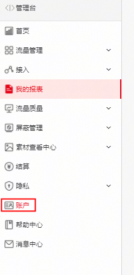

**Q1：如果应用需要转移到其他开发者账号，怎么办？**

A**：**应用转移时无需关闭/停止流量变现服务，可直接转移，详情请参考[应用转移](https://developer.huawei.com/consumer/cn/doc/distribution/app/50112#h1-1583379972649)。

| 转出方 | 转入方 | 是否支持转移 |
| --- | --- | --- |
| 中国大陆区域三方媒体账户 | 中国大陆区域三方媒体账户 | 支持转移 |
| 非中国大陆区域三方媒体账户 | 非中国大陆区域三方媒体账户 | 只支持同一[签约主体](https://developer.huawei.com/consumer/cn/doc/start/agreement-0000001052728169#ZH-CN_TOPIC_0000001052728169__section193661656462)内的账户转移 |
| 中国大陆区域三方媒体账户 | 非中国大陆区域三方媒体账户 | 不支持转移 |
| 非中国大陆区域三方媒体账户 | 中国大陆区域三方媒体账户 | 不支持转移 |

**Q2：登录到华为开发者Console页面后，流量变现服务页面无法正常打开。**

A**：**部分浏览器在实现广告屏蔽时会屏蔽广告平台的所有网址，导致无法正常访问。请关闭浏览器的所有广告屏蔽插件或使用无痕浏览模式，然后再尝试打开流量变现页面。

**Q3：个人开发者可以变更为企业开发者吗？**

A**：**目前不支持直接变更，需要重新注册企业开发者。

**Q4：是否支持个人开发者变现？**

A**：**鲸鸿动能广告流量变现服务的主体必须是已经完成实名认证及开通商户服务的企业开发者或个人开发者。

部分国家和地区（例如中国大陆）暂时不支持接入流量变现服务，各国家或地区（以账号注册地为准）的情况请参考：[受限说明](/docs/monetize/monetization/restriction-0000001061730052)

**Q5：想注册为企业开发者，但是注册为了个人开发者。该怎么办？**

A**：**目前不支持更改开发者账号类型。若您的华为账号/开发者账号没有关联其他业务，建议您先注销这个账号（此操作会同步删除您华为账号下关联的所有其他信息，如华为开发者联盟华为账号、应用市场华为账号、云空间存储的信息等等，请谨慎操作。详情请参考：[注销账号](https://developer.huawei.com/consumer/cn/doc/start/account-management-0000001052865467#section18429256122617)）,再重新注册新的账号，注册流程可查看此文档：[账号注册-接入流程-变现接入-鲸鸿动能流量变现（非中国大陆区） - 华为HarmonyOS开发者](/docs/monetize/monetization/registration-0000001061752683)

若存在特殊情况，请通过[在线提单](https://id1.cloud.huawei.com/CAS/portal/loginAuth.html?reqClientType=89&loginChannel=89000003&regionCode=cn&loginUrl=https://id1.cloud.huawei.com:443/CAS/portal/loginAuth.html&lang=zh-cn&themeName=red&clientID=6099200&state=5933814&service=https://oauth-login1.cloud.huawei.com/oauth2/v2/loginCallback?access_type=offline&client_id=6099200&display=page&flowID=0a8a43ac000001d17623332863833176&h=1762333286.3860&lang=zh-cn&redirect_uri=https%253A%252F%252Fdeveloper.huawei.com%252Fconsumer%252Fcn%252Fsupport%252Ffeedback%252F&response_type=code&scope=openid%2Bhttps%253A%252F%252Fwww.huawei.com%252Fauth%252Faccount%252Fcountry%2Bhttps%253A%252F%252Fwww.huawei.com%252Fauth%252Faccount%252Fbase.profile%2Bhttps%253A%252F%252Fwww.huawei.com%252Fauth%252Faccount%252Floginid%2Bhttps%253A%252F%252Fwww.huawei.com%252Fauth%252Faccount%252Faccount.flags%2Bhttps%253A%252F%252Fwww.huawei.com%252Fauth%252Faccount%252Fstate.register%2Bhttps%253A%252F%252Fwww.huawei.com%252Fauth%252Faccount%252Frealname%252Fstate%2Bhttps%253A%252F%252Fwww.huawei.com%252Fauth%252Faccount%252Frealname%252Fidentity%2Bhttps%253A%252F%252Fwww.huawei.com%252Fauth%252Faccount%252Frealname%252Fctf.type%2Bhttps%253A%252F%252Fwww.huawei.com%252Fauth%252Faccount%252Fanonymous.mobile&state=5933814&v=cada318171a2875b6d76b1c0140219fae8dd3a293e0381a163521e4085795f26&validated=true)反馈处理。

**Q6：开发者如何修改变现的账户名称？**

A**：**广告变现服务的账户名称是根据开发者实名认证的企业名称显示的，若您需要修改账户名称，可参照开发者联盟的企业名称变更流程，详情可参考：[开发者基本信息设置](https://developer.huawei.com/consumer/cn/doc/start/information-modification-0000001053145467#h1-2-changing-the-company-name)

**Q7：开发者账户注册完成后想变更注册主体和注册地址，如何变更？**

A**：**已完成注册的开发者，不允许更改国家或地区相关信息，有关允许修改的数据详情可参考：[开发者基本信息设置](https://developer.huawei.com/consumer/cn/doc/start/information-modification-0000001053145467#h1-2-changing-the-company-name)

**Q8：怎么确认开发者登录的是团队账户还是主账户？**

A**：**可根据以下3种方式进行判断您登录的是否是主账户：

1、登录页面左侧有“签约信息”栏，是开发者主账户；登录页面左侧没有“签约信息”栏，开发者登录的是团队账号。

2、登录页面左侧有查看有“账户”标识是主账户， 没“账户”标识是团队账户。

3、主账号管理中心（Console）的右上角是有自定义桌面按钮的，而成员账号没有。

**Q9：流量变现后台支持开通子账号吗？**

A**：**团队账户功能已支持，开通请参考：[团队账号预览-团队账号 - 华为HarmonyOS开发者](https://developer.huawei.com/consumer/cn/doc/start/team-account-guides-0000001053785552)

**Q10：注册开发者账号时手机无法正常接收到验证码怎么办？**

A**：**请按以下方法进行排查：

1、手机短信收件箱是不是已满，删除一些无用短信看是否可以正常接收。

2、手机是不是安装了安全软件，安全软件有可能会进行拦截到垃圾信箱里。

3、手机是不是长时间不关机，建议关机重启再查看。

4、手机是不是双卡双待的手机，建议拿出手机卡重新换一下卡槽再试试查看。

5、如若以上方法都检查过后还是收不到验证码，请您将SIM卡换到其他手机上进行测试。

按照以上提示都排查后仍然无法收到验证码可以通过[在线提单](https://id1.cloud.huawei.com/CAS/portal/loginAuth.html?reqClientType=89&loginChannel=89000003&regionCode=cn&loginUrl=https://id1.cloud.huawei.com:443/CAS/portal/loginAuth.html&lang=zh-cn&themeName=red&clientID=6099200&state=5933814&service=https://oauth-login1.cloud.huawei.com/oauth2/v2/loginCallback?access_type=offline&client_id=6099200&display=page&flowID=0a8a43ac000001d17623332863833176&h=1762333286.3860&lang=zh-cn&redirect_uri=https%253A%252F%252Fdeveloper.huawei.com%252Fconsumer%252Fcn%252Fsupport%252Ffeedback%252F&response_type=code&scope=openid%2Bhttps%253A%252F%252Fwww.huawei.com%252Fauth%252Faccount%252Fcountry%2Bhttps%253A%252F%252Fwww.huawei.com%252Fauth%252Faccount%252Fbase.profile%2Bhttps%253A%252F%252Fwww.huawei.com%252Fauth%252Faccount%252Floginid%2Bhttps%253A%252F%252Fwww.huawei.com%252Fauth%252Faccount%252Faccount.flags%2Bhttps%253A%252F%252Fwww.huawei.com%252Fauth%252Faccount%252Fstate.register%2Bhttps%253A%252F%252Fwww.huawei.com%252Fauth%252Faccount%252Frealname%252Fstate%2Bhttps%253A%252F%252Fwww.huawei.com%252Fauth%252Faccount%252Frealname%252Fidentity%2Bhttps%253A%252F%252Fwww.huawei.com%252Fauth%252Faccount%252Frealname%252Fctf.type%2Bhttps%253A%252F%252Fwww.huawei.com%252Fauth%252Faccount%252Fanonymous.mobile&state=5933814&v=cada318171a2875b6d76b1c0140219fae8dd3a293e0381a163521e4085795f26&validated=true)反馈处理。

**Q11：同一个公司主体和公司信息，可以注册两个开发者账号吗？**

A**：**不能，目前一个企业只能注册一个开发者账号。

**Q12：开发者主体可以和收款银行主体不一致吗？**

A**：**不可以，开发者主体和收款银行主体必须一致，详情请参考：[商户服务-管理中心 - 华为HarmonyOS开发者](https://developer.huawei.com/consumer/cn/doc/start/merchant-service-0000001053025967)
