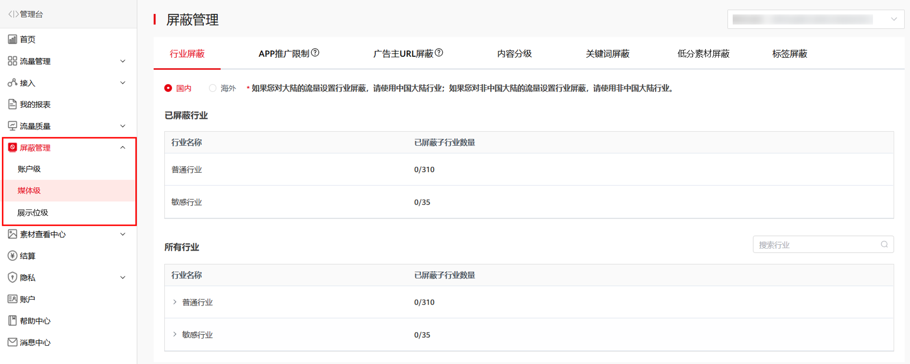

#### 1. 屏蔽管理

1. 屏蔽维度

   开发者可按账户级、媒体级和展示位级设置屏蔽规则。

   
2. 屏蔽规则
   * 行业屏蔽：可设置行业屏蔽，取消目标行业的投放许可。
   * APP推广限制：可限制目标APP的推广，使用目标APP包名进行设置。
   * 广告主URL屏蔽：可限制广告主URL的投放，使用目标URL进行设置。
   * 内容分级：可设置媒体的广告内容级别，具体分级详见媒体管理后台。
   * 关键词屏蔽：可添加关键词屏蔽，限制涉及目标关键词的广告投放。
   * 允许低分素材投放：可设置允许低分素材投放，低分素材仍然是合法合规的素材，仅在美观度、素材用户体验、细节处理等方面的要求有所降低。
   * 标签屏蔽：可添加标签屏蔽，取消目标标签的广告投放。

1. 设置广告屏蔽可能会影响广告填充率，请评估后谨慎选择;

2. 除标签屏蔽外，媒体级广告屏蔽设置优先级高于账户级广告屏蔽设置；

3. 标签屏蔽，若已有账户级屏蔽的标签，媒体级屏蔽无法修改，媒体级屏蔽按账户级设置生效；

4. 展示位级屏蔽优先级最高。
