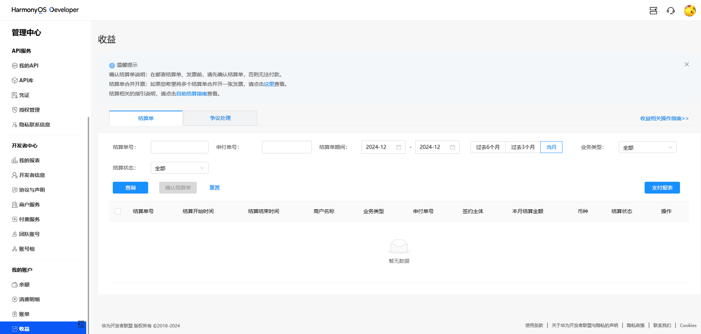

1. 结算单出具时间

   结算周期为日历月，每个结算周期的第15天我们会在开发者联盟平台提供您上一个日历月应得收入的结算数据，即结算款的计算细节（“结算单”）。

2. 结算单查看与确认
   * 结算单入口，鲸鸿动能媒体服务平台 - 【结算】，或者 开发者官网 -【管理中心】-【我的账户】-【收益】，进入自助结算页面查看结算单并确认。

   

   * 根据已签订的合作协议，合作伙伴可以在结算单出具后15个自然日内同鲸鸿动能对账并发起争议，如在15个自然日内未发起争议申请则视同无异议，系统自动进入支付处理流程（合作伙伴仍需提供发票）。

3. 发票邮寄

   发票邮寄前，请确认您已系统确认了结算单，并将“结算期#业务类型”备注在发票备注栏。（如，202404#流量变现）
   * 纸质发票，请邮寄给平台。
   * 电子发票，请发送至hwinvoice@huawei.com。
   * 如有负数结算单，需按正负抵冲后的金额开具发票。
   * 结算单确认方式及具体发票邮寄/邮件事宜详情参考“[自助结算指南](https://developer.huawei.com/consumer/cn/doc/start/checkoutguide-0000001053128363)”。
4. 单据审核及付款

   若您的付款单据被审核通过，结算页面的结算单状态会变为“付款中”（发起结算单付款）。我们会在收到合格有效的付款单据后30个自然日内付款， 若遇节假日可能顺延。付款完成后**，**结算单状态会变为“付款成功”。

根据您提供的服务类型和税法规定开具，如广告费，广告发布费，广告服务费，广告服务，广告发布，广告发布服务等，具体以您所在税务局规定为准。
