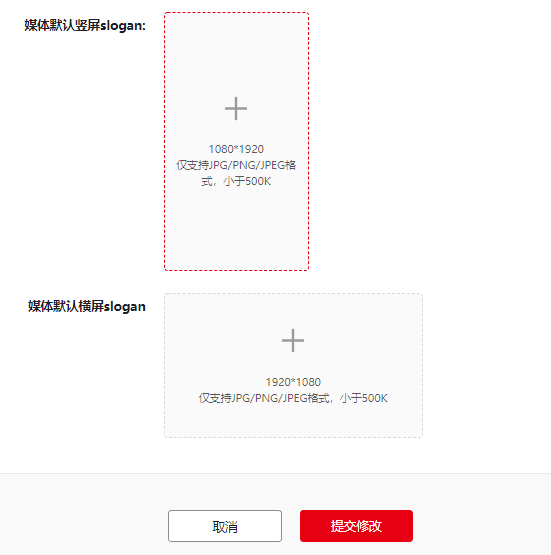

极速开屏是Android应用（APK）独有的广告样式，在应用启动时，由鲸鸿动能系统推送广告的开屏展示形式，无需媒体嵌入SDK就能快速实现广告变现。接入方式如下：

1. 【媒体管理】- 点击媒体名称打开展示位列表 – 启用【极速开屏】。
2. 【媒体管理】- 设置媒体 – 上传媒体默认Slogan（在无广告展示时或等待广告返回时默认展示此Slogan）。

   
3. 极速开屏接入[详见链接](https://developer.huawei.com/consumer/cn/doc/development/HMSCore-Guides/publisher-service-exsplash-0000001051056577)
