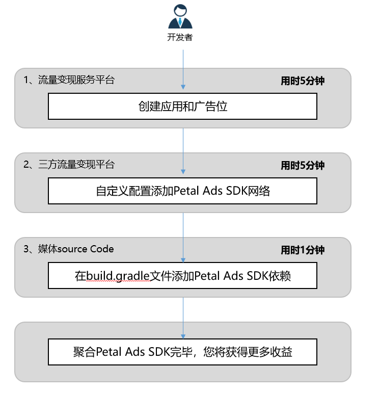

#### 接入流程

#### 操作流程

1. 登陆流量变现服务平台，创建应用和广告位。
2. 登陆三方流量变现平台，点击自定义配置添加鲸鸿动能广告SDK网络。
3. 在媒体文件source Code build.gradle中添加鲸鸿动能广告SDK依赖。
4. 聚合鲸鸿动能广告SDK完毕，您可以开始流量变现获得更多的收益。

详情请咨询联系[运营人员](/docs/monetize/monetization/support-0000001061434261)。
