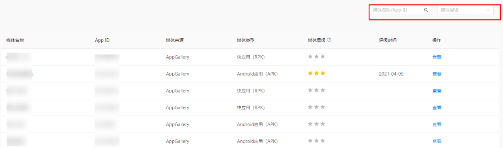
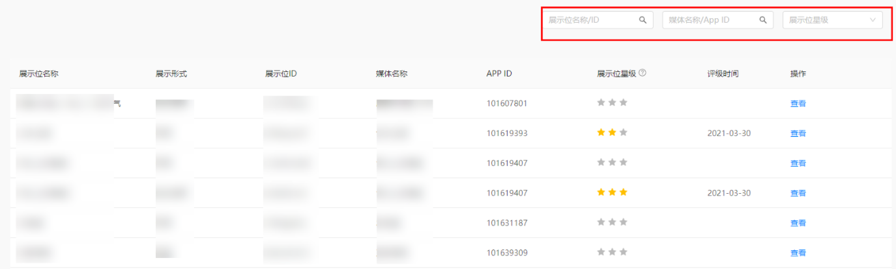

#### 概述

**流量质量评级**是衡量您的应用在流量变现服务平台中流量质量的一种方式。您的流量质量的评级越高，代表流量越优质，您的变现收益也会更高。通过关注流量质量评级，您可以发现流量质量问题并及时主动整改。系统将每天更新流量质量评级，您看到的评级是基于前7个自然日的数据。

#### 评级分类

**评级体系包含两个方面：**

* **展示位**评级：当您的展示位首次在一定周期内达到一定的展示数量，该展示位将进入评级，从真实性，转化效果，数据贡献，流量规模四个维度来评定。
* **媒体**评级：当您的应用下至少有一个展示位进行评级，则该应用将进行媒体评级，从真实性，转化效果，规模与稳定性，数据贡献四个维度来评定。

  若您的展示位或媒体一直没有评估结果，说明一直未能达到首次进入评估的基准条件，您需要对您的展示位进行检查，以提升展示位的展示次数，从而达到评估条件。

|  |  |
| --- | --- |
| 评级维度 | 说明 |
| 真实性 | 包含请求真实性、曝光真实性、点击真实性、下载真实性等； |
| 转化效果 | 包含展示点击率、点击下载率、激活率、留存率等； |
| 规模与稳定性 | 包含广告请求量、独立访客数、流量稳定趋势等； |
| 数据贡献 | 包含个性化上报率、ADS接入方式、媒体位置上报率、上下文内容上报率等。 |

**流量质量评级共分为五个星级：**

五星★★★★★、四星★★★★☆、三星★★★☆☆、二星★★☆☆☆、一星★☆☆☆☆、未评星。

星级越高，流量质量越好。

#### 查看评级结果

您可以在流量变现服务平台中的“流量质量”，查看**媒体星级、展示位星级**评级结果：

* 媒体星级：支持通过媒体名称/ID、媒体星级进行筛选查询；点击“查看”可以查看历史评级数据，历史评级时间为最近30天。

  
* 展示位星级：支持通过展示位名称/ID、媒体名称/ID、展示位星级进行筛选查询；点击“查看”可以查看历史评级数据。

  
