#### 媒体操作

* **添加媒体**

  如何添加媒体请参照[添加媒体](/docs/monetize/monetization/addmedia-0000001051201919)。

* **搜索媒体**

  进入[媒体服务平台—媒体管理](https://developer.huawei.com/consumer/cn/service/ads/publisher/html/index.html?lang=zh#/mainContent/appList)界面，支持在右上方的搜索框中输入展示位ID搜索对应的媒体。

  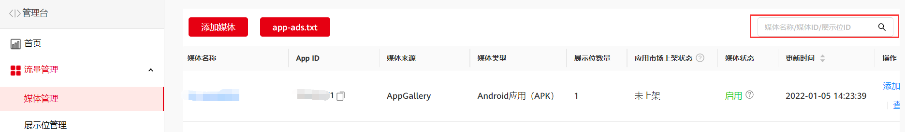

* **修改媒体信息**
  1. 选择**媒体管理**，单击**设置媒体；**

     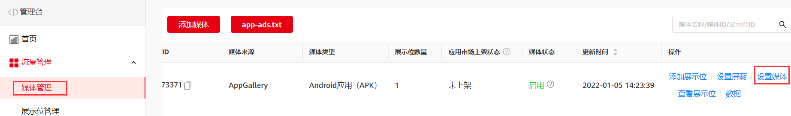
  2. 进入媒体编辑界面，完成修改后单击**提交修改****。**

     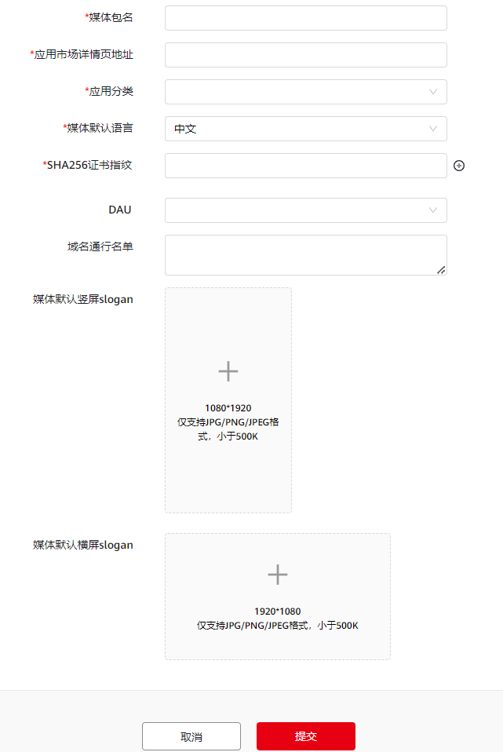

* **查看媒体状态**

  媒体状态分为正常和异常，只有媒体状态为正常时才可以进行变现。异常情况下应用不能进行变现，异常的原因有：
  + 应用未上架
  + 应用违规被暂停

#### app-ads.txt

目前仅开放给在Google Play上架的应用，后续会支持在AppGallery上架的应用，敬请期待。

授权应用卖方（或 app-ads.txt） 是一项 IAB 计划，可帮助保护您的应用广告资源免遭广告欺诈。

您可以创建 app-ads.txt 文件来指明有权销售您的广告资源的卖方。通过指明授权卖方，您可以避免那些原本可能流向欺诈应用的仿冒广告资源的广告客户支出。

app-ads.txt 文件是公开的，可供广告交易平台、供应方平台 (SSP) 以及其他买方抓取。

app-ads.txt并不是强制使用的，但如果您担心他人可能会欺诈自己应用时，建议使用app-ads.txt来保护您的应用。

1. **创建开发者网站**

   添加开发者网站地址，可按照以下步骤来操作：
   1. 登录[华为开发者平台](https://developer.huawei.com/consumer/cn/console/service/AppService)，选择“APPGallery Connect”。

      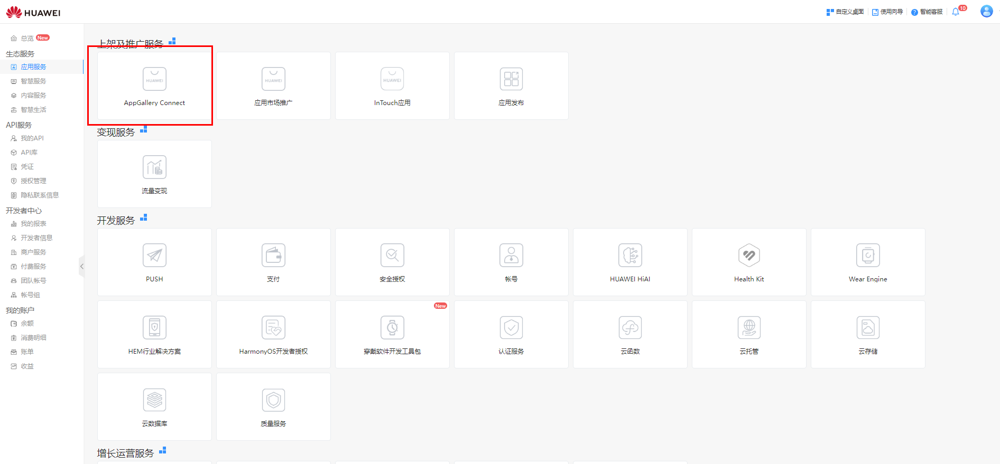
   2. 进入APPGallery Connect后,点击“我的应用”。

      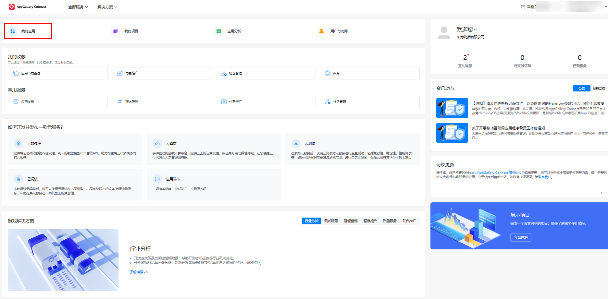
   3. 选择对应的应用，点击“发布”进入编辑页面。

      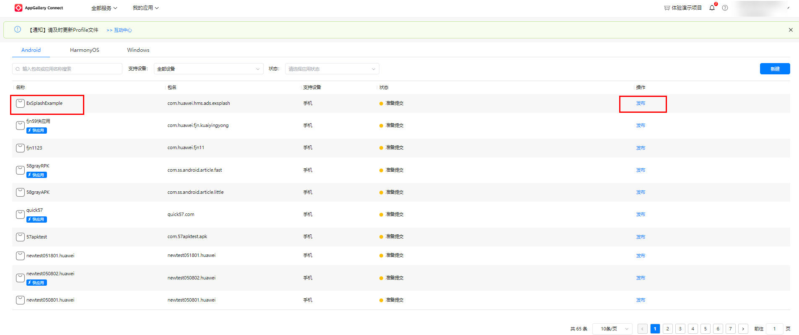
   4. 进入编辑页面后，点击“应用信息”，找到联系信息。

      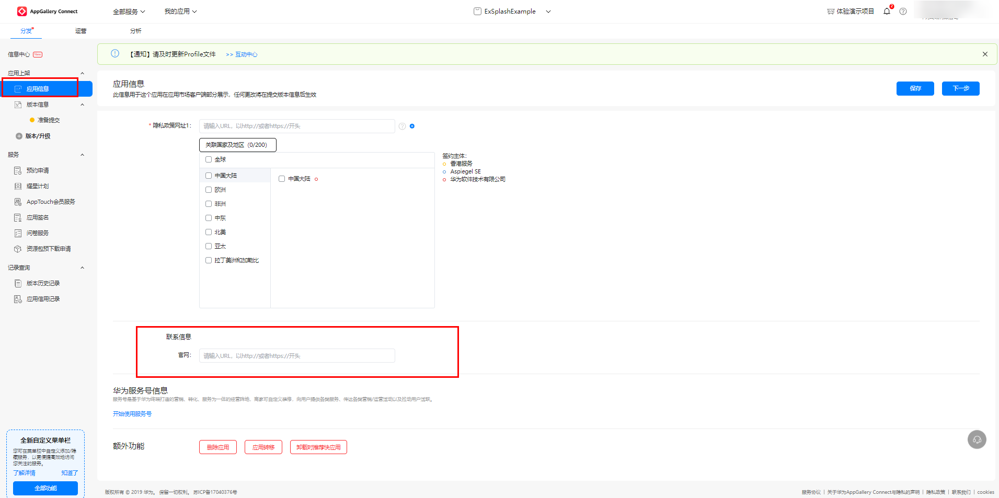
   5. 添加您的官网网址，点击“保存”。
2. **创建 app-ads.txt 文件**
   1. 选择**流量管理** &lt; **媒体管理** &lt; **app-ads.txt**。

      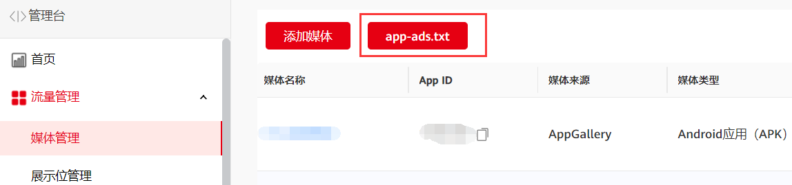
   2. 配置app-ads.txt文件。

      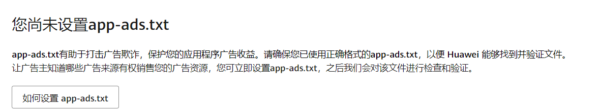

      

      app-ads.txt 文件的格式必须符合 IAB Tech Lab 的规定，才能通过验证。如果您需要其他帮助，请参阅 IAB Tech Lab 提供的[应用授权卖方规范](https://alliance-communityfile-drcn.dbankcdn.com/FileServer/getFile/cmtyPub/011/111/111/0000000000011111111.20260105162003.19948432006585044265057273942836%3A50001231000000%3A2800%3A08E871EA0F898B62A8F536BCCEB2846C85E7B3480556157D5A8173E716F21242.pdf?needInitFileName=true)。
   3. 复制代码并粘贴到您的app-ads.txt，如果没有创建请按照IAB Tech Lab提供的规范进行创建。

      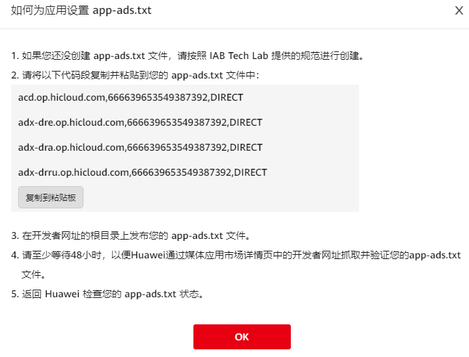

      如果需要在 app-ads.txt 文件中添加其他授权卖方 ID，需要在 app-ads.txt 文件中添加其他三方的网址，让您的第三方卖方也能找到并验证您的 app-ads.txt 文件。请与您的三方媒体平台联系，了解对方的 app-ads.txt 信息。
3. **检查****app-ads.txt 文件是否已通过验证**

   提交检查更新后，请等待文件验证至少48小时，以便更新系统app-ads.txt状态。

在完成添加媒体之后，您可以看到app-ads.txt界面中媒体信息都同步过来。

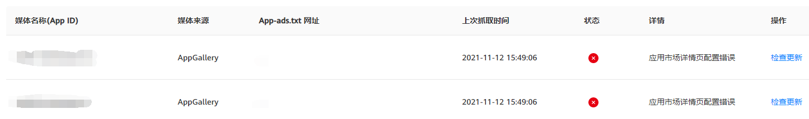

1. 媒体名称（App ID）：添加媒体时填写的媒体名称和应用ID。
2. 媒体来源：AppGallery、Google Play等其他三方应用。
3. app-ads.txt网址：使用应用的官网地址查找并抓取开发者的app-ads.txt 文件，基于您在AppGallery或Google Play所关联的域名地址（如：www.\*\*\*\*\*/app-ads.txt）。
4. 状态：表明配置app-ads.txt的应用状态。
