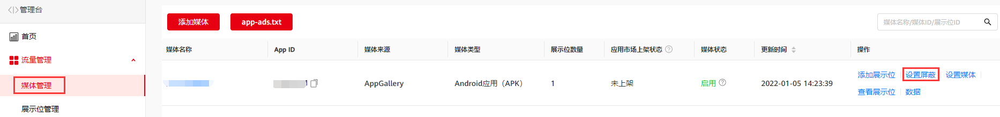
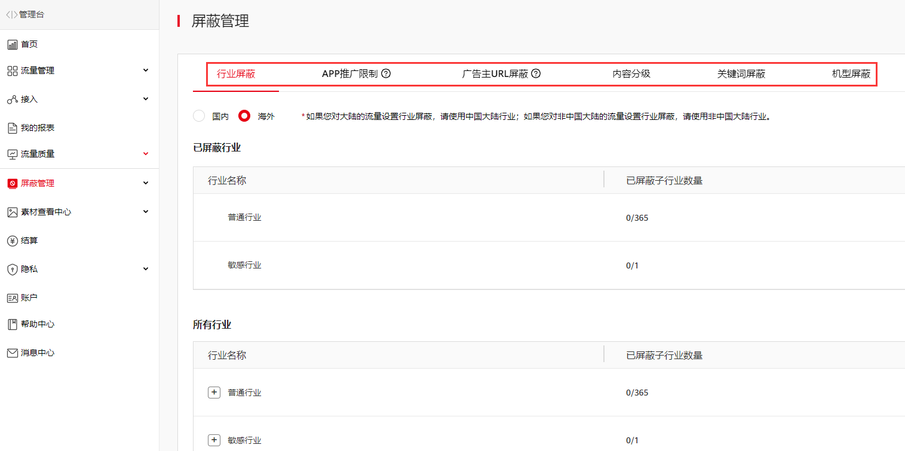
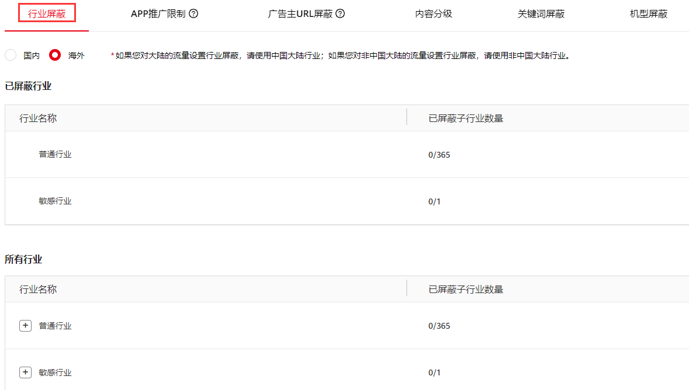
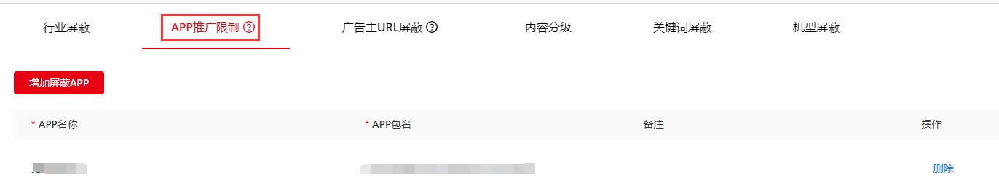
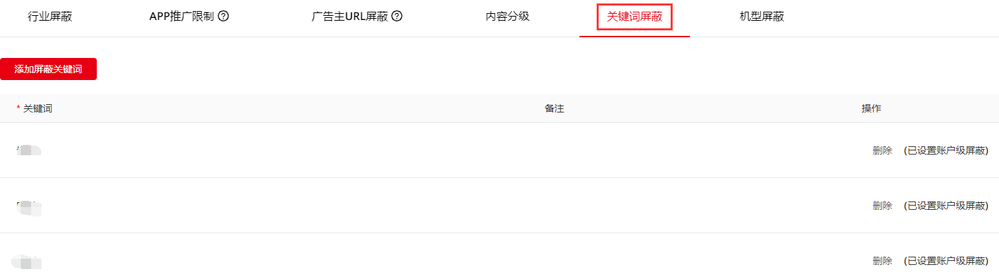

1. 登录媒体服务平台，单击**媒体管理**，选择目标媒体，单击**设置屏蔽**。

   
2. 选择需要屏蔽的类型，单击**状态**列中的选择按钮，完成屏蔽设置。

   

设置广告屏蔽可能会影响广告填充率，请评估后谨慎选择。

#### 按行业屏蔽

如选择屏蔽某行业，则所有该行业的广告不会在您的展示位上显示。一般用于屏蔽同行业的竞争对手。

1. 单击 **行业屏蔽**，选择“**普通行业**”或者“**敏感行业**”。搜索筛选相关行业，在状态栏中选择需要屏蔽的行业。您已经屏蔽的行业会在“**已屏蔽行业**”中显示。

   

   另外，为保证广告内容的合法合规，鲸鸿动能广告平台默认屏蔽法律法规禁止的行业。

#### 按APP推广限制屏蔽

如果您不希望某个或多个应用在您的展示位上进行展示，您只需在**APP推广限制**中添加一条记录，填写屏蔽应用的名称、包名，单击**保存**即可。

#### 按广告主URL屏蔽

您可以按广告主URL进行屏蔽操作，可屏蔽广告主的广告落地页。单击**广告主URL屏蔽**，填写屏蔽URL以及备注，单击**保存**即可。

您最多可屏蔽50个URL。支持具体广告素材URL、落地页URL和域名屏蔽。

#### 按内容分级屏蔽

为您的应用选择内容分级。内容分级主要有四级：

1. Widespread (content suitable for all audiences)：适合广泛受众的内容；
2. Parental instruction (content suitable for most audiences with parental instruction)：适合家长陪同下观看的内容；
3. Junior (content suitable for junior and older audiences)：适合青少年及以上观看的内容；
4. Adult (content only suitable for adults)：适合成年人及以上观看的内容。

当您选择W时，PI，J，A等级的广告内容会被屏蔽。以此类推，当开发者选择A级别时，没有任何等级的广告内容被屏蔽。单击**内容分级**选择相应分级，单击**保存**即可。请谨慎设置您的App广告内容分级，内容分级设置会影响您的广告填充率，按照分级从低到高的排序分别为：A、J、PI、W。

#### 按关键词屏蔽

开发者可指定关键词屏蔽广告的文案（标题和品牌名）。单击**添加屏蔽关键词**，填写关键词以及备注，单击**保存**即可。

#### 按低分素材屏蔽

**非中国大陆区域变现不支持低分素材屏蔽功能。**

中国大陆区域变现的开发者可设置是否允许低分素材投放。低分素材仍然是合法合规的素材，仅在美观度、素材用户体验、细节处理等方面的要求有所降低。如果您开启“低分素材禁投开关”，低分素材无法您的应用上进行投放。
