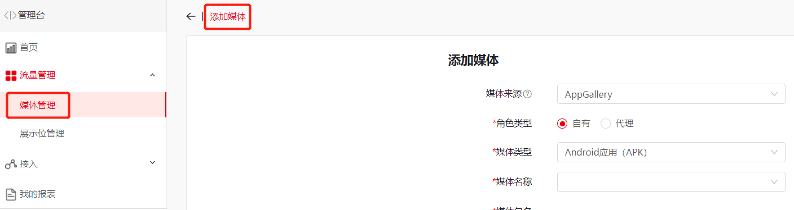
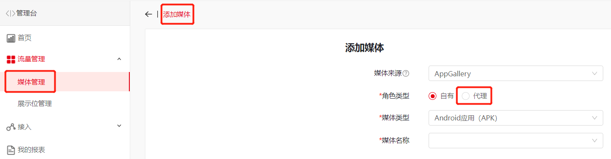
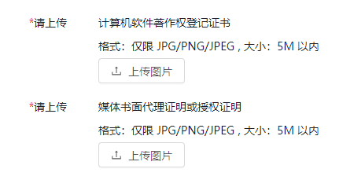

1. 添加媒体
   * 创建步骤：【流量管理】-【媒体管理】-【添加媒体】- 填写资料。
   * 添加媒体的前提是AppGallery在架状态，或在AppGallery Connect上完成[创建应用](https://developer.huawei.com/consumer/cn/doc/distribution/app/agc-help-createapp-0000001146718717)和[配置应用基本信息](https://developer.huawei.com/consumer/cn/doc/distribution/app/agc-help-configure-appinfo-0000001100086630)生成APP ID（提交状态）。

   
2. 填写资料

* 如接入平台的是应用，选择“Android应用（APK）”或“鸿蒙应用”，如接入快应用/快游戏，选择“快应用（RPK）”，如接入元服务，选择“元服务”，媒体的上架和审核状态不影响创建广告位和集成，待测试验收通过后审核状态会更新。

* 如广告变现使用的账号与华为应用市场上架的账号不一致，则添加媒体的角色类型为“代理”，并请提供《计算机软件著作权登记证书》、《媒体书面代理证明或授权证明》。

  

  

* SHA256指纹证书获取：
  + 应用：从AndroidManifest.xml文件获取软件包名称，然后使用以下命令获取指纹：keytool-list-v-keystore mystore.keystore
  + 快应用/快游戏：点击查看[快应用/快游戏生成配置证书指纹](https://developer.huawei.com/consumer/cn/doc/development/quickApp-Guides/quickapp-generate-fingerprint)
  + 鸿蒙应用/元服务：点击查看[鸿蒙应用/元服务配置签名证书指纹](https://developer.huawei.com/consumer/cn/doc/app/agc-help-signature-info-0000001628566748#section1766216380372)

1. SHA256证书指纹要求大写格式；

2. 如您后续在华为应用市场修改了证书指纹，请及时同步更新至SSP媒体管理后台，以免影响广告交互链路。
