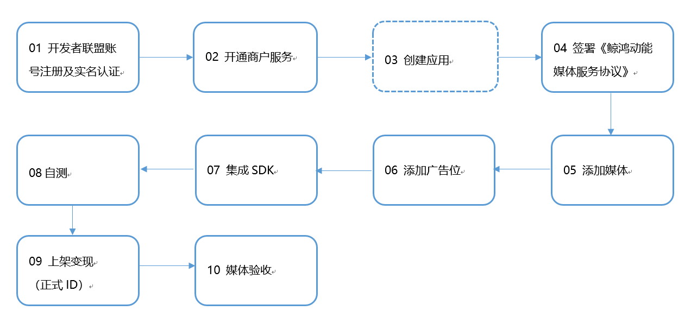

流量变现服务支持Android应用通过SDK集成变现，快应用/快游戏API集成变现两种方式。具体可参考：[集成开发](https://developer.huawei.com/consumer/cn/doc/monetize/androidappsdk-0000001053440624)。

* 流量变现服务**的安卓应用****SDK集成**变现需要完成以下几个步骤：

  
* 流量变现服务的**快应用/快游戏****API**集成变现接入需要完成以下几个步骤：

  

  

  若您已经有了华为账号并且在华为开发者联盟完成实名及商户认证，且应用已经上架AppGallery，则可跳过前三个步骤，直接从签署《鲸鸿动能媒体服务协议》开始接入。
