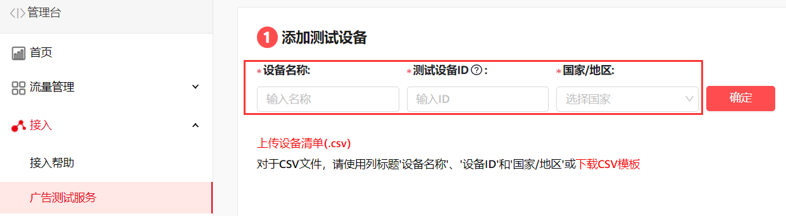
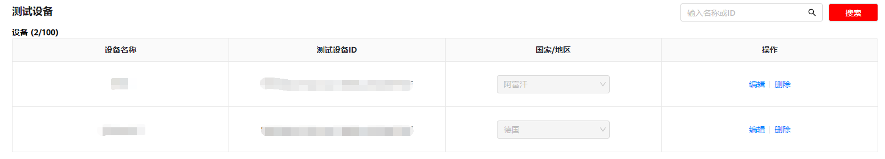
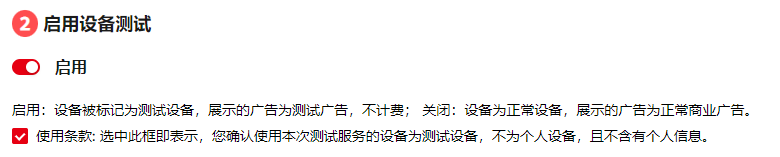
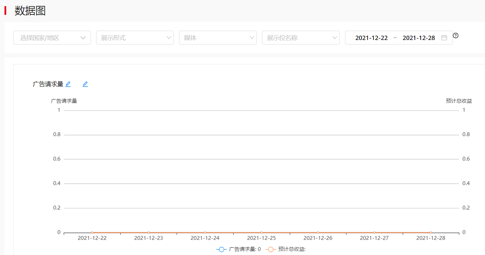
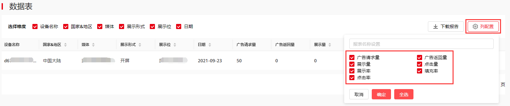

#### 变现测试

您可以用以下两种方式来测试是否已正确集成，当前支持测试方式：

1. 如果您的应用状态是“已上架”，您可以使用正式广告位ID，并且将您的设备添加为测试设备来进行测试。

   使用**正式广告位ID**进行测试：

   * 将使用APP[上架AppGallery](#section730819003819)（上架AppGallery系统需要24个小时同步应用状态，状态同步后方可返回广告）
   * 将使用APP[上架Google Play](#section730819003819)（上架GooglePlay，可实时请求并返回广告）

   然后将您想要测试的设备添加到Publisher Service的测试设备列表。具体步骤如下：

   1. 添加或更新测试设备，等待15分钟生效。
   2. 测试设备同步测试状态：初次使用需要将测试设备连接电脑（不需要其他操作），使用测试设备发起广告请求。
   3. 以上仅针对首次接入测试设备服务，后续该测试设备请求其他广告会立即生效；若对该测试设备进行国家/地区变更需等待15分钟生效。

      
   * **添加测试设备**：点击**设备测试服务**，输入**测试设备名称、测试设备ID(OAID或者GAID)、国家/地区，**指定测试国家之后，不受手机当前所在位置的限制，会固定返回指定国家的广告。

     **上传设备清单（.csv）：**请先下载CSV模板，按照模板填写测试设备名称（不支持特殊字符）、测试设备ID以及[国家码](https://alliance-communityfile-drcn.dbankcdn.com/FileServer/getFile/cmtyPub/011/111/111/0000000000011111111.20260105162008.18130791360229097260273910161181%3A50001231000000%3A2800%3A32715728EA34BF053C49AF4502999A4B90E0D4C3BFD8B9FF923D57A3430EA39D.xlsx?needInitFileName=true)并上传设备清单。

     

     **测试设备管理**：编辑、删除、查询。

     
   * **启用设备测试**：开启后可以正常测试拉取广告。

     
   * **支持开发者查看下载测试数据**：支持查看数据图和数据表，以及下载数据表，我们采用北京时间（UTC+8）为您提供数据报表信息。

     **数据图支持维度：**国家/地区、展示形式、媒体、展示位名称、日期。

     **数据图指标：**广告请求量、广告返回量、展示量、点击量。

     

     **数据表支持维度：**设备名称、国家/地区、媒体、展示形式、展示位、日期。

     **数据表指标：**广告请求量、广告返回量、展示量、点击量、展示率、填充率、点击率。

     

   

   * 设备测试服务要求媒体SDK升级到13.4.36.300及以上版本，HMSCore升级到5.1.0.300及以上版本。
   * 设备测试服务请求返回的广告是商用广告，但不计费。
2. 如果您的应用尚未发布，您可以使用测试广告位ID来进行测试。

   测试广告时，可以使用专门的测试广告位ID来获取测试广告，以避免在测试过程中产生无效的广告点击量。测试广告位ID仅作为功能调试使用，不可用于广告变现，正式商用前需替换成正式广告位ID。参考具体版位的测试广告位ID：[获取测试广告位ID](https://developer.huawei.com/consumer/cn/doc/development/HMSCore-Guides/publisher-service-banner-0000001050066915#ZH-CN_TOPIC_0000001057202899__section1119713111418)。

#### 应用上架发布

1. 商业发布需要将使用正式展示位ID的APP上架应用市场。上架后需要[媒体验收](/docs/monetize/monetization/acceptance-0000001051897737)。
2. 请务必检查确认关于用户隐私声明的要求，媒体需以自身的名义发布用户隐私声明，包含使用第三方广告服务要求的内容，禁止以华为或鲸鸿动能广告等名义发布用户隐私声明，参考如下：

   为了向您展示您感兴趣的广告，【XXXX应用】将收集和处理您的以下信息，并仅在上述的目的范围内分享各第三方广告服务平台：

   * 设备及使用信息：设备标识符、操作系统的设置信息、设备的硬件信息、应用的基本信息及使用信息、网络信息、运营商信息、华为账号信息。
   * 广告互动信息：对广告的浏览、点击、关闭和播放信息。打开和关闭应用的时间、应用使用频率、应用错误日志。
   * 位置信息。我们会收集、使用并处理您设备的模糊位置或准确位置，这些位置信息通过 GPS、WLAN 和服务提供商的网络 ID 获取。我们会询问您要为XXX应用程序启用基于位置的服务。您可在设备的设置菜单中选择关闭设备上的相应权限，拒绝共享您的位置信息。

   您的所属国家/地区与个人信息存储位置对应关系如下：

   |  |  |
   | --- | --- |
   | **存储位置** | **国家/地区** |
   | 中国大陆境内 | 中国大陆 |
   | 德国 | 奥地利、比利时、保加利亚、克罗地亚、塞浦路斯、捷克共和国、丹麦、爱沙尼亚、芬兰、法国、德国、希腊、匈牙利、爱尔兰共和国、意大利、拉脱维亚、立陶宛、卢森堡、北马其顿共和国、波兰、葡萄牙、罗马尼亚、斯洛伐克、斯洛文尼亚、西班牙、瑞典、荷兰、冰岛、列支敦士登、挪威、英国、瑞士、黑山、阿尔巴尼亚、塞尔维亚、波黑、梵蒂冈、马耳他、摩尔多瓦、以色列、荷属安的列斯、安道尔、摩纳哥、圣马力诺、法罗群岛、直布罗陀、格陵兰、根西、马恩岛、泽西、荷属圣马丁、法属圣马丁、圣皮耶与密克隆、荷兰加勒比区、奥兰、日本、韩国、土耳其、澳大利亚、新西兰、加拿大、圣文森特和格林纳丁斯、乌克兰 |
   | 新加坡 | 中国香港、中国澳门、马来西亚、越南、印度、孟加拉国、柬埔寨、老挝、缅甸、尼泊尔、巴布亚新几内亚、菲律宾、新加坡、斯里兰卡、中国台湾、泰国、斐济、萨摩亚、汤加、瓦努阿图、印度尼西亚、所罗门群岛、文莱、马尔代夫、不丹、圣诞岛、科科斯群岛、库克群岛、法属波利尼西亚、关岛、东帝汶、基里巴斯、马绍尔群岛、密克罗尼西亚、瑙鲁、新喀里多尼亚、纽埃、诺福克岛、北马里亚纳群岛、帕劳、皮特凯恩群岛、托克劳、图瓦卢、瓦利斯和富图纳、美属萨摩亚、玻利维亚、哥伦比亚、哥斯达黎加、多米尼加共和国、厄瓜多尔、萨尔瓦多、危地马拉、洪都拉斯、牙买加、墨西哥、尼加拉瓜、巴拿马、巴拉圭、秘鲁、乌拉圭、委内瑞拉、智利、波多黎各、巴哈马、巴巴多斯、英属维尔京群岛、法属圭亚那、格林纳达、海地、圣卢西亚、苏里南、特立尼达和多巴哥、伯利兹、安提瓜和巴布达、百慕大、安圭拉、圭亚那、马提尼克、圣基茨和尼维斯、特克斯和凯科斯群岛、开曼群岛、多米尼克、瓜德罗普、蒙特塞拉特岛、圣巴泰勒米岛、马尔维纳斯群岛（福克兰）、美属维尔京群岛、阿尔及利亚、巴林、喀麦隆、乍得、科特迪瓦、埃及、伊拉克、约旦、科威特、马里、阿曼、巴基斯坦、卡塔尔、沙特阿拉伯、塞内加尔、 阿拉伯联合酋长国（阿联酋）、也门、刚果共和国（刚果布）、贝宁、布基纳法索、赤道几内亚、埃塞俄比亚、加蓬、黎巴嫩、利比亚、毛里塔尼亚、摩洛哥、南苏丹、多哥、阿富汗、中非共和国、佛得角、刚果民主共和国（刚果金）、吉布提、厄立特里亚、冈比亚、几内亚比绍、尼日尔、几内亚、巴勒斯坦国、圣赫勒拿岛、休达及梅利利亚、加那利群岛、安哥拉、博茨瓦纳、科摩罗、加纳、肯尼亚、利比里亚、莱索托、马约特、马达加斯加、马拉维、毛里求斯、莫桑比克、尼日利亚、纳米比亚、留尼汪岛、塞拉利昂、索马里、斯威士兰、圣多美和普林西比、塞舌尔、南非、坦桑尼亚、乌干达、赞比亚、津巴布韦、布隆迪、卢旺达、白俄罗斯、格鲁吉亚、亚美尼亚、阿塞拜疆、蒙古、哈萨克斯坦、土库曼斯坦、乌兹别克斯坦、吉尔吉斯斯坦、塔吉克斯坦、巴西、阿根廷 |
   | 俄罗斯 | 俄罗斯 |

   您的个人信息将被保留1年。
3. 在完成上述所有步骤后，将已集成鲸鸿动能广告SDK的应用上架到应用市场中，审核通过后即可开始变现。上架操作可参考：[发布应用](https://developer.huawei.com/consumer/cn/doc/distribution/app/agc-release_app)。
