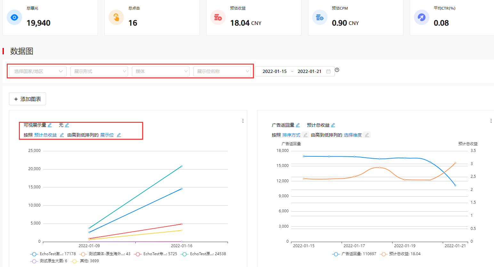
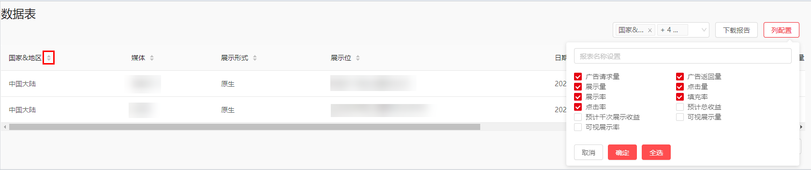
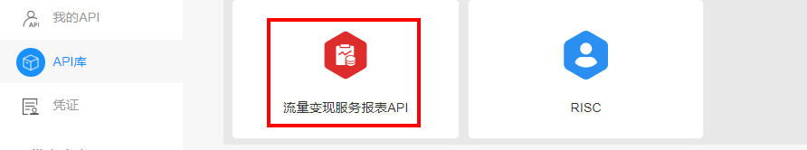

#### 报表查看

1. 打开[媒体服务平台](https://developer.huawei.com/consumer/cn/monetize/)，在首页中您可以查看收益金额及数据图；我们采用北京时间（UTC+8）为您提供数据报表信息。
   * **收益**

     可直观展示昨日预估收益、近7日收益（今日之前的7日，不含今日）、本月累计收益以及账号总收益。支持按币种展示收益，可选币种为：CNY、EUR、USD、JPY、HKD、GBP。
   * **数据图**
     + 可根据“国家/地区”“展示形式”、“媒体”、“展示位名称”、“日期范围”查询数据图。
     + 支持国家/地区、媒体、展示形式、展示位名称筛选条件多选，日期范围最长周期为最近365天。
     + 该数据图可展示广告请求量、广告返回量、展示量、可视展示量、点击量、点击率、展示率、可视展示率、填充率、预计总收益、预计千次展示收益，最多可同时比较两个维度的折线图。
2. 登录[媒体服务平台](https://developer.huawei.com/consumer/cn/monetize/)，单击**我的报表**即可根据条件筛选查看报表信息，我们采用北京时间（UTC+8）为您提供数据报表信息。

   

   * **数据筛选**

     您可以根据“币种”、“媒体”、“国家/地区”、“展示位名称”“展示形式”以及“时间”条件，根据需求进行相关数据的查询。该表格可为您展示“平均点击率”、“总展示量”、“总点击量”、“预计千次展示收益”、“预估总收益”等数据图表信息。
   * **展示指标含义**
     + 总曝光：展示位展示广告总次数。
     + 总点击：用户点击广告总次数。
     + 预估收益：预估展示广告带来的收益。
     + 预估CPM：预估每一千次展示收益。
     + 平均CTR：平均点击率。
     + 广告请求量：向广告服务器请求的广告的个数。
     + 广告返回量：广告服务器返回的广告的个数。
     + 填充率：广告返回量/广告请求量。
     + 可视展示量：广告（图片或者视频）露出50%，并且时长500ms记为一次可视展示量。
     + 可视展示率：可视展示量/广告返回量。
     + 展示量：可视展示量进行反作弊规则后的实际展示。
     + 展示率：展示量/广告返回量。
   * **筛选指标含义**
     + 选择国家/地区：可以根据不同的国家/地区筛选查询。
     + 展示形式：选择广告的展示形式，如“原生”、“激励”等展示形式来筛选查询。
     + 媒体：选择不同的应用筛选查询。
     + 展示位名称：根据展示位的名称筛选查询。
     + 时间：按时间范围筛选查询。

#### 2 报表导出

确定报表数据的展示维度后，单击**下载报表**即可进行报表导出。

* 支持排序： 点击排序图标，可更改排序状态 ，支持正序和倒序排序。

  

* 支持列配置：可以自行勾选需要展示的指标，下载的报表展示开发者列配置。
* 支持自定义报表名称：单击列配置，可以设置报表名称，下载报表时默认名称设置为：设置报表名称\_日期。
* 支持按国家、媒体、展示位、日期、展示形式等多个维度展示数据，时间范围最长周期为最近365天。

#### 3 启动Reporting API

**支持开发者通过Reporting API获取收益数据****，包括请求量、返回量、点击率等。**

**操作步骤：**

1. 登录开发者联盟，在我的API中新建项目；
2. 单击从库中添加API，跳转至API库，找到**流量变现服务报表API**，单击**启用**；
3. 在参考中单击查看文档跳转至[开发指南](https://developer.huawei.com/consumer/cn/doc/development/HMSCore-Guides/reporting-api-client-id-and-key-0000001050933698)，根据开发指南进行操作。

   
